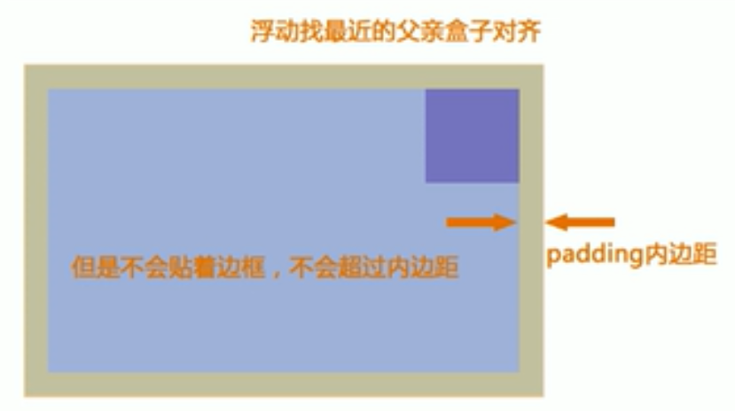
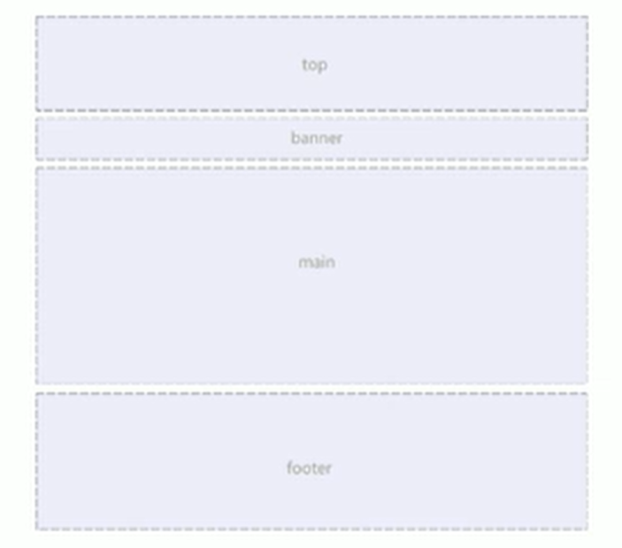
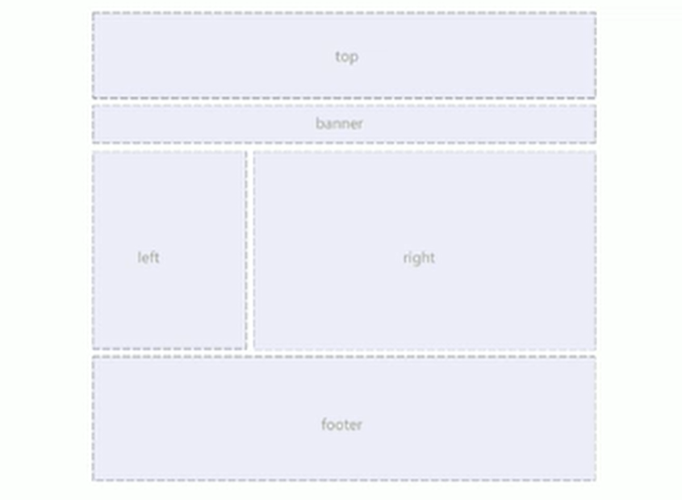
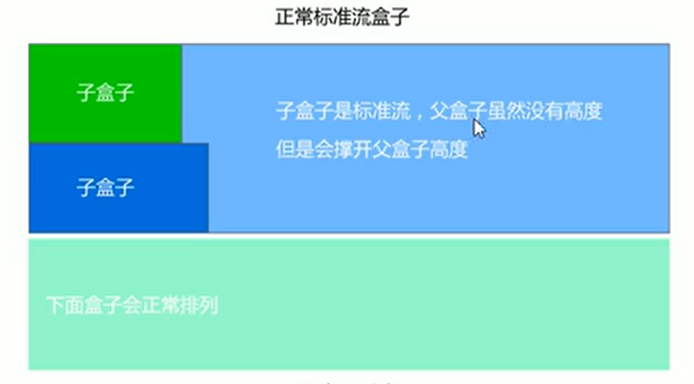
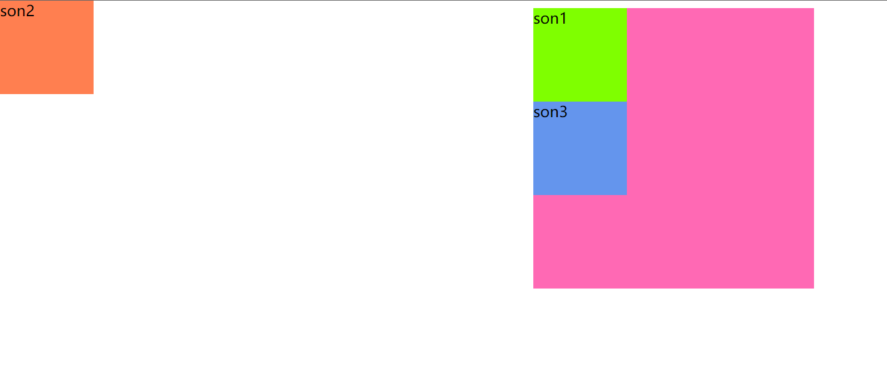
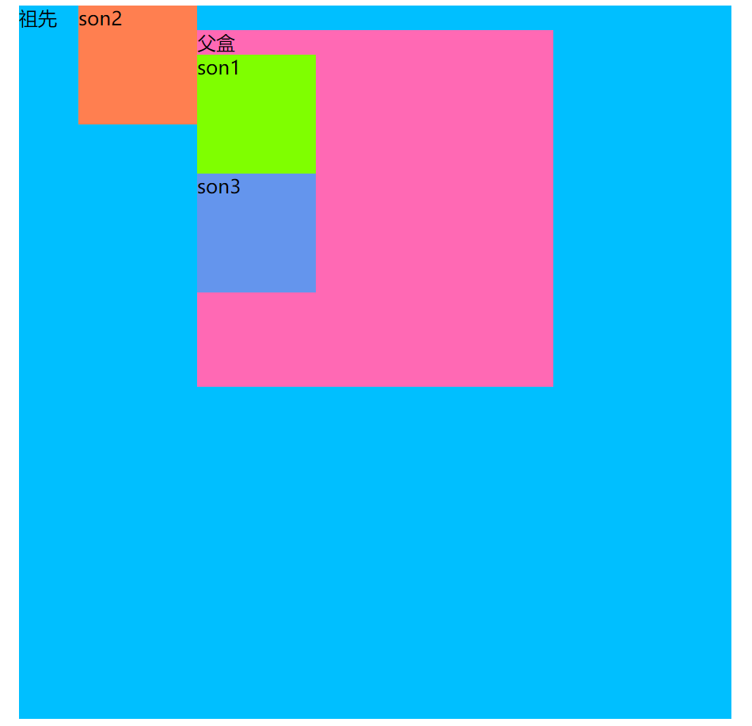

## CSS 初识

CSS(Cascading Style Sheets)

CSS通常称为CSS样式表或层叠样式表（级联样式表），主要用于设置HTML页面中的文本内容（字体、大小、对齐方式等）、图片的外形（宽高、边框样式、边距等）以及版面的布局等外观显示样式。

CSS以HTML为基础，提供了丰富的功能，如字体、颜色、背景的控制及整体排版等，而且还可以针对不同的浏览器设置不同的样式。

## CSS样式规则

使用HTML时，需要遵从一定的规范。CSS亦如此，具体格式如下：

> 选择器 {属性: 值; 属性: 值;}
> h1 {color:red font-size: 10px ;}

```
规则详解：
1. 选择器用于指定css样式作用的HTML对象，花括号内是对该对象设置的具体样式。
2. 属性和属性值以“键值对”的形式出现。
3. 属性是对指定的对象设置的样式属性，例如字体大小，文本颜色等。
4. 属性和属性值之间用英文“:”连接。
5. 多个“键值对”之间用英文“;”进行区分。
```

## CSS字体样式属性

### font-size: 字号大小
font-size属性用于设置字号，该属性的值可以使用相对长度单位，也可以使用绝对长度单位。其中，相对长度单位比较常用，推荐使用像素单位px，绝对长度单位使用较少。

| 相对长度单位 | 说明 |
| --- | --- |
| em | 相对于当前对象内文本的字体尺寸 |
| px | 像素，最常用，推荐使用 |

| 绝对长度单位 | 说明 |
| --- | --- |
| in | 英寸 |
| cm | 厘米 |
| mm | 毫米 |
| pt | 点 |

### font-family: 字体

font-family属性用于设置字体。网页中常用的字体有宋体、微软雅黑、黑体等。
可以同时指定多个字体，中间以逗号隔开，表示如果浏览器不支持第一种字体时，则会尝试下一个，直到找到合适的字体。

> :+1: 小技巧：
```
1. 现在网页中普遍使用14px+。
2. 尽量使用偶数的数字字号。ie6等老式浏览器支持奇数会有bug。
3. 各种字体之间必须使用英文状态下的逗号隔开。
4. 中文字体需要加英文状态下的引号，英文字体一般不需要加引号。当需要设置英文字体时，英文字体名必须位于中文字体名之前。
5. 如果字体名中包含空格、#、$等符号，则该字体必须加英文状态下的单引号或双引号。
6. 尽量使用系统的默认字体，保证在任何用户的浏览器中都能正确显示。
```

### CSS Unicode字体

在CSS中设置字体名称，直接写中文是可以的。但是在文件编码（GB2312、UTF-8等）不匹配时会产生乱码的错误。

* 方案一：
可以使用英文来替代。如:`font-family: "Microsoft Yahei"`。

* 方案二：
在CSS直接使用Unicode编码来写字体名称可以避免这些错误。使用Unicode写中文字体名称，浏览器是可以正确的解析的。
比如：`font-family:"\5FAE\8F6F\96C5\9ED1"`，表示设置字体为“微软雅黑”。

### font-weight: 字体粗细

字体加粗除了用`b`和`strong`标签之外，可以使用CSS来实现。

font-weight属性用于定义字体的粗细，其可用属性值：normal、bold、bolder、lighter、100~900（100的整数倍）。

### font-sytle: 字体风格

字体倾斜除了用`i`和`em`标签之外，可以使用CSS来实现。

font-style属性用于定义字体风格，如设置斜体、倾斜和正常字体，其可用属性值如下：

* normal: 默认值，浏览器会显示标准的字体样式。
* italic: 浏览器会显示斜体的字体样式。
* oblique： 浏览器会显示倾斜的字体样式。

### font:综合设置字体样式

font属性用于对字体样式进行综合设置，其基本语法格式如下：

```
选择器 {font: font-style font-weight font-size/line-height font-family;}
```

使用font属性时，必须按上面语法格式中的顺序写，不能更换顺序，各个属性以空格隔开。

其中不需要设置的尚需经可以省略（取默认值），但必须保留font-size和font-family属性，否则font属性将不起作用。

## CSS选择器

### 类选择器

类选择器使用`.`进行表示，后面紧跟类名，其基本语法格式如下：

```
.类名 {属性1: 属性值1; 属性2: 属性值2;...}
```

类选择器最大的优势是可以对元素对象定义单独或相同的样式。

:+1: 小技巧：

```
1. 长名称或词组可以使用中横线来为选择器命名。
2. 不建议使用`_`下划线来命名CSS选择器。
3. 不要用纯数字、中文(可以正常显示)等命名，尽量使用英文字母来表示。
```

### 多类名选择器

多类名选择器在后期布局比较复杂的情况下，还是比较多使用的。

每个类名用空格隔开，其基本格式如下：
```
<标签 class="类名1 类名2 类名3 ...">
```

注意：
```
1. 样式显示效果跟HTML元素中的类名先后顺序没有关系，受CSS样式书写的上下顺序有关。
2. 各个类名中间用空格隔开。
```

### id选择器

id选择器使用`#`进行标识，后面紧跟id名，其基本语法格式如下：

```
#id名 {属性1: 属性值1; 属性2:属性值2; 属性3:属性值3; ...}
```

该语法中，id名即为HTML元素的id属性值，大多数HTML元素都可以定义id属性，元素的id值是唯一的，只能对应于文档中某一个具体的元素。用法基本和类选择器相同。

### 通配符选择器

通配符选择器用`*`号表示，他是所有选择器中作用范围最广的，能匹配页面中所有的元素。其基本语法格式如下：

```
* {属性1:属性值1; 属性2:属性值2; 属性3:属性值3; ...}
```

例如：使用通配符选择器定义CSS样式，清除所有HTML标记的默认边距。

```css
* {
    margin: 0;
    padding: 0; 
}
```

### 伪类选择器

伪类选择器用于向某些选择器添加特殊的效果。比如给链接添加特殊效果。其基本语法格式如下：

```
:伪类名 {属性: 属性值;...}
```

#### 链接伪类选择器

```css
:link {} /*未访问的链接*/

:visited {} /*已访问的链接*/

:hover {} /*鼠标移动到链接上*/

:active {} /*选定的链接*/
```

伪类选择器写的时候，要严格按照lvha的顺序。

#### 结构(位置)伪类选择器（CSS3）

```css
:first-child {} /*选取属于其父元素的首个子元素的指定选择器*/

:last-child {} /*选取属于其父元素的最后一个子元素的指定选择器*/

:nth-child(n) {} /*匹配属于其父元素的第N个子元素，不论元素的类型*/

:nth-last-child(n) {} /*选择器匹配属于其元素的第N个子元素的每个元素，不论元素的类型，从最后一个子元素开始计数。n可以是数字、关键词或公式*/
```

n可以是:
* odd: 可以选择所有的奇数的孩子标签
* even: 可以选择所有的偶数的孩子标签 
* n: 代表所有,0 1 2 3 4...
* 2n: 偶数，0 2 4 6 8...
* 2n-1: 奇数，0 1 3 5 7...


#### 目标伪类选择器

目标伪类选择器可用于选取当前活动的目标元素，其基本语法格式如下：

```css
:traget {}
```

## CSS外观属性

### color：文本颜色

color属性用于定义文本的颜色，其取值方式有如下三种：

* 预定义的颜色值。

* 十六进制。在工作中，十六进制是最常用的定义颜色的方式。

* RGB代码。

### line-height:行间距

line-height属性用于设置行间距，就是行与行之间的间距，即字符的垂直间距，一般称为行高。line-height常用的属性值单位有三种，分别为像素px，相对值em和百分比%。

一般情况下，行距比字号大7,8像素左右就可以了。

### text-align:水平对齐方式

text-align属性用于设置文本内容的水平对齐，相当于HTML中的align对齐属性。其可用属性值如下：

* left:左对齐(默认值)

* right：右对齐

* center：居中对齐

### text-indent:首行缩进

text-indent属性用于设置首行文本的缩进，其属性值可以为不同单位的数值、em字符宽度的倍数、或相对于浏览器窗口宽度的百分比%，允许使用负值，建议使用em作为设置单位。

1em就是一个字的宽度。

### letter-spacing:字间距

letter-spacing属性用于定义字间距。所谓字间距就是字符与字符之间的空白。其属性值可以为不同单位的数值，允许使用负值，默认为normal。

### word-spacing:单词间距

word-spacing属性用于定义英文单词之间的间距，对中午字符无效。和letter-spacing一样，其属性值可为不同单位的数值，允许使用负值，默认为normal。

word-spacing和letter-spacing均可对英文进行设置。不同的是letter-spacing定义的为字母之间的间距，而word-spacing定义的为英文单词之间的间距。

### word-break：自动换行

normal 使用浏览器默认的换行规则。

break-all 允许在单词内换行。

keep-all 只能在半角空格或连字符处换行。

### 颜色半透明（CSS 3）

文字颜色到了CSS 3 我们可以采取半透明的格式，其基本语法格式如下：

```css
    /* a是alpha 透明的意思 取值范围0~1直接，0代表完全透明，1代表完全不透明 */
    color: rgba(r,g,b,a)
    /* 例：*/
    color: rgba(0, 0, 0, 0.3)
```

### 文字阴影（CSS 3）

在CSS 3中可以给我们的文字添加阴影效果，其基本语法格式如下：

```css
    text-shadow:水平位置 垂直位置 模糊位置 阴影颜色;
```

| 值  | 描述  |
| --- | --- |
| h-shadow | 必须。水平阴影的位置。允许负值 |
| v-shadow | 必须。垂直阴影的位置。允许负值 |
| blur | 可选。模糊的距离 |
| color | 可选。阴影的颜色 |

## 引入CSS样式表

### 内部样式表

内嵌式是将CSS代码集中写在HTML文档的head头部标签中，并且用style标签定义，其基本语法格式如下：

```html
<head>
<style type="text/css">
    选择器 {
        属性1: 属性值1;
        属性2: 属性值2;
        属性3: 属性值3;
    }
</style>
</head>
```

语法中，style标签一般位于head标签中title标签之后，也可以把它放在HTML文档的任何地方。

`type="text/css"`在HTML 5中可以省略，写上也比较符合规范。

### 行内式（内联样式）

内联样式，又称为行内样式、行间样式、内嵌样式。是通过标签的style属性来设置元素的样式。其基本语法格式如下：

```html
<标签名 style="属性1:属性值1;属性2:属性值2;属性3:属性值3;"> </标签名>
```

行内样式表适合于样式比较少的情况

### 外部样式表（外链式）

外链式是将所有的样式放在一个或多个以`.css`为扩展名的外部样式表文件中，通过`link`标签将外部样式表文件链接到HTML文档中，其基本语法格式如下：

```html
<head>
    <link href="css文件的路径" type="text/css" rel="stylesheet">
</head>
```

该语法中，`link`标签需要放在head头部标签中，并且必须指定link标签的三个属性，具体如下：

* href: 定义所链接外部样式表文件的URL，可以是相对路径，也可以是绝对路径。
* type: 定义所链接文档的类型，在这里需要指定为`"text/css"`,表示链接的外部文件为css样式表。
* rel: 定义当前文档与被链接文档之间的关系，在这里需要指定为`"stylesheet"`，表示被链接的文档是一个样式表文件。

## 标签显示模式

### 块级元素（block-level）

每个块元素通常都会独自占据一整行或多整行，可以对其设置宽度、高度、对齐等属性，常用于网页布局和网页结构的搭建。

```
常见的块元素有:
<h1>~<h6>、<p>、<div>、<ul>、<ol>、<li>等
```

块级元素的特点：

1. 总是从新行开始
2. 高度，行高、外边距以及内边距都可以控制。
3. 宽度默认是容器的100%
4. 可以容纳内联元素和其他块元素。

### 行内元素（inline-level）

行内元素又称内联元素 不占有独立的区域，仅仅靠自身的字体大小和图像尺寸来支撑结构，一般不可以设置宽度、高度、对齐等属性，常用于控制页面中文本的样式。

```
常见的行内元素有：
<a>、<strong>、<b>、<em>、<i>、<del>、<s>、<ins>、<u>、<span>等
```

行内元素的特点：

1. 和相邻行内元素在一行上。
2. 高、宽无效，但水平方向的padding和margin可以设置，垂直方向的无效。
3. 默认宽度就是它本身内容的宽度。
4. 行内元素只能容纳文本或其他行内元素。

### 行内块元素（inline-block）

在行内元素中有几个特殊的标签``、`<input/>`、`<td>`可以对它们设置宽高和对齐属性。

行内块元素的特点：

1. 和相邻行内元素在一行上，但是之间会有空白缝隙。
2. 默认宽度就是它本身内容的宽度。
3. 高度，行高、外边距以及内边距都可以控制。

### 标签显示默认转换 display

块转行内：`display: inline;`
行内转块：`display: block;`
块、行内元素转换为行内块：`dislplay: inline-block;`

## CSS复合选择器

复合选择器是由两个或多个基础选择器，通过不同的方式组合而成的，目的是为了可以选择更准确更精细的目标元素标签。

### 交集选择器

交集选择器由两个选择器构成，其中第一个为标签选择器，第二个为class选择器，两个选择器之间不能有空格，其基本语法格式如下：

```
标记选择器.类别选择器 {属性1: 属性值1; 属性2: 属性值2}
```

### 并集选择器

并集选择器（CSS选择器分组）是各个选择器通过`,`连接而成的，任何形式的选择器（包括标签选择器、class类选择器和id选择器等），都可以作为并集选择器的一部分。如果某些选择器定义的样式完全不同，或部分相同，就可以利用并集选择器为它们定义相同的CSS样式。

其基本语法格式如下：

```
类选择器,标记选择器 {属性1: 属性值1; 属性2: 属性值2}
```

### 后代选择器

后代选择器又称为包含选择器，用来选择元素或元素组的后代，其写法就是把外层标签写在前面，内层标签写在后面，中间用空格分隔。当标签发生嵌套时，内层标签就称为外层标签的后代。

其基本语法格式如下：

```
类别选择器 标记选择器 {属性1: 属性值1; 属性2: 属性值2}
```


### 子元素选择器

子元素选择器只能选择作为某元素子元素的元素。其写法就是把父级标签写在前面，子级标签写在后面，中间跟一个`>`进行连接。注意，符号左右两侧各保留一个空格。

其基本语法格式如下：

```
类别选择器>标记选择器 {属性1: 属性值1; 属性2: 属性值2}
```

### 属性选择器

属性选择器的作用就是选取标签带有某些特殊属性的选择器，其基本语法格式如下：

| 选择器形式 | 含义 |
|---|---|
| element[attr] | 选取存在attr属性的element |
| element[attr=val] | 选取属性值等于val的element |
| element[attr*=val] | 选取属性值里包含val字符并且在"任意"位置的element |
| element[attr^=val] | 选取属性值里包含val字符并且在"开始"位置的element |
| element[attr$=val] | 选取属性值里包含val字符并且在"结束"位置的element |

### 伪元素选择器（CSS3）

* element::first-letter > 文本的第一个单词或字
* element::first-line   > 文本的第一行
* element::selection    > 可改变选中文本的样式
* element::before       > 在element内部的开始位置创建一个元素，该元素为行内元素，且必须要结合content属性使用。
* element::after        > 在element内部的结束位置创建一个元素，该元素为行内元素，且必须要结合content属性使用。

## CSS背景（background）

CSS可以添加背景颜色和背景图片，来进行图片设置。

| 属性 | 说明 |
| --- | --- |
| background-color | 背景颜色 |
| background-image | 背景图片 |
| background-repeat | 是否平铺 |
| background-position | 背景位置 |
| background-attachement | 背景固定还是滚动 |

### 背景图片

语法：

```
background-image:url();
```

### 背景平铺

指定对象的背景图像如何铺排填充

语法：

```
background-repeat: repeat-x|repeat-y|repeat|no-repeat
```

参数：

* repeat-x: 背景图像在x轴上平铺
* repeat-y: 背景图像在y轴上平铺
* repeat: 背景图像在x轴和y轴上平铺（默认值）
* no-repeat: 背景图像不平铺


### 背景位置

设置或检索对象的背景图像位置。必须先指定`background-image`属性。默认值为：(0% 0%)。

如果只指定了一个值，该值将用于横坐标。纵坐标将默认为50%。第二个值将用于纵坐标。

语法：

```
background-position: length || length
background-position: position || position
```

参数：

* length：百分数|由浮点数字和单位标识符组成的长度值。
* position：top|center|bottom|left|center|right

注意：
1. position后面是x坐标和y坐标。可以使用`方位名次`或者`精确单位`。
2. 如果和精确单位和方位名字混合使用，则必须是x坐标在前，y坐标后面。

### 背景附着

设置或检索背景图像是随对象内容滚动还是固定的。 

语法:

```
background-attachement: scroll(默认值) | fixed
```

参数：
* scroll： 背景图像是随对象内容滚动
* fixed：  背景图像固定

### 背景简写

复合属性

```
background: 背景颜色 背景图片地址 背景平铺 背景滚动 背景位置
```

### 背景透明（CSS3）

CSS 3支持背景半透明的写法，其基本语法格式如下：

```
background: rgba(0, 0, 0, 0.3);
```

最后一个参数是alpha 透明度 取值范围0~1之间

注意：背景半透明是指盒子背景半透明，盒子里面的内容不受影响。

### 背景缩放（CSS3）

通过`background-size`设置背景图片的尺寸，就像我们设置img的尺寸大小一样，在移动web开发中做屏幕适配应用非常广泛。

其参数设置如下：

1. 可以设置长度单位(px)或百分比
2. 设置cover时，会自动调整缩放比例，保证图片始终填充满整个盒子，如有溢出部分会被隐藏
3. 设置为contain时，会自动调整缩放比例，保证图片始终完整显示在盒子内。

```css
div {
    background-image: url("images/plmm.jpg");
    background-size: 300px; /*尽量只改一个值，以防止缩放失真扭曲*/
    /*
    background-size: contain;
    background-size:cover;
    */
}
```

### 多背景图片（CSS3）

以逗号分隔可以设置多个背景，可用于自适应布局。

注意：

* 一个元素可以设置多个重复背景图像
* 每组属性间使用逗号分隔。
* 如果设置的多重背景之间存在着交集（即存在重叠关系），前面的背景图会覆盖在后面的背景图之上。
* 为了避免背景色将图像盖住，背景色通常都定义在最后一组上。

```css
div {
    width: 1000px;
    height: 1000px;
    background: 
    url('https://www.wahaotu.com/uploads/allimg/202009/1601459002816578.jpg') no-repeat scroll top left,
    url("https://www.wahaotu.com/uploads/allimg/202010/1603012753796740.jpg") no-repeat scroll top right,
    url("https://www.wahaotu.com/uploads/allimg/202009/1601459002738609.jpg") no-repeat scroll bottom left,
    url("https://www.wahaotu.com/uploads/allimg/202009/1601459003206650.jpg") no-repeat scroll bottom right;
}
```

### 凸起凹陷浮雕效果

```css
a {
    width: 200px;
    height: 50px;
    display: inline-block;
    text-align: center;
    text-decoration: none;
    line-height: 50px;
    font-size: 22px;
    color: #fff;
}
a:hover {
    background: url("https://game.gtimg.cn/images/yxzj/cp/a20161115tyf/sp.png") no-repeat;
}
.nav {
    height: 100px;
    text-align: center;
    line-height: 100px;
    background-color: #000;
}
```

## CSS三大特性

### CSS层叠性

所谓层叠性是指多种CSS样式的叠加。是浏览器处理冲突的一个能力，如果一个属性通过两个相同选择器设置到同一个元素上，那么这个时候一个属性就会将另一个属性层叠掉。

比如先给某个标签指定了内部文字颜色为红色，接着又指定了颜色为蓝色，此时出现一个标签指定了相同样式不同值的情况，这就是样式冲突。一般情况下，如果出现样式冲突，则会按照CSS书写的顺序，以最后的样式为准。

### CSS继承性

所谓继承性是指书写CSS样式表时，子标签会继承父标签的某些样式，如颜色和字号等。

想要设置一个可继承的属性，只需要它应用于父元素即可。

恰当地使用继承可以简化代码，降低CSS样式的复杂性。子元素可以继承父元素的样式(text-,font-,line-这些元素开头的都可以继承，以及color属性)

### CSS优先级

定义CSS样式时，经常出现两个或更多规则应用在同一元素上，这时就会出现优先级的问题。

在考虑权重时，还需要注意一些特殊的情况，具体如下：

```
继承样式的权重为0。即在嵌套结构中，不管父元素样式的权重多大，被子元素继承时，他的权重都为0，也就是说子元素定义的样式会覆盖继承来的样式。

行内样式优先。应用style属性的元素，其行内样式的权重非常高，可以理解为远大于100.总之，他拥有比上面提到的选择器都大的优先级。

权重相同时，CSS遵循就近原则。也就是说靠近元素的样式具有最大的优先级，或者说排在最后的样式优先级最大。

CSS定义了一个!important命令，该命令被赋予最大的优先级。也就是说不管权重如何以及样式位置的远近，!important都具有最大优先级。
```

#### CSS特殊性

关于CSS权重，需要一套计算公式来去计算，这个就是CSS Specificity。称为CSS特性或非凡性，它是一个衡量CSS值优先级的一个标准 具体规范如下：

specificity用一个四位的数字串(CSS2是三位)来表示，更像四个级别，值从左到右，左面的最大，一级大于一级，数位之间没有进制，级别之间不可超越。

| 类型 | 权重值 |
| --- | --- |
| 继承或者*的贡献值 | 0,0,0,0 |
| 每个标签贡献值 | 0,0,0,1 |
| 每个类，伪类贡献值 | 0,0,1,0 |
| 每个ID贡献值 | 0,1,0,0 |
| 每个行内样式贡献值 | 1,0,0,0 |
| 每个!important贡献值 | Max |

!important > 行内样式 > id选择器 > 标签选择器 > 类选择器 == 伪类选择器 > 继承值

另外权重是可以叠加的，例如：

```css
div ul li {} /*0,0,0,3*/

.nav ul li {} /*0,0,1,2*/

a:hover {} /*0,0,1,1*/

.nav a {} /*0,0,1,1*/

#nav p {} /*0,1,0,1 */
```

## 盒子模型

其实，CSS就三个大模块：盒子模型、浮动、定位，其余的都是细节。

所谓盒子模型就是把HTML页面中的元素看作是一个矩形的盒子，也就是一个盛装内容的容器。每个矩形都由元素的内容、内边距(padding)、边框(border)和外边距(margin)组成。

### 盒子边框（border）

语法：

```
border: border-width || border-color || border-style
```

边框宽度(border-width)用于定义页面中边框的粗细；

边框颜色(border-style)用于定义页面中边框的颜色；

边框样式(border-style)用于定义页面中边框的风格，常用属性值如下：

```
none: 没有边框即忽略所有边框的宽度（默认值）

solid: 边框为单实线（最为常用的）

dashed: 边框为虚线

dotted: 边框为点线

double: 边框为双实线
```

#### 盒子边框写法总结

| 设置内容 | 样式属性 | 常用属性值 |
| --- | --- | --- |
| 上边框 | border-top-style:样式; border-top-width:宽度; border-top-color:颜色; border-top:宽度 样式 颜色; |  |
| 下边框 | border-bottom-style:样式; border-bottom-width:宽度; border-bottom-color:颜色; border-bottom:宽度 样式 颜色; |  |
| 左边框 | border-left-style:样式; border-left-width:宽度; border-left-color:颜色; border-left:宽度 样式 颜色; |  |
| 右边框 | border-right-style:样式; border-right-width:宽度; border-right-color:颜色; border-right:宽度 样式 颜色; |  |
| 样式综合设定 | border-style:上 [下 左 右] | none, solid, dashed, dotted, double |
| 宽度综合设定 | border-width:上 [下 左 右] | 像素值 |
| 颜色综合设定 | border-color:上 [下 左 右] | 颜色值、十六进制值、rgb值 |
| 边框综合设定 | border:四边宽度 四边样式 四边颜色 |  |

#### 表格的细线边框

table的边框如果设置为1px td又设置边框为1px，当他俩在一起的时候就是2px。边框总体就是2px。但当设置0.5px时 浏览器又会自动转化为1px。
这时就需要`border-collapse`这个属性来合并边框。

```css
table {
    border-collapse: collapse; /*表示边框合并在一起*/
}
```

#### 圆角边框（CSS3）

语法格式：
```
border-radius: 左上角 右上角 右下角 左下角;
```

### 内边距（padding）

`padding`属性用于设置内边距。内边距是指`边框与内容之间的距离`。

其语法格式如下：

```
padding: 上内边距 右内边距 下内边距 左内边距;
```

* padding-top: 上内边距
* padding-right: 右内边距
* padding-bottom: 下内边距
* padding-left: 左内边距


padding后面跟的值的数量不同代表不同意思：

| 值的个数 | 表达的意思 |
| --- | --- |
| 1 | 代表设置上下左右内边距都为该值 |
| 2 | 代表设置上下内边距为第一个值，左右内边距为第二个值 |
| 3 | 代表设置上内边距为第一个值，左右内边距为第二个值， 下内边距为第三个值 |
| 4 | 代表设置上内边距为第一个值，右内边距为第二个值，下内边距为第三个值，左内边距为第三个值 |

### 外边距(margin) 

`margin`属性用于设置外边距。设置外边距会在元素之间创建"空白",这段空白通常不能放置其他内容。

其基本语法格式如下：

```
margin: 上外边距 右外边距 下外边距 左外边距;
```

* margin-top: 上外边距
* margin-right: 右外边距
* margin-bottom: 下外边距
* margin-left: 左外边距

#### 外边距实现盒子居中

让一个盒子实现水平居中，需要满足以下两个条件：

1. 必须是块级元素。
2. 盒子必须指定了宽度（width）

然后就给左右的外边距都设置为`auto`,就可使块级元素水平居中。

#### 清除元素的默认内外边距

为了更方便地控制网页中的元素，制作网页时，可使用如下代码清除元素的默认内外边距：

```css
* {
    padding: 0; /* 清除内边距 */
    margin: 0;  /* 清除外边距 */
}
```

注意：行内元素是只有左右外边距的，是没有上下外边距的。

### 外边距合并

#### 相邻块元素垂直外边距的合并

#### 嵌套块元素垂直外边距的合并

使用margin定义块元素的垂直外边距时，可能会出现外边距的合并。 

### content 宽度和高度

使用宽度属性width和高度属性height可以对盒子的大小进行控制。

width和height的属性值可以为不同单位的数值或相对于父元素的百分比%，实际工作中最常用的是像素值。

大多数浏览器都采用了W3C规范，符合CSS规范的盒子模型的总宽度和总高度的计算原则是：

```
外盒尺寸计算（元素空间尺寸）：
元素空间高度 = content height + padding + border + margin
元素空间宽度 = content width + padding + border + margin

内盒尺寸计算（元素实际大小）：
元素尺寸高度 = content height + padding + border
元素尺寸宽度 = content width + padding + border
```

注意：
1. 宽度属性width和高度属性height仅适用于`块级元素`，对行内元素无效（img标签和input标签除外）。
2. 计算盒子模型的总高度时，还应该考虑上下两个盒子`垂直外边距合并`的情况。
3. 如果一个盒子没有给定`宽度/高度或继承父亲的宽度/高度`，则padding不会影响本盒子大小。


### 盒子模型布局稳定性

开始学习盒子模型时，最大的困惑就是，分不清内外边距的使用。

其实它们大部分情况下是可以混用的。就是说，用内边距也可以，用外边距也可以。
但是，根据稳定性来分，建议如下：
按照有限使用`宽度(width)` 其次使用`内边距(padding)`再次 `外边距(margin)`。

原因有如下三点：
1. margin会有外边距合并 还有ie6下面margin加倍的bug。所以最不先考虑使用
2. padding会影响盒子大小，需要进行加减计算，其次考虑使用。
3. width没有任何问题，经常使用`宽度剩余法 高度剩余法`来做。

### CSS3盒模型

CSS3中可以通过`box-sizing`来指定盒模型，即可指定为`content-box`、`border-box`，这样我们计算盒子大小的方式就发生了改变。

可以分成两种情况：
1. `box-sizing:cotent-box`: 此值为默认值，其让元素维持W3C的标准盒子模型。盒子大小为`width+padding+border`。
2. `box-sizing:border-box`: 其让padding和border包含到width里面的。盒子大小为`width`的大小。

### 盒子阴影

语法格式：

```
box-shadow: 水平阴影 垂直阴影 模糊距离 阴影尺寸 阴影颜色 内/外阴影;
```

| 值 | 描述 |
| --- | --- |
| h-shadow | 必须。水平阴影的位置，允许负值 |
| v-shadow | 必须。垂直阴影的位置，允许负值 |
| blur | 可选，模糊距离。 |
| spread | 可选，阴影的尺寸。 |
| color | 可选，阴影的颜色。 |
| inset | 可选，将外部阴影(outset)改为内部阴影。 |

注意：
1. 前两个属性是必须写，其余的可以省略。

## 浮动（float）

### 普通流（normal flow）

网页布局的核心，就是用CSS来摆放盒子位置。

CSS的定位机制有3种：`普通流（标准流）`、`浮动`和`定位`。

html语言当中灵位一个相当重要的概念--标准流（普通流、文档流）。普通流实际上就是一个网页内标签元素正常从上到下，从左到右排列顺序的意思，比如块级元素会独占一行，行内元素会按顺序依次前后排列；按照这种大前提的布局排列之下绝对不会出现例外的情况叫做普通流布局。

三种定位的特点：

* 标准流：规规矩矩 跑在地上 固定路线

* 浮动：浮在空中 航道行驶 有风险

* 定位：浮在空中 可以去任何一个地方 

### 浮动

浮动最早是用来控制图片，以便达到其他元素（特别是文字）实现“环绕”图片的效果。

元素的浮动是指设置了浮动属性的元素会脱离标准普通流的控制，移动到其父元素中指定位置的过程。在CSS中，通过float属性来定义浮动，其基本语法格式如下：

```
选择器 {float:属性值;}
```

| 属性值 | 描述 |
| --- | --- |
| left | 元素向左浮动 |
| right | 元素向右浮动 |
| none | 元素不浮动（默认值） |

#### 浮动特性

浮动脱离标准流，不占位置，会影响标准流。浮动只有左右浮动。

浮动首先创建包含块的概念（包裹）。就是说，浮动的元素总是找离它最近的父级元素对齐。但是不会超出内边距的范围。



浮动的元素排列位置，跟上一个元素（块级）有关系。如果上一个元素有浮动，则A元素顶部会和上一个元素的顶部对齐；如果上一个元素是标准流，则A元素的顶部会和上一个元素的底部对齐。

一个父盒子里面的子盒子，如果其中一个子级有浮动的，则其他子级都需要浮动。这样才能一行对齐显示。

元素添加浮动后，元素会具有行内块元素的特性。元素的大小完全取决于定义的大小或者默认的内容多少。

浮动根据元素书写的位置来显示相应的浮动。

总结：

浮动的主要目的就是为了让多个块级元素一行内显示。

* 加了浮动的元素盒子是浮起来的，漂浮在其他的标准流盒子上面。
* 加了浮动的盒子，不占位置。它浮起来了，它原来的位置漏给了标准流的盒子。
* 特别注意，这是特殊的使用，有很多的不好处，使用要谨慎。


## 版心和布局流程

版心（可视区）是指网页中主体内容所在的区域。一般在浏览器窗口中水平居中显示，常见的宽度值为960px、980px、1000px、1200px等。

### 布局流程

为了提高网页制作的效率，布局时通常需要遵守一定的布局流程，具体如下：

1. 确定页面的版心（可视区）。

2. 分析页面中的行模块，以及每个行模块中的列模块。

3. 制作HTML结构。

4. CSS初始化，然后开始运用盒子模型的原理，通过DIV+CSS布局来控制网页的各个模块。

### 常见布局

#### 一列固定宽度且居中

最普通的，最为常用的结构




#### 两列左窄右宽型布局




#### 通栏平均分布型布局


## 清除浮动

浮动本质是用来做一些文字混排效果的，但是被我们哪来做布局用，则会有很多的问题出现。

由于浮动元素不再占用原文档流的位置，所以它会对后面的元素排版产生影响，为了解决这些问题，此时就需要在该元素中清楚浮动。

准确地说，并不是清除浮动，而是**清除浮动后造成的影响**。

### 清除浮动本质

清除浮动主要为了解决父级元素因为子级浮动引起内部高度为0的问题。




### 清除浮动的方法

清除浮动就是把浮动的盒子圈到里面，让父盒子闭合出口和入口不让他们出来影响其他元素。

在CSS中，clear属性用于清除浮动，其基本语法格式如下：

```
选择器{clear: 属性值;}
```

| 属性值 | 描述 |
| --- | --- |
| left | 不允许左侧有浮动元素（清除左侧浮动的影响） |
| right | 不允许右侧有浮动元素（清除右侧浮动的影响） |
| both | 同时清除左右两侧浮动的影响 |

#### 额外标签法

W3C推荐的做法，是通过在浮动元素末尾添加一个空的便签。

例如：

```html
<div class="box1"></div>
<div style="clear:both"></div>
<div class="box2"></div>
```

优点：通俗易懂，书写方便
缺点：添加许多无意义的标签，结构化较差。

#### 父级添加overflow属性法

可以通过触发BFC的方式，可以实现清除浮动效果。给`父级`添加：`overflow`属性。

```
选择器 {overflow: hidden|auto|scroll }
```

优点：代码简洁
缺点：内容增多时容易造成不会自动换行导致内容被隐藏掉，无法显示需要溢出的元素。

#### 使用after伪元素清除浮动

使用方法：

```css
.clearfix:after { 
    content: "."; /* 追加内容，尽量不要空，否则旧版本浏览器有空隙 */
    display: block; /* 转换为块级元素 */
    height: 0; /* 高度为0 */
    clear: both; /* 清除浮动 */
    visibility: hidden; /* 隐藏盒子内容 */
}

.clearfix {*zoom: 1;} /*IE6、7专有*/
```

优点：符合闭合浮动思想 结构语义化正确
缺点：由于IE6-7不支持`:after`,使用`zoom:1`触发`hasLayout`。

#### 使用before和after双伪元素清除浮动

使用方法：

```css
.clearfix:before, .clearfix:after {
    content: "";
    display: table; /*触发BFC BFC可以清除浮动*/
}
.clearfix:after {
    clear:both;
}
.clearfix {
    *zoom:1;
}
```

优点：代码更简洁
缺点：由于IE6-7不支持`:after`,使用`zoom:1`触发`hasLayout`。


## 定位（position）

简单来说，一个元素钉在屏幕的一块就是定位。

### 元素的定位属性

元素的定位属性主要包括`定位模式`和`边偏移`两部分。

#### 边偏移

| 边偏移属性 | 描述 |
| --- | --- |
| top | 顶端偏移量，定义元素相对于其父元素上边线的距离 |
| bottom | 底部偏移量， 定义元素相对于其父元素下边线的距离 |
| left | 左侧偏移量，定义元素相对于其父元素左边线的距离 |
| right | 右侧偏移量，定义元素相对于其父元素右边线的距离 |

#### 定位模式

在CSS中，position属性用于定义元素的定位模式，其基本语法格式如下：

```
选择器 {position: 属性值;}
```

position属性的常用值：

| 值 | 描述 |
| --- | --- |
| static | 自动定位（默认定位方式）|
| relative | 相对定位，相对于其原文档流的位置进行定位 |
| absolute | 绝对定位，相对于其上一个已经定位的父元素进行定位 |
| fixed | 固定定位，相对于浏览器窗口进行定位 |

定位模式 + 边偏移 = 完整定位

### 静态定位（static）

静态定位是所有元素的默认定位方式，当position属性的取值为static时，可以将元素定位于静态位置。所谓静态位置就是各个元素在HTML文档流中默认的位置。

就是网页中所有元素都默认是静态定位，其实就是标准流的特性。

在静态定位状态下，无法通过`边偏移属性`来改变元素的位置。

一般用静态定位来清除定位的。比如原来有定位的盒子，不想加定位了，就用静态定位。

### 相对定位（relative）

相对定位是将元素相对于它在标准流中的位置进行定位，当position属性的取值为relative时，可以将元素定位于相对位置。

对元素设置相对定位后，可以通过边偏移属性改变元素的位置，但是它在文档流中的位置仍然保留。

注意：

1. 相对定位最重要的一点是，它可以通过边偏移移动位置，但是原来的所占的位置，继续占有。

2. 其次，每次移动的位置，是以自己的左上角为基点移动（相对于自己来移动位置）

就是说，相对定位的盒子仍在标准流中，它后面的盒子仍以标准流方式对待它（相对定位不脱标）。

如果说浮动的主要目的是让多个块级元素一行显示，那么定位的主要价值就是移动位置，让盒子到我们想要的位置上去。


### 绝对定位（absolute）

当position属性的取值为absolute时，可以将元素的定位模式设置为绝对定位。

绝对定位最重要的一点是，它可以通过边偏移移动位置，但是它完全脱标，完全不占位置。

如果文档可以滚动，绝对定位元素会随着它滚动，因为元素最终会相对于正常流的某一部分定位。

#### 当父元素没有定位子元素使用绝对定位时

若所有父元素都没有定位，以浏览器为准对齐



#### 当父元素有定位子元素使用绝对定位时

绝对定位是将元素依据最近的已经定位（绝对、固定或相对定位）的父元素进行定位。



#### 子绝父相

子绝父相的意思就是，子级是绝对定位的话，父级要用相对定位。

首先，绝对定位是将元素依据最近的已经定位（绝对、固定或相对定位）的父元素（祖先）进行定位。

就是说，子级是绝对定位，父亲只要是定位即可（不管父亲是绝对定位还是相对定位，甚至是固定定位都可以）。

也就是说，子绝父绝，子绝父相都是正确的。

但是在网页布局中，最常用的就是子绝父相。


**分析**：

1. **方向箭头**叠加在其他图片上方，应该使用**绝对定位**，因为**绝对定位完全脱标**，完全不占位置。
2. **父级盒子**应该使用**相对定位**，因为**相对定位不脱标**，后续盒子仍然以标准流的方式对待它。
   * 如果父级盒子也使用**绝对定位**，会完全脱标，那么下方的**广告盒子**会上移，这显然不是我们想要的。

**结论**：**父级要占有位置，子级要任意摆放**，这就是**子绝父相**的由来。

### 绝对定位的盒子水平/垂直居中

加了**绝对定位/固定定位的盒子**不能通过设置 `margin: auto` 设置**水平居中**。

但是可以通过以下计算方法实现水平和垂直居中，可以按照下图的方法：


1. `left: 50%;`：让**盒子的左侧**移动到**父级元素的水平中心位置**；
2. `margin-left: -100px;`：让盒子**向左**移动**自身宽度的一半**。

**盒子居中定位示意图**


### 固定定位（fixed）

固定定位是绝对定位的一种特殊形式，它以浏览器窗口作为参照物来定义网页元素。当`position`属性的取值为`fixed`时，即可将元素的定位模式设置为固定定位。

当对元素设置固定定位后，它将脱离标准文档流的控制，始终依据浏览器窗口来定义自己的显示位置。不管浏览器滚动条如何滚动也不管浏览器窗口的大小如何变化，该元素都会始终显示在浏览器窗口的固定位置。

固定定位有两点：
1. 固定定位的元素跟父亲没有任何关系，只认浏览器。
2. 固定定位完全脱标，不占有位置，不随着滚动条滚动。 

### 叠放次序（z-index）

当对多个元素同时设置定位时，定位元素之间有可能会发生重叠。

在CSS中，要想调整重叠定位元素的堆叠顺序，可以对定位元素应用`z-index`层叠等级属性，其取值可为正整数、负整数和0。

注意：
1. z-index的默认属性值是0，取值越大，定位元素在层叠元素中越居上。
2. 如果取值相同，则根据书写顺序，后来居上。
3. 后面数字一定不能加单位。
4. 只有相对定位，绝对定位，固定定位有此属性，其余标准流，浮动，静态定位都无此属性，亦不可指定此属性。

### 定位总结

| **定位模式**          | **是否脱标**         | **移动位置**           | **是否常用**                 |
| --------------------- | -------------------- | ---------------------- | ---------------------------- |
| static   静态定位     | 否                   | 不能使用边偏移         | 很少                         |
| **relative 相对定位** | **否 (占有位置)**    | **相对于自身位置移动** | **基本单独使用**             |
| **absolute绝对定位**  | **是（不占有位置）** | **带有定位的父级**     | **要和定位父级元素搭配使用** |
| **fixed 固定定位**    | **是（不占有位置）** | **浏览器可视区**       | **单独使用，不需要父级**     |
| sticky 粘性定位       | 否   (占有位置)      | 浏览器可视区           | 当前阶段少                   |

- 一定记住 相对定位、固定定位、绝对定位 两个大的特点： 1. 是否占有位置（脱标否） 2. 以谁为基准点移动位置。

- 学习定位重点学会子绝父相。
- 注意：

1. **边偏移**需要和**定位模式**联合使用，**单独使用无效**；
2. `top` 和 `bottom` 不要同时使用；
3. `left` 和 `right` 不要同时使用。

### 使用定位进行元素转换

跟浮动一样，元素添加了`绝对定位(absolute)`和`固定定位(fixed)`之后元素模式也会发生转换，转换为`行内块模式`。

因此，行内元素如果添加了绝对定位或者固定定位后，可以不用转换模式，直接给高度和宽度就可以了。

## 元素的显示与隐藏

目的(本质): 让一个元素在页面中消失或者显示出来

场景：类似网站广告，当我们点击关闭就不见了，但是当我们重新刷新页面，会重新出现。

### display显示

display设置或检索对象是否及如何显示。

```
display: none  隐藏对象

display: block 除了转换为块级元素之外，同时还有显示元素的意思。
```

特点：display隐藏元素后，不再占有原来的位置。

### visibility可见性

visibility属性用于指定一个元素应可见还是隐藏。

```
visibility: visible; 元素可视

visibility: hidden;  元素隐藏
```

特点：visibility隐藏元素后，继续占有原来的位置。

visibility:hidden与display:none的区别：

* 如果隐藏元素想要原来的位置，就用`visibility: hidden;`

* 如果隐藏元素不想要原来的位置，就用`display: none;`

### overflow溢出

overflow属性指定了如果内容溢出一个元素的框（超过其指定高度及宽度）时，会发生什么。

| 属性值 | 描述 |
| --- | --- |
| visible | 不剪切内容也不添加滚动条（默认值） |
| hidden | 不显示超过对象尺寸的内容，超出的部分隐藏掉 |
| scroll | 不管超出内容与否，总是显示滚动条 |
| auto | 超出自动显示滚动条，不超出不显示滚动条 |

一般情况下，我们都不想让溢出的内容显示出来，因为溢出的部分会影响布局。

但是如果有定位的盒子，请慎用`overflow: hidden`因为它会隐藏多余的部分。

使用overflow还可以清除浮动。

