# 布局实现
一般网页的设计实现如下：
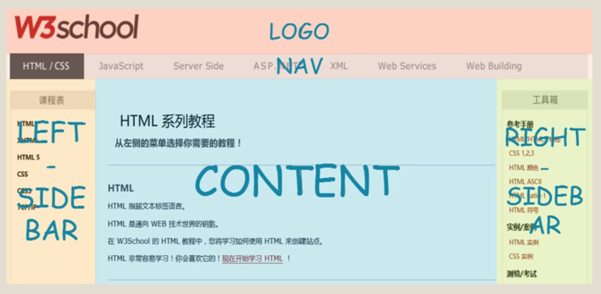

## 流式布局

块的默认布局叫做流式布局，顾名思义，就是像水一样流动。默认的块宽度会充满整个页面，前面的块在前面，后面的块在后面。即使我们把块的宽度调整到只有页面的一半，即使页面这一行有足够的空间，容纳这两个块，也会依据这个次序往下排列，这就叫做流样式布局。

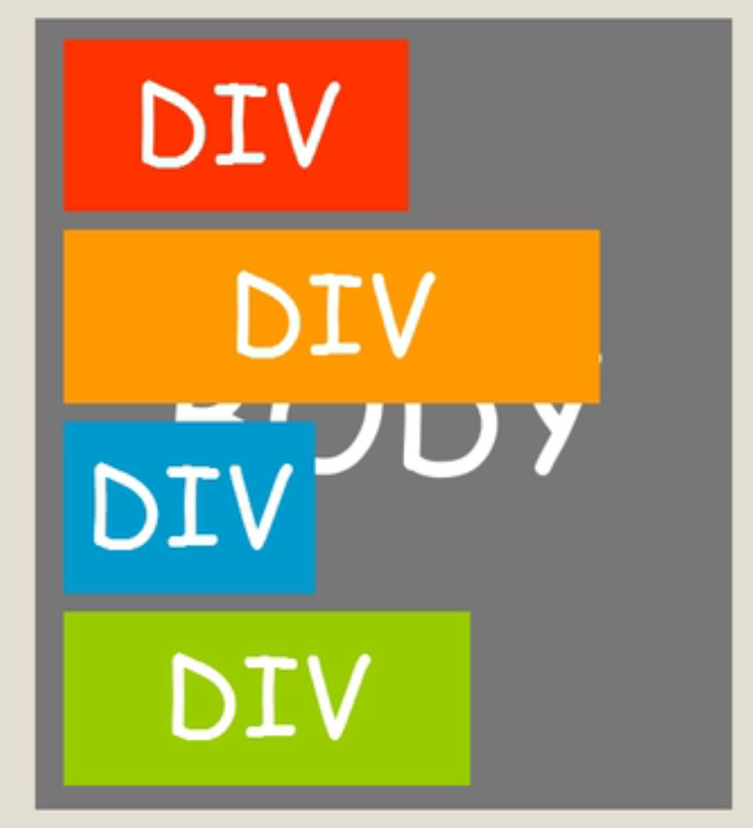

## 浮动布局

浮动布局(float布局)是CSS中一种比较麻烦的属性，涉及到BFC和清除浮动。

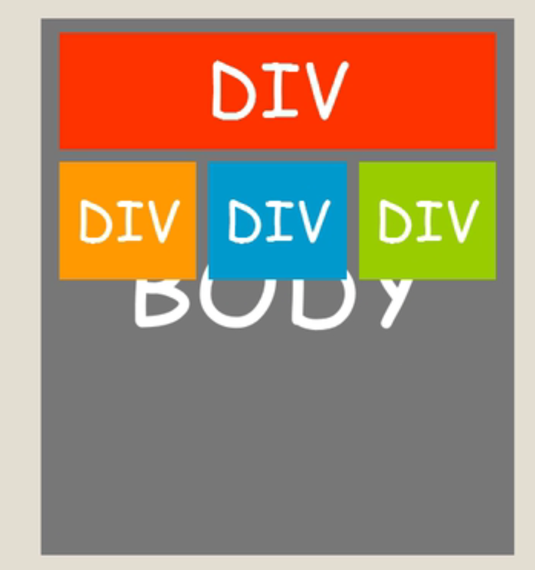

float本身是用来做图文混排、文字环绕的效果。

### float属性的特点

* 元素浮动

* 脱离文档流，但不脱离文本流

### float所带来的影响

1. 对自身的影响：
    * 形成"块"(BFC)
    * 位置尽量靠上
    * 位置尽量靠左/右
2. 对兄弟元素的影响：
    * 不影响其他块级元素的位置
    * 影响其他块级元素的内部文本
3. 对父级元素的影响：
    * 从父级的布局中“消失”
    * 造成父级元素的高度塌陷：父级元素撑开div1之后（父级元素里没有其他元素的情况下），如果设置div1为float之后，会让父级元素的高度变为0.

## 定位布局

CSS定位布局是通过`position`属性设置的，它有`static`,`relative`,`absolute`,`fixed`,`sticky`这几种属性。

### static

static是静态定位，它是position的默认值，也是CSS的默认布局方式，从上到下，从左到右排列元素，它属于正常的文档流。

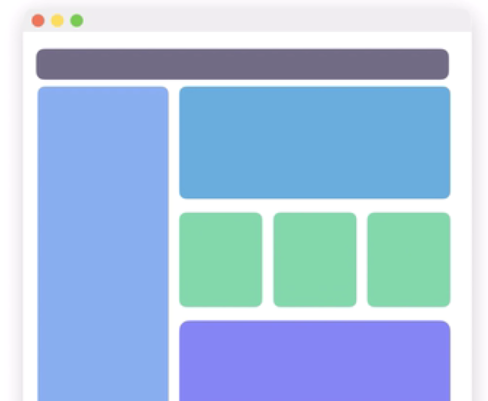

```css
div {
    /* 默认值，可不设置 */
    position: static;
}
```

### relative

relative相对定位，它是确定元素的默认位置之后，通过`left`,`right`,`top`,`bottom`属性来设置位置的偏移。

但是元素所占的空间还保留在原位，其他元素不会挤占它原本的空间。

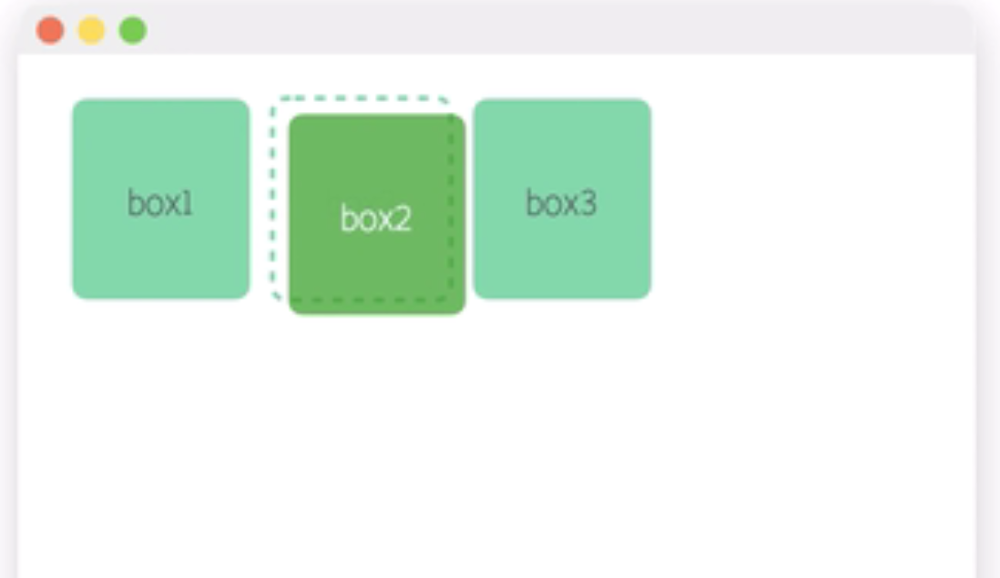

```css
.box2 {
    position: relative;
    left: 5px;
    top: 5px;
}
```

### absolute

absolute绝对定位，它会把元素移出正常的文档流，后面的元素会挤占它的空间，而他自己会覆盖在挤占它空间的元素的上方。

它也可以通过设置`left`,`right`,`top`,`bottom`属性来设置位置的偏移。但与relative不同的是，这些属性是相对于包含它的元素来偏移的。

包含元素指的是，如果这个元素的所有父级都没有设置`position`、`transform`或者`perspective`属性，那么包含元素就是包含HTML元素的容器，也就是说是浏览器的窗口，这时偏移是相对于浏览器左上角进行偏移的。

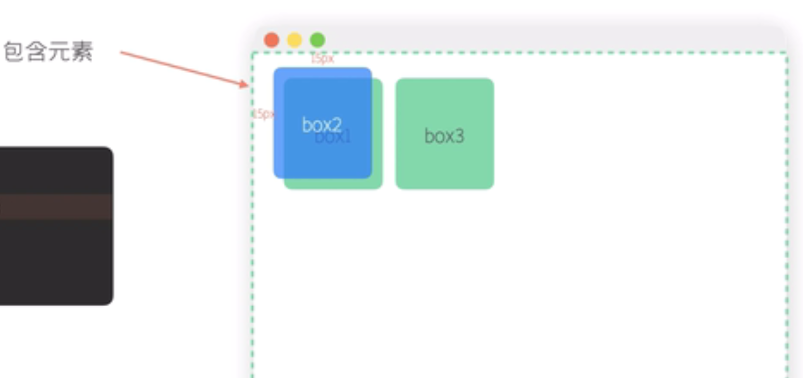

```css
.box2 {
    position: absolute;
    top: 15px;
    left: 15px;
}
```

如果父级元素有设置了`position（除了static属性）`、`transform`或者`perspective`属性,那么包含元素就是指离它最近的设置了这些属性的元素，它是相对于父级元素的padding盒子边界进行偏移的，无论父级元素的内间距有多大，都会与边框与padding交界处开始计算偏移。

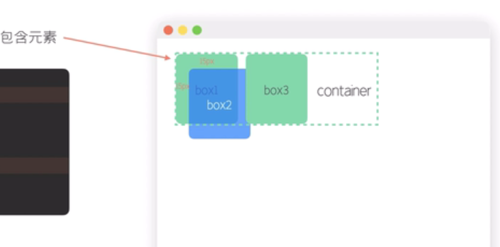

```css
.container {
    position: relative;
    /* transform */
    /* perspective */
}
.box2 {
    position: absolute;
    top: 15px;
    left:15px;
}
```

我们通常使用relative设置包含元素，因为它不会影响正常的文档流。（**子绝父相**）

absolute是用途最广的定位方式，可以实现弹出层，叠加，不规则的位置等布局形式。

### fixed

fixed固定定位，跟absolute定位类似，只是它的包含元素是当前浏览器窗口。

当通过`left`,`right`,`top`,`bottom`属性来设置偏移后，无论页面怎么滚动，它都会固定在指定位置。适合用于固定浮窗，导航条的布局。

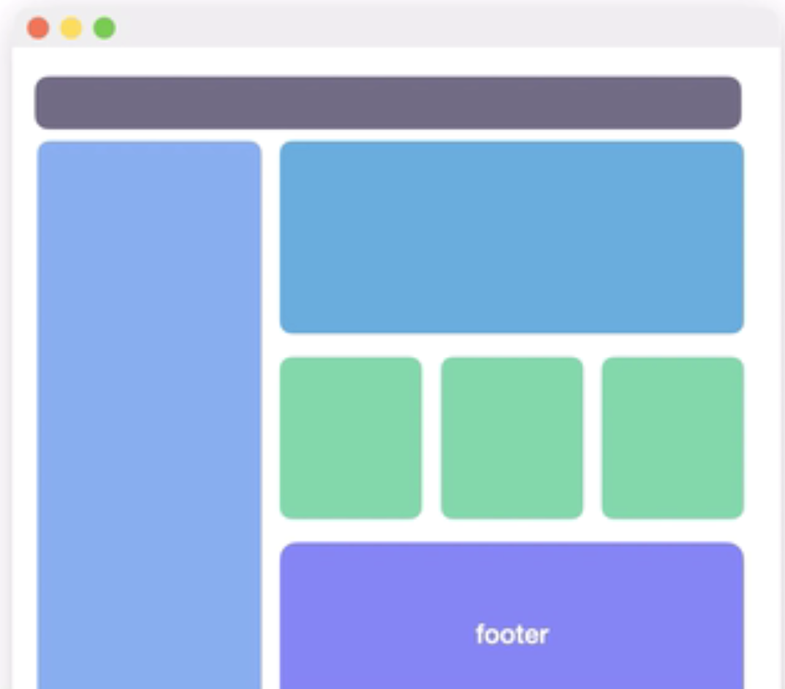

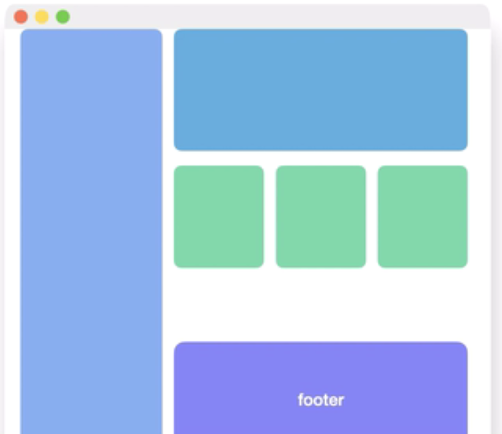

```css
footer {
    position: fixed;
    bottom: 0;
}
```

absolute和fixed这种脱离正常文档流的定位方式会把元素的宽高设置成内容的宽高。可以通过设置`left:0;right:0;`来让宽度占满包含容器，设置`top:0;bottom:0;`来让高度占满包含容器。

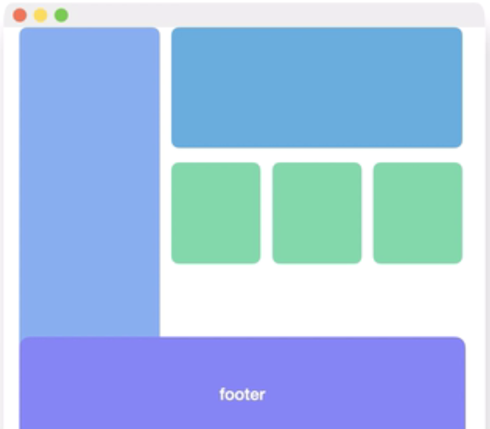

```css
footer {
    position: fixed;
    bottom: 0;
    left: 0;
    right: 0;
}
```

### sticky

sticky是一个比较新的属性，相当于relative和fixed的结合体。

它可以让元素在离窗口一定位置时，把它变成固定在这个位置，而其他情况下就还在正常的文档流中。它也是通过`left`,`right`,`top`,`bottom`属性来设置距离浏览器窗口左上右下多少像素距离时把它固定住。

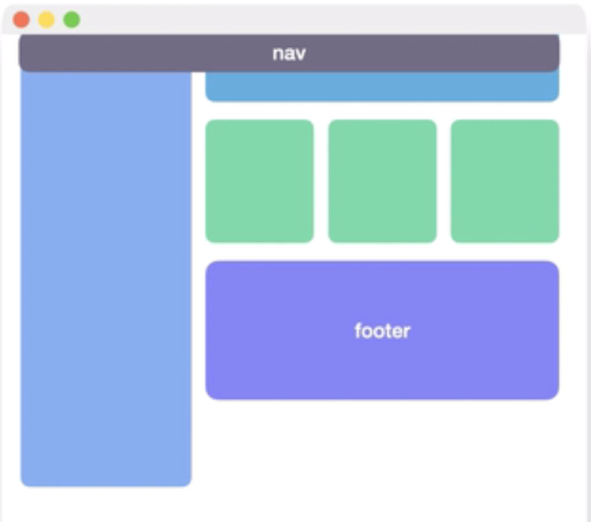

```css
nav {
    position: sticky;
    top: 0;
}
```

### z-index

除了sticky定位外，其他方式设置了偏移之后，很可能覆盖在其他元素的上面。比如说一个包含元素内同时拥有两个设置了absolute定位的元素，那么后定义的absolute定位的元素会覆盖在先定义的上面。如果想让先定义的在上面的话，可以给它设置一个较大的`z-index数值`来实现。

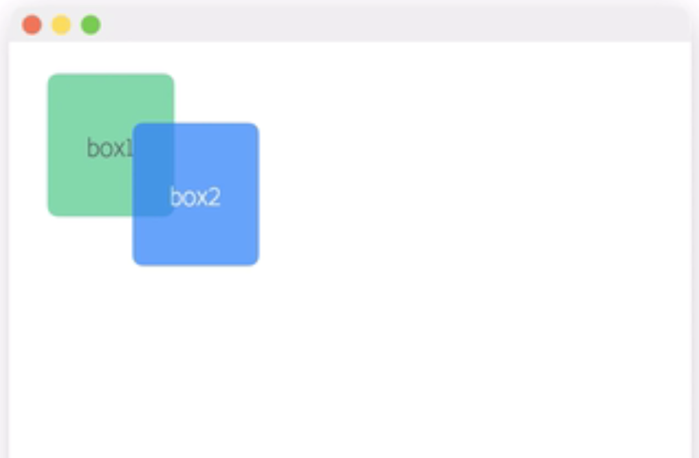

```html
<div class="container">
        <div class="box1"></div>
        <div class="box2"></div>
</div>
```

```css
.box2 {
    position: absolute;
    top: 30px;
    left: 50px;
}

.box1 {
    position: absolute;
    z-index: 1;
}
```

z-index是设置z轴方向的偏移，也就说浏览器到人眼的方向，数值越大离人眼越近，所以会覆盖在数值小的上面。

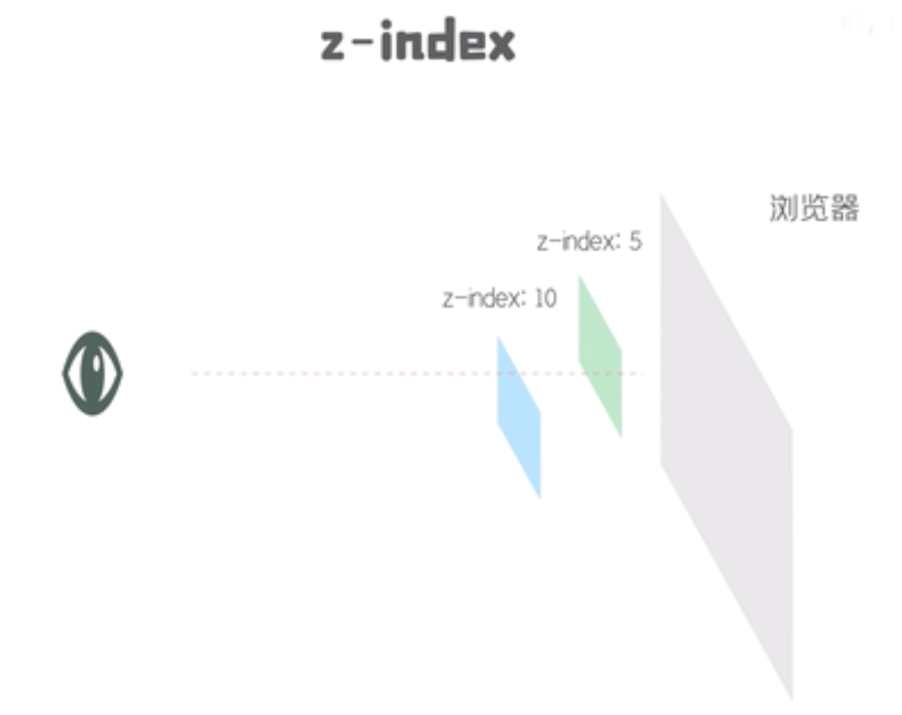

除了sticky外所有的定位都可以通过z-index来设置z轴偏移。它的默认值是0，可以设置成正数也可以设置成负数。

需要注意的是，如果两个定位元素分别在两个不同的包含元素中，并且这两个包含元素中也设置了z-index的话，那么这两个元素的堆叠顺序就取决于包含元素的z-index

```html
<div class="container1">
        <div class="box1"></div>
</div>
<div class="container2">
        <div class="box2"></div>
</div>
```

```css
.container1 {
    position: relative;
    z-index: 10;
}
.container2 {
    position: relative;
    z-index: 5;
}
.box1 {
    position: absolute;
    z-index: 100;
}
.box2 {
    position: absolute;
    z-index: 50;
}
```

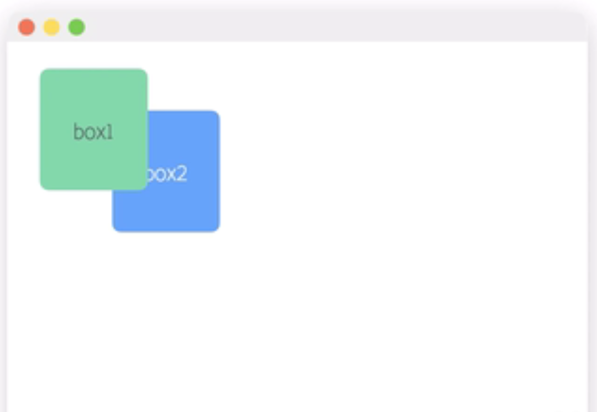
