# 布局实现
一般网页的设计实现如下：


## 流式布局

块的默认布局叫做流式布局，顾名思义，就是像水一样流动。默认的块宽度会充满整个页面，前面的块在前面，后面的块在后面。即使我们把块的宽度调整到只有页面的一半，即使页面这一行有足够的空间，容纳这两个块，也会依据这个次序往下排列，这就叫做流样式布局。


## 浮动布局

浮动布局(float布局)是CSS中一种比较麻烦的属性，涉及到BFC和清除浮动。


float本身是用来做图文混排、文字环绕的效果。

### float属性的特点

* 元素浮动

* 脱离文档流，但不脱离文本流

### float所带来的影响

1. 对自身的影响：
    * 形成"块"(BFC)
    * 位置尽量靠上
    * 位置尽量靠左/右
2. 对兄弟元素的影响：
    * 不影响其他块级元素的位置
    * 影响其他块级元素的内部文本
3. 对父级元素的影响：
    * 从父级的布局中“消失”
    * 造成父级元素的高度塌陷：父级元素撑开div1之后（父级元素里没有其他元素的情况下），如果设置div1为float之后，会让父级元素的高度变为0.

## 定位布局

CSS定位布局是通过`position`属性设置的，它有`static`,`relative`,`absolute`,`fixed`,`sticky`这几种属性。

### static

static是静态定位，它是position的默认值，也是CSS的默认布局方式，从上到下，从左到右排列元素，它属于正常的文档流。


```css
div {
    /* 默认值，可不设置 */
    position: static;
}
```

### relative

relative相对定位，它是确定元素的默认位置之后，通过`left`,`right`,`top`,`bottom`属性来设置位置的偏移。

但是元素所占的空间还保留在原位，其他元素不会挤占它原本的空间。


```css
.box2 {
    position: relative;
    left: 5px;
    top: 5px;
}
```

### absolute

absolute绝对定位，它会把元素移出正常的文档流，后面的元素会挤占它的空间，而他自己会覆盖在挤占它空间的元素的上方。

它也可以通过设置`left`,`right`,`top`,`bottom`属性来设置位置的偏移。但与relative不同的是，这些属性是相对于包含它的元素来偏移的。

包含元素指的是，如果这个元素的所有父级都没有设置`position`、`transform`或者`perspective`属性，那么包含元素就是包含HTML元素的容器，也就是说是浏览器的窗口，这时偏移是相对于浏览器左上角进行偏移的。


```css
.box2 {
    position: absolute;
    top: 15px;
    left: 15px;
}
```

如果父级元素有设置了`position（除了static属性）`、`transform`或者`perspective`属性,那么包含元素就是指离它最近的设置了这些属性的元素，它是相对于父级元素的padding盒子边界进行偏移的，无论父级元素的内间距有多大，都会与边框与padding交界处开始计算偏移。


```css
.container {
    position: relative;
    /* transform */
    /* perspective */
}
.box2 {
    position: absolute;
    top: 15px;
    left:15px;
}
```

我们通常使用relative设置包含元素，因为它不会影响正常的文档流。（**子绝父相**）

absolute是用途最广的定位方式，可以实现弹出层，叠加，不规则的位置等布局形式。

### fixed

fixed固定定位，跟absolute定位类似，只是它的包含元素是当前浏览器窗口。

当通过`left`,`right`,`top`,`bottom`属性来设置偏移后，无论页面怎么滚动，它都会固定在指定位置。适合用于固定浮窗，导航条的布局。


```css
footer {
    position: fixed;
    bottom: 0;
}
```

absolute和fixed这种脱离正常文档流的定位方式会把元素的宽高设置成内容的宽高。可以通过设置`left:0;right:0;`来让宽度占满包含容器，设置`top:0;bottom:0;`来让高度占满包含容器。


```css
footer {
    position: fixed;
    bottom: 0;
    left: 0;
    right: 0;
}
```

### sticky

sticky是一个比较新的属性，相当于relative和fixed的结合体。

它可以让元素在离窗口一定位置时，把它变成固定在这个位置，而其他情况下就还在正常的文档流中。它也是通过`left`,`right`,`top`,`bottom`属性来设置距离浏览器窗口左上右下多少像素距离时把它固定住。


```css
nav {
    position: sticky;
    top: 0;
}
```

### z-index

除了sticky定位外，其他方式设置了偏移之后，很可能覆盖在其他元素的上面。比如说一个包含元素内同时拥有两个设置了absolute定位的元素，那么后定义的absolute定位的元素会覆盖在先定义的上面。如果想让先定义的在上面的话，可以给它设置一个较大的`z-index数值`来实现。


```html
<div class="container">
        <div class="box1"></div>
        <div class="box2"></div>
</div>
```

```css
.box2 {
    position: absolute;
    top: 30px;
    left: 50px;
}

.box1 {
    position: absolute;
    z-index: 1;
}
```

z-index是设置z轴方向的偏移，也就说浏览器到人眼的方向，数值越大离人眼越近，所以会覆盖在数值小的上面。


除了sticky外所有的定位都可以通过z-index来设置z轴偏移。它的默认值是0，可以设置成正数也可以设置成负数。

需要注意的是，如果两个定位元素分别在两个不同的包含元素中，并且这两个包含元素中也设置了z-index的话，那么这两个元素的堆叠顺序就取决于包含元素的z-index

```html
<div class="container1">
        <div class="box1"></div>
</div>
<div class="container2">
        <div class="box2"></div>
</div>
```

```css
.container1 {
    position: relative;
    z-index: 10;
}
.container2 {
    position: relative;
    z-index: 5;
}
.box1 {
    position: absolute;
    z-index: 100;
}
.box2 {
    position: absolute;
    z-index: 50;
}
```


## flex布局

特点：
1. 操作方便，布局极其简单，`移动端`应用很广泛
2. PC端浏览器支持情况较差
3. IE 11或更低版本，不支持或仅部分支持

### 布局原理

flex 弹性布局，用来为盒状模型提供最大的灵活性，任何一个容器都可以指定为flex布局。

注意：
* 当为父盒子设定flex布局以后，子元素的float、clear和vertical-align属性将失效。
* 伸缩布局 = 弹性布局= 伸缩盒布局 = 弹性盒布局 = flex布局

采用flex布局的元素，称为flex容器（flex container），简称“容器”。它的所有子元素自动成为容器成员，称为flex项目（flex item），简称“项目”。项目可以横向排列也可以纵向排列。

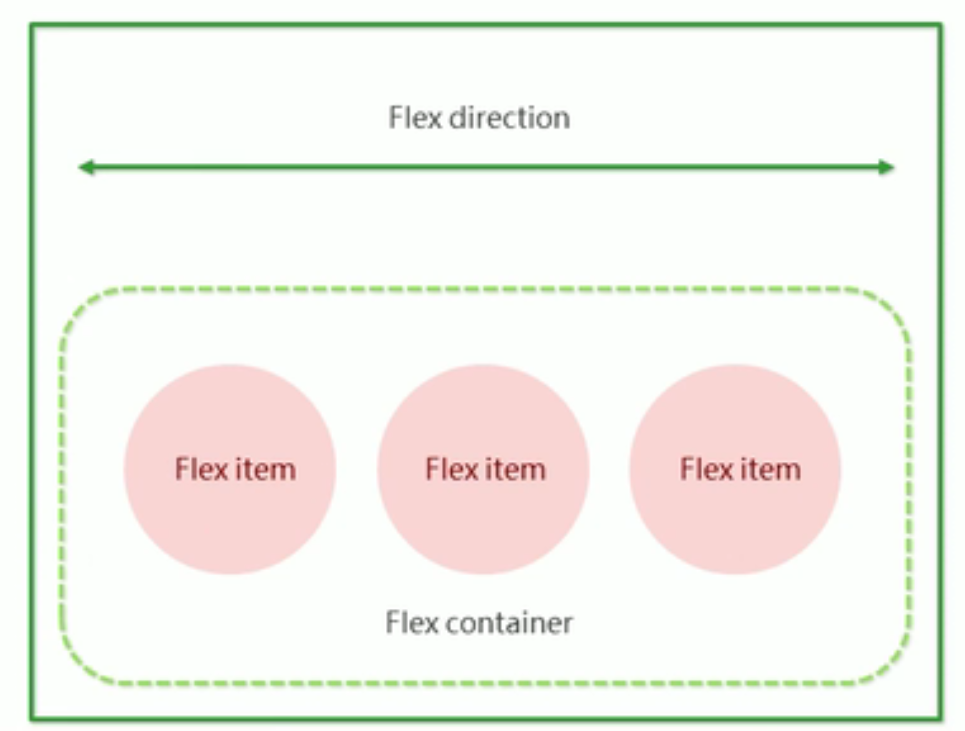

flex布局就是通过给父盒子添加flex属性，来控制子盒子的位置和排列方式。

### flex布局父项常见属性

常见对父元素设置的属性有如下6个：
* flex-direction: 设置主轴的方向
* justify-content: 设置主轴上的子元素排列方式
* flex-wrap: 设置子元素是否换行
* align-content: 设置侧轴上的子元素的排列方式（多行）
* align-items: 设置侧轴上的子元素排列方式（单行）
* flex-flow: 符合属性，相当于同时设置了flex-direction和flex-wrap

#### 主轴和侧轴

在flex布局中，是分为主轴和侧轴两个方向，同样的叫法有：行和列、x轴和y轴

* 默认主轴方向就是x轴方向，水平向右

* 默认侧轴方向就是y轴方向，水平向下

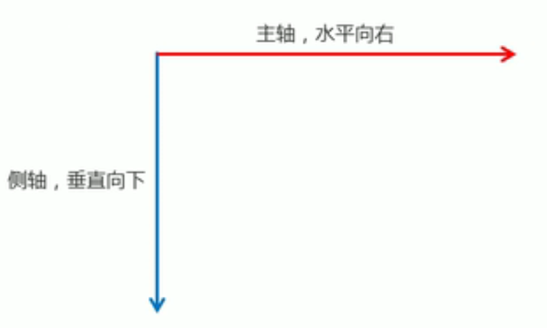
#### flex-direction

flex-direction 属性决定主轴的方向（即项目的排列方向）

**注意：**
主轴和侧轴是会变化的，就看flex-direction设置谁为主轴，剩下的就是侧轴。而我们的子元素是跟着主轴来排列的

属性值：

| 属性值 | 说明 |
| --- | --- |
| row | 默认值从左到右 |
| row-reverse | 从右到左 |
| column | 从上到下 |
| column-reverse | 从下到上 |

#### justify-content 

justify-content属性定义了`项目`在主轴上的对齐方式。

| 属性值 | 说明 |
| --- | --- |
| flex-start | 默认值 从头部开始 如果主轴是x轴，则从左到右|
| flex-end | 从尾部开始排列 |
| center | 在主轴居中对齐 如果主轴是x轴则水平居中 |
| space-around | 平分剩余空间 |
| space-between | 先两边贴边 再平分剩余空间 |

#### flex-wrap

flex-wrap设置子元素是否换行，默认情况下，项目都排在一条线上。flex-wrap属性定义，flex布局中默认是不换行的。

| 属性值 | 说明 |
| --- | --- |
| nowrap | 默认值，不换行 |
| wrap | 换行 |

#### align-items

align-items设置侧轴上的子元素排列方式（单行）。

该属性是控制子项在侧轴（默认是y轴）上的排列方式 在子项为单项的时候使用

| 属性值 | 说明 |
| --- | --- |
| flex-start | 默认值 从上到下 |
| flex-end | 从下到上 |
| center | 挤在一起居中（垂直居中） |
| stretch | 拉伸 |

#### align-content

align-content设置侧轴上的子元素的排列方式（多行）

该属性设置子项在侧轴上的排列方式，并且只能用于子项出现换行的情况（多行），在单行下是没有效果的。

| 属性值 | 说明 |
| --- | --- |
| flex-start | 默认值 在侧轴的头部开始排列 |
| flex-end | 在侧轴的尾部开始排列 |
| center | 在侧轴中间显示 |
| space-around | 子项在侧轴平分剩余空间 |
| space-between | 子项在侧轴先分布在两头， 再平分剩余空间 |
| stretch | 设置子项元素高度平分父元素高度 |

#### flex-flow

flex-flow属性是flex-direction和flex-wrap属性的复合属性

```
flex-flow: flex-direction flex-wrap;
```

### flex布局子项常见属性

常见对子元素设置的属性有如下3个：
* flex：子项目占的分数
* align-self：控制子项自己在侧轴的排列方式
* order：定义子项的排列顺序（前后顺序）

#### flex

flex属性定义子项目分配剩余空间，用flex来表示占多少份数。

```css
.item {
    flex: <number>;  /* default 0 */
}
```

#### align-self

align-self控制子项自己在侧轴上的排列方式

align-self属性允许单个项目有与其他项目不一样的对齐方式，可覆盖align-items属性。

默认值为auto，表示继承父元素的align-items属性，如果没有父元素，则等同于stretch。

```css
span:nth-child(3) {
    align-self: flex-end;
}
```

#### order

order 属性定义项目的排列顺序

数值越小，排列越靠前，默认为0。

```css
span:nth-child(2) {
    order: -1;
}
```

## Grid布局

`Flex`布局是轴线布局，只能指定`项目`针对轴线的位置，可以看作是一维布局，`Grid`布局则是将容器划分成`行`和`列`，产生单元格，然后指定项目所在的单元格，可以看作是二维布局，Grid布局远比Flex布局强大。

### 基本概念

1. 容器 --- 有容器属性

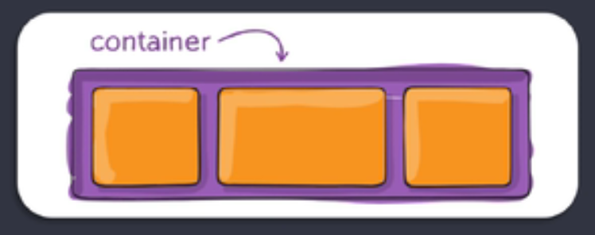

2. 项目 --- 有项目属性

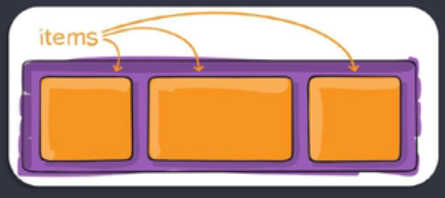

Grid布局中最基础的概念就是容器和项目，其余Flex布局中的容器和项目可以理解为一样的。


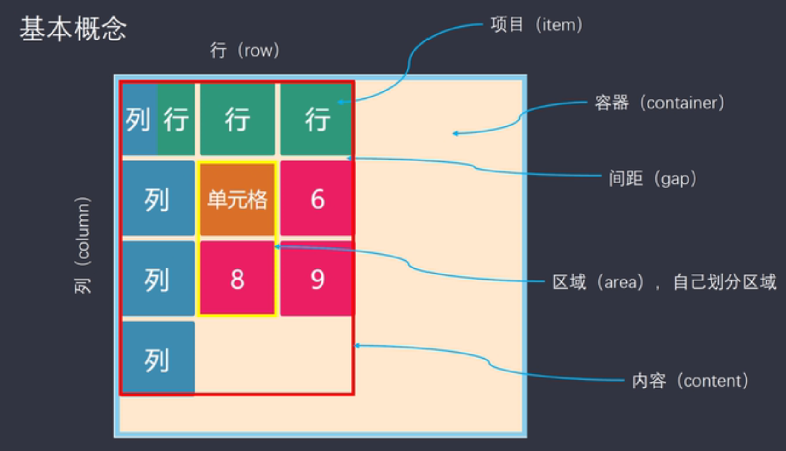

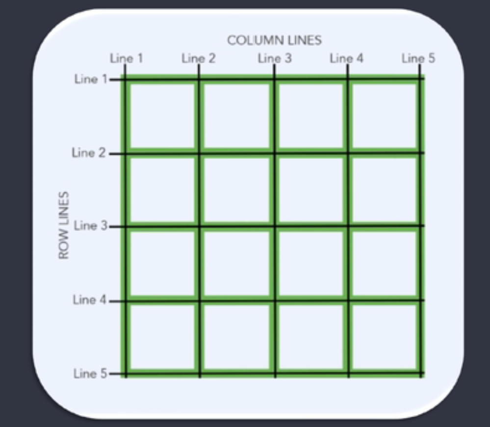

* 容器: 可以理解为包含多个单独子元素的父元素
* 项目(item): 可以理解为每个单独的子元素
* 间距(gap): 可以理解为每个单独子元素之间的距离
* 区域(area): 可以理解为让多个单独子元素之间合为一个元素
* 内容(content): 可以理解为容器内所有的项目
* 网格线: 比如一个4x4的布局，那么就有5x5的网格线，网格线的主要作用就是给元素定位


### Grid布局容器常见属性

常见对容器设置的属性有如下15个：

* grid-template-columns
* grid-template-rows
* grid-row-gap
* grid-column-gap
* grid-gap
* grid-template-areas
* grid-auto-flow
* justify-items
* align-items
* place-items
* justify-content
* align-content
* place-content
* grid-auto-columns
* grid-auto-rows

#### grid-template-*

想要多少行或者列，就填写相应属性值的个数。不填写则自动分配。

``` css
.container {
    display: grid;
    /* 创建一个3x4的Grid */
    grid-template-columns: 100px 100px 100px;
    grid-template-rows: 100px 100px 100px 100px;
}
```

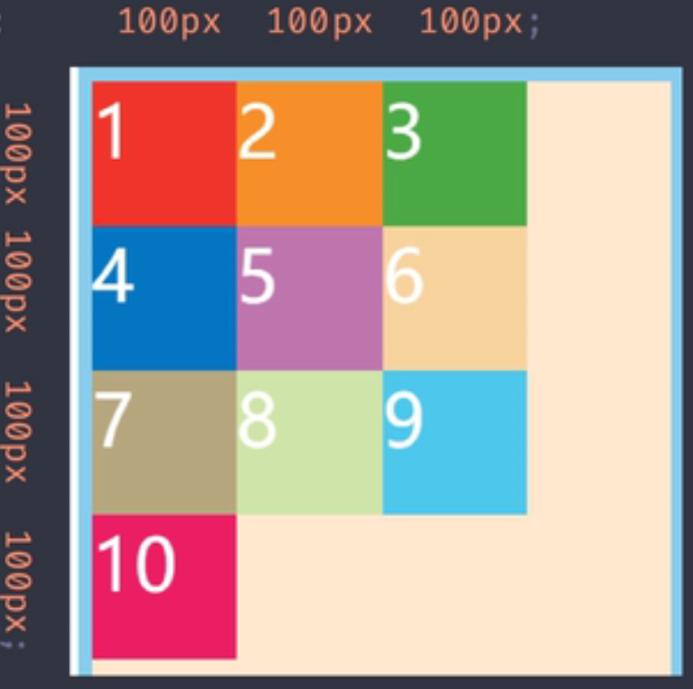

如果只设置行，那么容器中的项目的宽会撑满容器。
如果只设置列，那么容器中的项目的高会撑满容器。

**几个实用函数/关键字：**

##### repeat

##### repeat()。 第一个参数是重复的`次数`，第二个参数是所要重复的值。

```css
grid-template-columns: 100px 100px 100px;
/* 这两种写法是相等的 */
grid-template-columns: repeat(3, 100px);
```
##### auto-fill

有时，单元格的大小是固定的，但是容器的大小不确定，实用`auto-fill`这个属性就会自动填充。

```css
grid-template-columns: repeat(auto-fill, 100px);
```


#####  fr

为了方便表示`比例关系`，Grid布局提供了`fr`关键字(fraction的缩写，意为“片段”)

```css
grid-template-columns: 1fr 2fr 3fr; /* 宽度平均分为6份，第一列占1份，第二列占2份，第三列占3份*/
grid-template-columns: repeat(4, 1fr); /*宽度平均分成3份*/
```


##### minmax()

minmax()函数产生一个长度范围，表示长度就在这个范围之中，它接收两个参数，分别为最小值和最大值。

```css
/* 宽度平均分2份， 第一列占1份， 第二列占一份，但最小不能小于150px */
grid-template-columns: 1fr minmax(150px, 1fr);
```


##### auto

auto表示由浏览器自己决定长度

```css
/* 宽度平均分3份， 第一列占1份，第三列占一份，第二列占容器剩下的所有空间 */
grid-template-columns: 100px auto 100px;
```


##### 网格线

网格线可以用方括号定义网格线名称，方便以后的引用

```css
grid-template-columns: [c1] 100px [c2] 100px [c3] 100px [c4];
```


#### grid-row-gap/grid-column-gap


item(项目)相互之间的距离

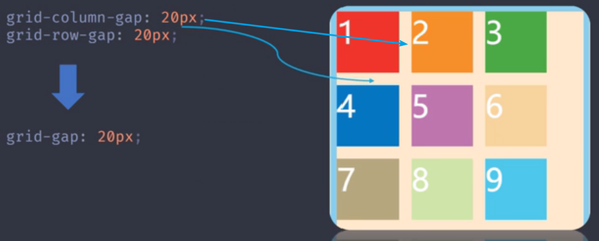


**注意：**

根据最新标准，上面三个属性名的grid-前缀已经删除，现在标准都写`column-gap`,`row-gap`,`gap`这三个属性。

```css
{
    column-gap: 10px;
    row-gap: 10px;

    gap: 10px; /* 上面两个的简写， 一个属性时代表两个都是同样的间距*/
}
```


#### grid-template-areas

一个区域由`单个或多个单元格`组成。具体使用，需要在项目属性里面设置

```css
{
    /* 创建9个不同区域 */
    grid-tempalte-areas: 'a b c' 'd e f' 'g h i';
    
    /* 创建3个不同区域 第一行是同一个区域，第二行是同一个区域，第三行是同一个区域 */
    grid-template-areas: 'a a a' 'b b b' 'c c c';
}
```

区域不需要利用时，则使用`点(.)`表示。

```css
{
    grid-tempalte-areas: 'a . c' 'd . f' 'g . i';
}
```


区域的命名会影响到网格线。每个区域的起始网格线会自动命名为`区域名-start`，终止网格线自动命名为`区域名-end`。


#### grid-auto-flow


划分网格以后，容器的子元素会按照顺序，自动放置在每一个网格。默认的放置顺序是`先行后列`，即先填满第一行，再开始放入第二行。


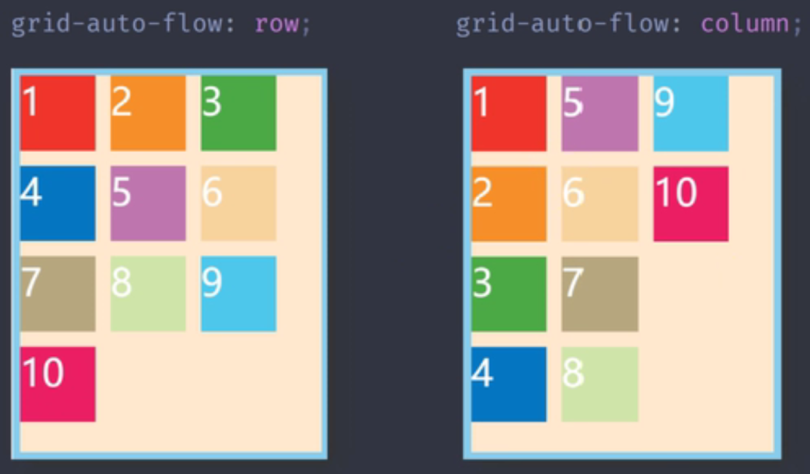


grid-auto-flow有三个值：row，column，dense

- `row`

  该关键字指定自动布局算法按照通过逐行填充来排列元素，在必要时增加新行。如果既没有指定 `row` 也没有 `column`，则默认为 `row`。

- `column`

  该关键字指定自动布局算法通过逐列填充来排列元素，在必要时增加新列。

- `dense`

  该关键字指定自动布局算法使用一种“稠密”堆积算法，如果后面出现了稍小的元素，则会试图去填充网格中前面留下的空白。这样做会填上稍大元素留下的空白，但同时也可能导致原来出现的次序被打乱。

  如果省略它，使用一种「稀疏」算法，在网格中布局元素时，布局算法只会「向前」移动，永远不会倒回去填补空白。这保证了所有自动布局元素「按照次序」出现，即使可能会留下被后面元素填充的空白。

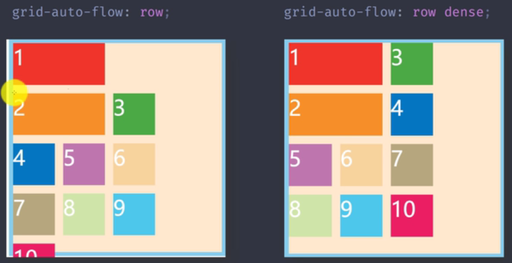


#### justify-items/align-items

justify-items属性设置单元格内容的水平对齐方式

```css
{
    justify-items: start | end | center | stretch;
}
```

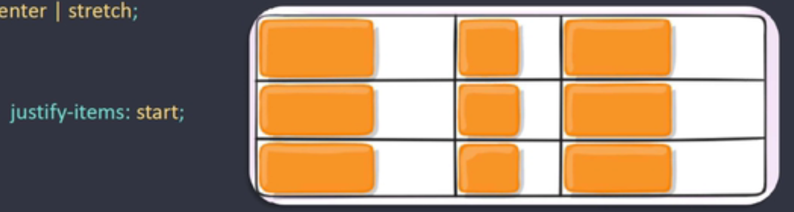

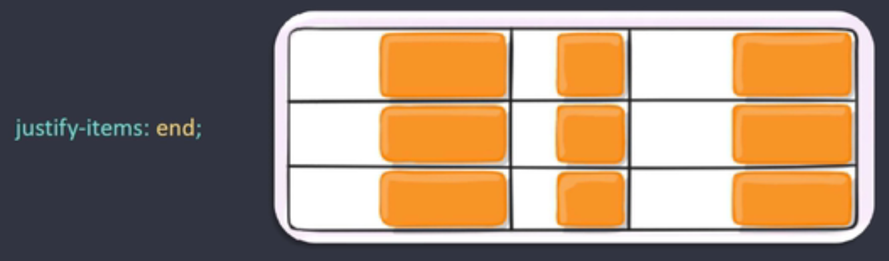

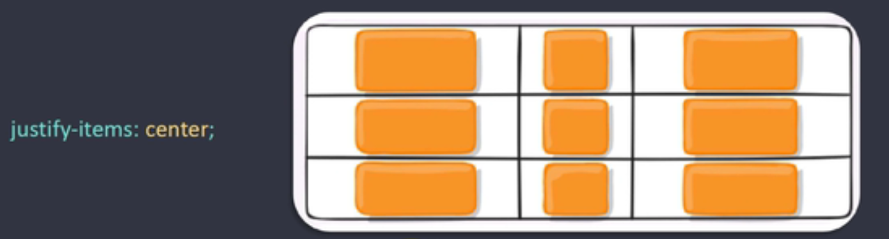

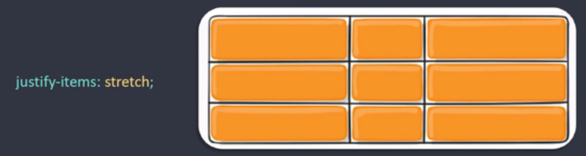


align-items属性设置单元格内容的垂直对齐方式

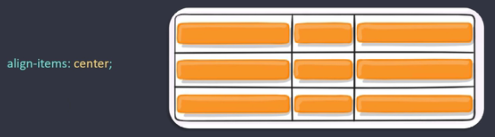


**place-items**属性是align-items属性和justify-items属性的合并简写形式，其语法格式如下：

```css
{
    place-items: align-items justify-items;
}
```


#### justify-content/align-content

justify-content属性是设置`整个内容`区域的`水平对齐`方式

其基本语法格式如下：

```css
{
    justify-content: start | end | center | stretch | space-around | space-between | space-evenly;
}
```


align-content属性是设置`整个内容`区域的`垂直对齐`方式

其基本语法格式如下：

```css
{
    align-content: start | end | center | stretch | space-around | space-between | space-evenly;
}
```


#### grid-auto-columns/grid-auto-rows

grid-auto-columns属性是用来设置`多出来的项目`的高

grid-auto-rows属性是用来设置`多出来的项目`的宽


```css
{
    grid-auto-columns: 50px;
    grid-auto-rows:50px;
}
```

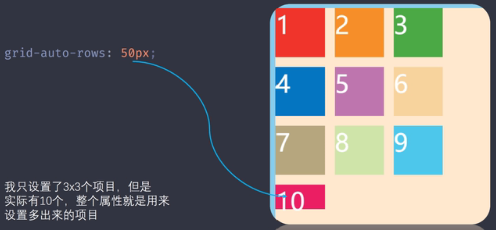


### Grid布局项目属性

常见对项目设置的属性有如下10个：

* grid-column-start
* grid-column-end
* grid-row-start
* grid-row-end
* grid-column
* grid-row
* grid-area
* justify-self
* align-self
* place-self


#### grid-column-start/grid-column-end/grid-row-start/grid-row-end

一句话来解释，用来指定item的具体位置，根据在哪跟网格线。

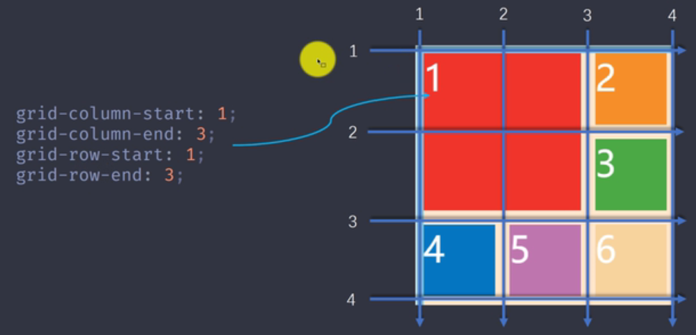


gird-column为grid-column-start和grid-column-end的简写

```css
{
    grid-column: grid-column-start/grid-column-end;
}
```

grid-row为grid-row-start和grid-row-end的简写

```css
{
    grid-row: gird-row-start/grid-row-end;
}
```


#### grid-area


grid-area属性指定项目放在哪一个指定区域内


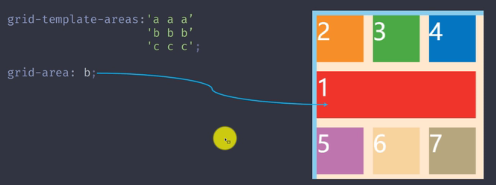


grid-area属性还可以用作grid-row-start、grid-column-start、grid-row-end、 grid-column-end的合并简写形式，直接指定项目的位置。


其基本语法格式如下：

```css
{
    grid-area: grid-row-start/grid-column-start/grid-row-end/grid-column-end;
}
```

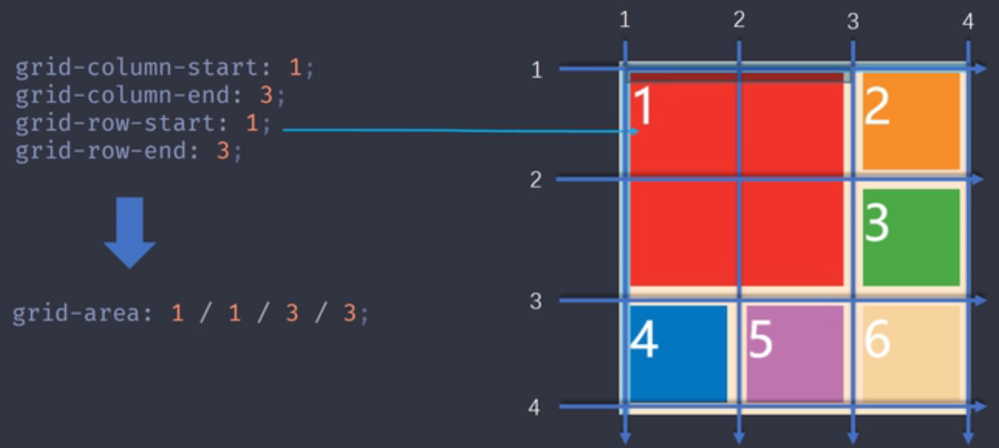


#### justify-self/align-self/place-self


justify-self属性设置单元格内容的水平位置（左中下拉伸），跟justify-items属性的用法完全一致。但只作用于单个项目（水平方向）

```css
{
    justify-self: start | end | center | stretch;
}
```

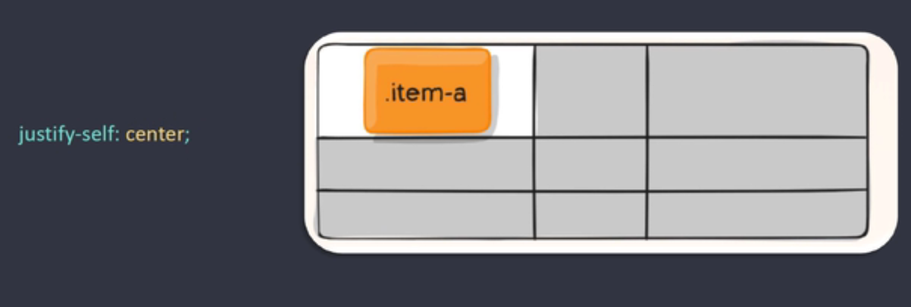


align-self属性设置单元格内容的垂直位置（上中下拉伸），跟justify-items属性的用法完全一致。但只作用于单个项目（垂直方向）

```css
{
    align-self: start | end | center | stretch;
}
```

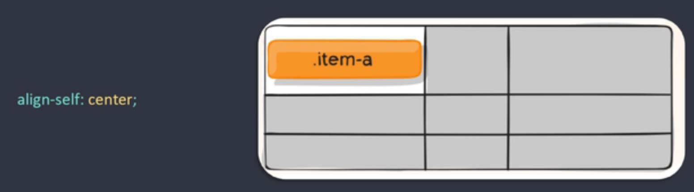


place-self属性是align-self属性和justify-self属性的合并简写形式

其语法格式如下：

```css
{
    place-self: align-self justify-self;
}
```

