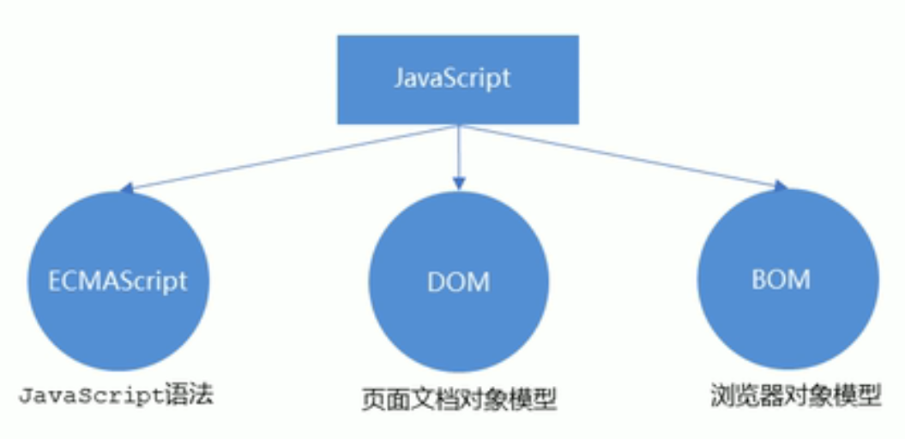
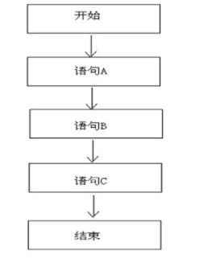
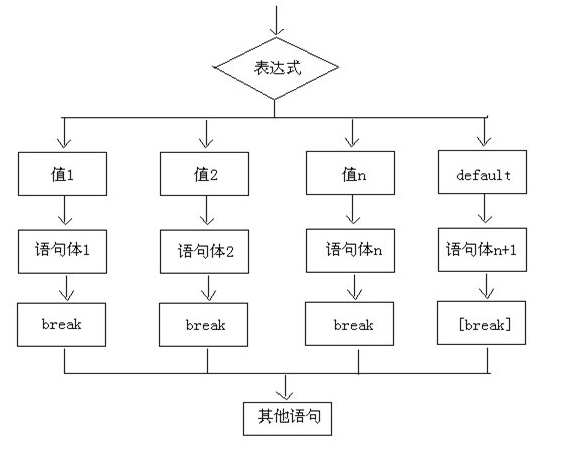
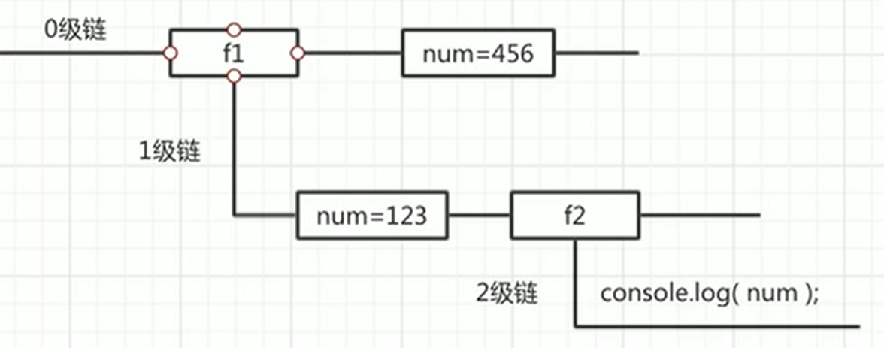

# 初始JavaScript

## JavaScript的组成



### ECMAScript

ECMAScript是由ECMA国际（原欧洲计算机制造商协会）进行标准化的一门编程语言，这种语言在万维网上应用广泛，它往往被称为JavaScript或JScript，但实际上后两者是ECMAScript语言的实现和扩展。

ECMAScript规定了JS的编程语法和基础核心知识，是所有浏览器厂商共同遵守的一套JS语法工业标准。

### DOM--文档对象模型

文档对象模型是W3C组织推荐的处理可扩展标记语言的标准编程接口，通过DOM提供的接口可以对页面上的各种元素进行操作。

### BOM -- 浏览器对象模型

BOM是指浏览器对象模型，它提供了独立于内容的、可以与浏览器窗口进行互动的对象结构。通过BOM可以操作浏览器窗口，比如弹出框、控制浏览器跳转、获取分辨率等。

## JavaScript 的引入方式

### 方式1：行内式
代码举例：
```html
<input type="button" value="点我点我" onclick="alert('千古壹号')" />
```
完整的可执行代码如下：
```html
<!DOCTYPE html>
<html lang="en">
    <head>
        <meta charset="UTF-8" />
        <meta name="viewport" content="width=device-width, initial-scale=1.0" />
        <title>Document</title>
    </head>
    <body>
        <input type="button" value="点我点我" onclick="alert('千古壹号的方式1')" />
    </body>
</html>
```

分析：

* 可以将单行或少量 JS 代码写在HTML标签的事件属性中（以 on 开头的属性），比如放在上面的 onclick点击事件中。

* 这种书写方式，不推荐使用，原因是：可读性差，尤其是需要编写大量 JS代码时，容易出错；引号多层嵌套时，也容易出错。

* 关于代码中的「引号」，在HTML标签中，我们推荐使用双引号, JS 中我们推荐使用单引号。

### 方式2、内嵌式
我们可以在html 页面的 `<body>` 标签里放入`<script type=”text/javascript”></script>`标签对儿，并在`<script>里书写JavaScript 代码`：
```html
<!DOCTYPE html>
<html lang="en">
<head>
	<meta charset="UTF-8">
	<title>Document</title>
</head>
<body>
	<script type="text/javascript">
		// 在这里写 js 代码
		alert('千古壹号的方式2');
		console.log('qianguyihao 方式2');
	</script>
</body>
</html>
```
分析：

* text表示纯文本，因为JavaScript也是一个纯文本的语言。

* 可以将多行JS代码写到 <script> 标签中。

* 内嵌式 JS 是学习时常用的方式。

### 方式3：引入外部的 JS 文件
```html
<!DOCTYPE html>
<html lang="en">
<head>
	<meta charset="UTF-8">
	<title>Document</title>
</head>
<body>
	<!-- 引入外部的 js 文件 -->
	<script src="tool.js"></script>
</body>
</html>
```
上面这段代码，依然是放到body标签里，可以和内嵌的js代码并列。

另外，引用外部 JS文件的 script 标签中间不可以再写代码。

总结：

我们在实战开发中，基本都是采用方式3，因为这种方式，可以确保 html 文件和 js 文件是分开的，有利于代码的结构化和复用。很少会有人把一大堆 js 代码塞到 html 文件里。

## JavaScript 的注释

单行注释：

```javascript
// 我是注释
```

多行注释：

```javascript
/*
	多行注释1
	多行注释2
*/
```

## Javascript 输入输出语句

### 弹出警告框：alert语句

alert（英文翻译为“警报”）的用途：弹出“警告框”。

代码举例如下：

```html
<!DOCTYPE html>
<html lang="en">
    <head>
        <meta charset="UTF-8" />
        <meta name="viewport" content="width=device-width, initial-scale=1.0" />
        <title>Document</title>
    </head>
    <body>
        <script>
            alert('千古壹号');
        </script>
    </body>
</html>
```

上面的代码中，如果写了两个alert()语句的话，网页的效果是：弹出第一个警告框，点击确定后，继续弹出第二个警告框。

### 控制台输出：console.log("")

console.log("")表示在控制台中输出。console表示“控制台”，log表示“输出”。

在Chrome浏览器中，按F12即可打开控制台，选择「console」栏，即可看到打印的内容。

控制台是工程师、程序员调试程序的地方。程序员经常使用这条语句输出一些东西，来测试程序是否正确。

### 弹出输入框：prompt()语句

prompt()就是专门用来弹出能够让用户输入的对话框。用得少，测试的时候偶尔会用。

```js
var a = prompt("请随便输入点什么东西吧");
console.log(a);
```

prompt()语句中，用户不管输入什么内容，都是`字符串`。

alert()和prompt()的区别：

* alert() 可以直接使用。

* prompt() 会返回用户输入的内容。我们可以用一个变量，来接收用户输入的内容。

## JavaScript 变量

### 变量的概念

**变量**：是用于存放数据的容器。我们通过「变量名」获取数据，甚至可以修改数据。

变量还可以用来保存字面量。

**本质**：变量是程序在内存中申请的一块用来存放数据的空间。

### 变量的声明和赋值

#### 变量的声明/变量的定义

在`ES6`语法之前，统一使用`var`关键字来声明一个变量。比如：

```js
var name; // 声明一个名为 name 的变量
```

PS：在JavaScript中，永远都是用var来定义变量（在ES6 之前），这和C、Java等语言不同。

在`ES6`语法及之后，可以使用`const`、`let`关键字来声明一个变量

```js
const name; // 定义一个常量

let age;
```

如果你想定义一个`常量`，就用`const`；如果你想定义一个`变量`，就用`let`。

#### 变量的赋值

```js
name = "coder"
```

变量的声明和赋值，写在一起，举例如下：

```js
var a = 100; // ES5语法

const b = hello; // ES6 语法
let b = world; // ES6 语法
```

#### 变量的初始化

声明一个变量并赋值， 我们称之为变量的初始化。

### 变量声明和赋值的补充

#### 更新变量

一个变量被重新复赋值后，它原有的值就会被覆盖，变量值将以最后一次赋的值为准。

```js
var a = 100;
a = 110;

console.log(a); // 打印结果：110。因为 110 覆盖了 100
```

#### 同时声明多个变量

同时声明多个变量时，只需要写一个 var， 多个变量名之间用英文逗号隔开。

```js
var name = '千古壹号', age = 27, number = 100;
```

#### 变量声明的几种特殊情况
变量建议先声明，再使用。否则可能会报错。具体如下。

写法1、先声明，再赋值：（正常）

```js
var a;
a = 100;
console.log(a); // 打印结果：100
```

写法2、不声明，只赋值：（正常）

```js
a = 100;
console.log(a); // 打印结果：100
```

写法3、只声明，不赋值：（注意，打印 undefined）

```js
var a;
console.log(a); // 打印结果：undefined
```

写法4、不声明，不赋值，直接使用：（会报错）

```js
console.log(a); // 会报错
```

### 变量的命名规范

* 只能由字母(A-Z、a-z)、数字(0-9)、下划线(_)、美元符( $ )组成

* 不能以数字开头。也就是说，必须以字母(A-Z、a-z)、下划线(_)或者美元符( $ )开头。变量名中不允许出现空格。

* 不用使用 JS 语言中保留的「关键字」和「保留字」作为变量名。

* 建议用驼峰命名规则。比如getElementById、matherAndFather、aaaOrBbbAndCcc

* 变量名会区分大小写(javascript 是区分大小写的语言)。

* 变量名长度不能超过255个字符。

* 汉语可以作为变量名。但是不建议使用，因为 low。

## 数据类型

JS 的变量数据类型，是在程序运行的过程中，根据等号右边的值来确定的。而且，变量的数据类型是可以变化的。比如说：

```js
var name = 'qianguyihao';

name = 123; // 强制将变量 name 修改为 数字类型
```

**JS中一共有六种数据类型**

* **基本数据类型（值类型）**：String 字符串、Number 数值、Boolean 布尔值、Null 空值、Undefined 未定义。

* **引用数据类型（引用类型）**：Object 对象。

注意：内置对象 Function、Array、Date、RegExp、Error等都是属于 Object 类型。也就是说，除了那五种基本数据类型之外，其他的，都称之为 Object类型。


**数据类型之间最大的区别：**

* 基本数据类型：参数赋值的时候，传数值。

* 引用数据类型：参数赋值的时候，传地址（修改的同一片内存空间）。

### 基本数据类型

#### 数字型 Number

JavaScript数字类型既可以用来保存整数值，也可以保存小数（浮点数）。

```js
var age = 22;
var PI = 3.14;
```

`isNaN()`这个方法用来判断变量是否是非数字类型，如果是数字类型则返回的是`false`,如果不是数字类型则返回的是`true`。

```js
console.log(isNaN(12)); // false
console.log(isNaN('12')); // false
console.log(isNaN('12a')); // true
```

#### 字符串型 String

字符串型可以是引号中的任意文本，其语法为：双引号`""`或者单引号 `''`。

**注意事项**：

1. 单引号和双引号不能混用。比如下面这样写是不可以的：

2. 同类引号不能嵌套：双引号里不能再放双引号，单引号里不能再放单引号。

3. 单引号里可以嵌套双引号；双引号里可以嵌套单引号。


**转义字符**：

在字符串中我们可以使用`\`作为转义字符，当表示一些特殊符号时可以使用`\`进行转义。

* \" 表示 " 双引号

* \' 表示 ' 单引号

* \\ 表示\

* \r 表示回车

* \n 表示换行。n 的意思是 newline。

* \t 表示缩进。t 的意思是 tab。

* \b 表示空格。b 的意思是 blank。

##### 获取字符串长度

字符串是由若干个字符组成的，这些字符的数量就是字符串的长度。我们可以通过字符串的`length`属性可以获取整个字符串的长度。

```js
var str1 = '千古壹号';
var str2 = '千古壹号，永不止步！';

var str3 = 'qianguyihao';
var str4 = 'qianguyihao, keep moving!';

console.log(str1.length); // 4
console.log(str2.length); // 10
console.log(str3.length); // 11
console.log(str4.length); // 25
```

由此可见，字符串的 length 属性，在判断字符串的长度时，会认为：

* 一个中文算一个字符，一个英文算一个字符

* 一个标点符号（包括中文标点、英文标点）算一个字符

* 一个空格算一个字符

##### 字符串拼接

多个字符串之间可以使用加号 `+` 进行拼接。

**拼接语法**：

```
字符串 + 任意数据类型 = 拼接之后的新字符串;
```

**拼接规则**：拼接前，会把与字符串相加的这个数据类型转成字符串，然后再拼接成一个新的字符串。

```js
var str1 = '千古壹号' + '永不止步';
var str2 = '千古壹号' + 666;
var str3 = '千古壹号' + true;
var str4 = '千古壹号' + null;
var str5 = '千古壹号' + undefined;

var obj = { name: '千古壹号', age: 28 };
var str6 = '千古壹号' + obj;

console.log(str1);
console.log(str2);
console.log(str3);
console.log(str4);
console.log(str5);
console.log(str6);
```

##### 字符串的不可变性

字符串里面的值不可被改变。虽然看上去可以改变内容，但其实是地址变了，内存中新开辟了一个内存空间。

##### 模板字符串（模板字面量）

ES6中引入了模板字符串，让我们省去了字符串拼接的烦恼。下面一起来看看它的特性。

###### 在模板字符串中插入变量

```js
var name = 'qianguyihao';
var age = '26';

console.log('我是' + name + ',age:' + age); //传统写法

console.log(`我是${name},age:${age}`); //ES6 写法。注意语法格式
```

**注意**，上方代码中，倒数第二行用的符号是单引号，最后一行用的符号是反引号（在 tab 键的上方）。

###### 在模板字符串中插入表达式

以前，在字符串中插入表达式的写法必须是这样的：

```js
const a = 5;
const b = 10;
console.log('this is ' + (a + b) + ' and\nnot ' + (2 * a + b) + '.');
```

现在，通过模板字符串，我们可以使用一种更优雅的方式来表示：

```js
const a = 5;
const b = 10;

// 下面这行代码，故意做了换行。
console.log(`this is ${a + b} and
not ${2 * a + b}.`);
```

###### 模板字符串中可以换行

因为模板字符串支持换行，所以可以让代码写得非常美观。

```js
const result = {
	name: 'qianguyihao',
	age: 28,
	sex: '男',
};

// 模板字符串支持换行
const html = `<div>
	<span>${result.name}</span>
	<span>${result.age}</span>
	<span>${result.sex}</span>
</div>`;

console.log(html); // 打印结果也会换行
```

###### 模板字符串中可以调用函数

模板字符串中可以调用函数。字符串中调用函数的位置，将会显示函数执行后的返回值。

```js
function getName() {
	return 'qianguyihao';
}

console.log(`www.${getName()}.com`); // 打印结果：www.qianguyihao.com
```

###### 模板字符串支持嵌套使用

```js
const nameList = ['千古壹号', '许嵩', '解忧少帅'];

function myTemplate() {
	// join('') 的意思是，把数组里的内容合并成一个字符串
	return `<ul>
	${nameList
		.map((item) => `<li>${item}</li>`)
		.join('')}
	</ul>`;
}
document.body.innerHTML = myTemplate();
```

#### 布尔值：Boolean

布尔型有两个值：true 和 false。主要用来做逻辑判断： true 表示真，false 表示假。

布尔值直接使用就可以了，千万不要加上引号。

```js
var a = true;
console.log(typeof a);
```

布尔型和数字型相加时， true 按 1 来算 ，false 按 0 来算。

#### Null：空对象

null 专门用来定义一个空对象（例如：let a = null）。

如果你想定义一个变量用来保存引用类型，但是还没想好放什么内容，这个时候，可以在初始化时将其设置为 null。

```js
let myObj = null;
cosole.log(typeof myObj); // 打印结果：object
```

总结：

* Null 类型的值只有一个，就是 null。比如 let a = null。

* 使用 typeof 检查一个 null 值时，会返回 object。

#### Undefined

##### case1：变量已声明，未赋值时

声明了一个变量，但没有赋值，此时它的值就是 undefined。举例：

```js
let name;
console.log(name); // 打印结果：undefined
console.log(typeof name); // 打印结果：undefined
```

##### case2：变量未声明（未定义）时

如果你从未声明一个变量，就去使用它，则会报错（这个大家都知道）；此时，如果用 typeof 检查这个变量时，会返回 undefined。举例：

```js
console.log(typeof a); // undefined
console.log(a); // 打印结果：Uncaught ReferenceError: a is not defined
```

##### case3：函数无返回值时

如果一个函数没有返回值，那么，这个函数的返回值就是 undefined。

或者，也可以这样理解：在定义一个函数时，如果末尾没有 return 语句，那么，其实就是 return undefined。

##### case4：调用函数时，未传参

调用函数时，如果没有传参，那么，这个参数的值就是 undefined。

举例：

```js
function foo(name) {
    console.log(name);
}

foo(); // 调用函数时，未传参。执行函数后的打印结果：undefined
```

实际开发中，如果调用函数时没有传参，我们可以给形参设置一个默认值：

```js
function foo(name) {
    name = name || 'qianguyihao';
}

foo();
```

#### Null 与 Undefined的区别

null 和 undefined 有很大的相似性。看看 null == undefined 的结果为 true 也更加能说明这点。

但是 null === undefined 的结果是 false。它们虽然相似，但还是有区别的，其中一个区别是，和数字运算时：

* 10 + null 结果为 10。

* 10 + undefined 结果为 NaN。

规律总结：

* 任何数据类型和 undefined 运算都是 NaN;

* 任何值和 null 运算，null 可看做 0 运算。

#### typeof 运算符

typeof()表示“获取变量的数据类型”，返回的是小写，语法为：（两种写法都可以）

```
// 写法1
typeof 变量;

// 写法2
typeof(变量);
```

typeof 这个运算符的返回结果就是变量的类型。那返回结果的类型是什么呢？是`字符串`。

```js
typeof typeof 1; // string
```

返回结果：

| typeof 的代码写法 | 返回结果 |
| --- | --- |
|typeof 数字|	number|
|typeof 字符串|	string|
|typeof 布尔型|	boolean|
|typeof 对象|	object|
|typeof 方法|	function|
|typeof null|	object|
|typeof undefined |	undefined|

注意：

为啥 typeof null的返回值也是 object 呢？因为 null 代表的是空对象。

typeof NaN的返回值是 number，NaN 是一个特殊的数字。

空数组[]、空对象{} ，为啥他们在使用 typeof 时，返回值也是 object呢？因为这里的 返回结果object指的是引用数据类型。空数组、空对象都是引用数据类型 Object。


#### 其他基本数据类型转String

##### 调用 toString()方法(显示转换)

语法：

```js
变量.toString()
```

【重要】该方法不会影响到原变量，它会将转换的结果返回。当然我们还可以直接写成a = a.toString()，这样的话，就是直接修改原变量。

注意：null 和 undefined 这两个值没有 toString()方法，所以它们不能用方法二。如果调用，会报错。

另外，Number 类型的变量，在调用 toString()时，可以在方法中传递一个整数作为参数。此时它将会把数字转换为指定的进制，如果不指定则默认转换为 10 进制。例如：

```js
var a = 255;

//对于Number调用toString()时可以在方法中传递一个整数作为参数
//此时它将会把数字转换为指定的进制,如果不指定则默认转换为10进制
a = a.toString(2); // 转换为二进制

console.log(a); // 11111111
console.log(typeof a); // string
```

##### 字符串拼接（隐式转换）

格式：

```
变量 + 字符串
```

举例：

```js
var a = 123; // Number 类型
console.log(a + ''); // 转换成 String 类型
console.log(a + 'haha'); // 转换成 String 类型
```

上面的例子中，打印的结果，都是字符串类型的数据。实际上内部是调用的 String() 函数。也就是说，c = c + "" 等价于 c = String(c)。

##### 使用 String()函数（强制转换）

语法：

```js
String(变量)
```

使用 String()函数做强制类型转换时：

* 对于 Number 和 Boolean 而言，本质上就是调用 toString()方法。

* 但是对于 null 和 undefined，则不会调用 toString()方法。它会将 null 直接转换为 "null"。将 undefined 直接转换为 "undefined"。


#### 其他的数据类型转Number


##### 使用 parseInt()函数：字符串 -> 整数（显示转换）

**parseInt()的作用是将字符串中的有效的整数内容转为数字**。parse 表示“转换”，Int 表示“整数”（注意`Int`的拼写）。例如：

```js
parseInt("5");

```


parseInt()的转换情况如下。

**情况一：字符串 --> 数字**

- 1.**只保留字符串最开头的数字**，后面的中文自动消失。
- 2.如果字符串不是以数字开头，则转换为 NaN。
- 3.如果字符串是一个空串或者是一个全是空格的字符串，转换时会报错。

**情况二：Boolean --> 数字**

- 结果为：NaN

**情况三：Null --> 数字**

- 结果为：NaN

**情况四：Undefined --> 数字**

- 结果为：NaN

Number() 函数和 parseInt() 函数的区别：

就拿`Number(true)` 和 `parseInt(true)/parseFloat(true)`来举例，二者在使用时，是有区别的：

- Number(true) ：千方百计地想转换为数字。
- parseInt(true)/parseFloat(true) ：先转为字符串，再提取出最前面的数字部分；没提取出来，那就返回 NaN。

**parseInt()具有以下特性**：

（1）**只保留字符串最开头的数字**，后面的中文自动消失。例如：

```
console.log(parseInt("2017在公众号上写了6篇文章")); //打印结果：2017

console.log(parseInt("2017.01在公众号上写了6篇文章")); //打印结果仍是：2017   （说明只会取整数）

console.log(parseInt("aaa2017.01在公众号上写了6篇文章")); //打印结果：NaN （因为不是以数字开头）
```

（2）如果对**非 String**使用 parseInt()或 parseFloat()，它会**先将其转换为 String** 然后再操作。【重要】

比如：

```
var a = 168.23;
console.log(parseInt(a)); //打印结果：168  （因为是先将 a 转为字符串"168.23"，然后然后再操作）

var b = true;
console.log(parseInt(b)); //打印结果：NaN （因为是先将 b 转为字符串"true"，然后然后再操作）

var c = null;
console.log(parseInt(c)); //打印结果：NaN  （因为是先将 c 转为字符串"null"，然后然后再操作）

var d = undefined;
console.log(parseInt(d)); //打印结果：NaN  （因为是先将 d 转为字符串"undefined"，然后然后再操作）
```

（3）自动带有截断小数的功能：**取整，不四舍五入**。

例 1：

```
var a = parseInt(5.8) + parseInt(4.7);
console.log(a);
```

打印结果：

```
9
```

例 2：

```
var a = parseInt(5.8 + 4.7);
console.log(a);
```

打印结果：

```
10;
```

（4）带两个参数时，表示在转换时，包含了进制转换。

代码举例：

```
var a = '110';

var num = parseInt(a, 16); // 【重要】将 a 当成 十六进制 来看待，转换成 十进制 的 num

console.log(num);
```

打印结果：

```
272
```

如果你对打印结果感到震惊，请仔细看上面的代码注释。就是说，无论 parseInt() 里面的进制参数是多少，最终的转换结果是十进制。

我们继续来看下面的代码，打印结果是多少。

```
var a = '5';

var num = parseInt(a, 2); // 将 a 当成 二进制 来看待，转换成 十进制 的 num

console.log(num); // 打印结果：NaN。因为 二进制中没有 5 这个数，转换失败。
```


##### parseFloat()函数：字符串 --> 浮点数（小数）

parseFloat()的作用是：将字符串转换为**浮点数**。

parseFloat()和 parseInt()的作用类似，不同的是，parseFloat()可以获得有效的小数部分。

代码举例：

```
var a = '123.456.789px';
console.log(parseFloat(a)); // 打印结果：123.456
```

parseFloat() 的几个特性，可以参照 parseInt()。


##### 使用 Number() 函数（强制转换）

**情况一：字符串 --> 数字**

- 1.如果字符串中是纯数字，则直接将其转换为数字。
- 2.如果字符串是一个空串或者是一个全是空格的字符串，则转换为 0。
- 3.只要字符串中包含了其他非数字的内容（`小数点`按数字来算），则转换为NaN。


**情况二：布尔 --> 数字**

- true 转成 1
- false 转成 0


**情况三：null --> 数字**

* 结果为：0


**情况四：undefined --> 数字**

* 结果为：NaN


补充：怎么理解这里的 **NaN** 呢？可以这样理解，使用 Number() 函数之后，**如果无法转换为数字，就会转换为 NaN**。


#### 转换为 Boolean

其他的数据类型都可以转换为 Boolean类型。情况如下：

- 情况一：数字 --> 布尔。除了 0 和 NaN，其余的都是 true。也就是说，`Boolean(NaN)`的结果是 false。
- 情况二：字符串 ---> 布尔。除了空串，其余的都是 true。全是空格的字符串，转换结果也是 true。字符串`'0'`的转换结果也是 true。
- 情况三：null 和 undefined 都会转换为 false。
- 情况四：引用数据类型会转换为 true。注意，空数组`[]`和空对象`{}`，**转换结果也是 true**，这一点，很多人都不知道。

**1、隐式转换为 Boolean 类型**：

当非 Boolean 类型的数值和 Boolean类型的数值做比较时，会先把前者进行隐式转换为 Boolean类型，然后再做比较；且不会改变前者的数据类型。举例如下：

```
const a = 1;

console.log(a == true); // 打印结果：true
console.log(typeof a); // 打印结果：number。可见，上面一行代码里，a 做了隐式类型转换，但是 a 的数据类型并没有发生变化，仍然是 Number 类型

console.log(0 == true); // 打印结果：false
```

**2、显式转换为 Boolean 类型**：

方法1：使用 `!!`可以显式转换为 Boolean 类型。比如 `!!3`的结果是true。

方法2：使用 Boolean()函数可以显式转换为 Boolean 类型。


**总结**：

转换为 Boolean 的这几种情况，**很重要**，开发中会经常用到。比如说，我们在项目开发中，经常需要对一些**非布尔值**做逻辑判断，符合条件后，才做进一步的事情。下面来看个例子。	

```js
const result1 = '';
const result2 = {a:'data1', b: 'data2'};

if (result1) {
    console.log('因为 result1的内容为空，所以代码进不了这里');
}

if (result2 && result2.a) {
    // 接口返回了 result2，且 result2.a 里面有值，前端才做进一步的事情
    console.log('代码能进来，前端继续在这里干活儿');
}
```

这里再次强调一下，空数组`[]`和空对象`{}`转换为 Boolean 值时，转换结果为 true。


#### 变量的类型转换的分类

类型转换分为两种：显示类型转换、隐式类型转换。

##### 显示类型转换

* toString()

* String()

* Number()

* parseInt(string)

* parseFloat(string)

* Boolean()

##### 隐式类型转换

* isNaN ()

* 自增/自减运算符：++、—-

* 正号/负号：+a、-a

* 加号：+

* 运算符：-、*、/

##### 隐式类型转换（特殊）

逻辑运算符：&&、||、！ 。非布尔值进行与或运算时，会先将其转换为布尔值，然后再运算，但运算结果是原值。具体可以看下一篇文章《运算符》。

关系运算符：<、> <= >=等。关系运算符，得到的运算结果都是布尔值：要么是true，要么是false。具体可以看下一篇文章《运算符》。


## 运算符和表达式

### 运算符的定义 

**运算符**：也叫操作符，是一种符号。通过运算符可以对一个或多个值进行运算，并获取运算结果。

**表达式**：由数字、运算符、变量的组合（组成的式子）。

表达式最终都会有一个运算结果，我们将这个结果称为表达式的**返回值**。

比如：`+`、`*`、`/`、`(` 都是**运算符**，而`（3+5）/2`则是**表达式**。


### 运算符的分类

JS 中的运算符，分类如下：

- 算数运算符
- 自增/自减运算符
- 一元运算符
- 逻辑运算符
- 赋值运算符
- 比较运算符
- 三元运算符（条件运算符）


#### 算术运算符

**算术运算符**：用于执行两个变量或值的算术运算。

常见的算数运算符有以下几种：

| 运算符 | 描述                   |
| ------ | ---------------------- |
| +      | 加、字符串连接         |
| -      | 减                     |
| *      | 乘                     |
| /      | 除                     |
| %      | 获取余数（取余、取模） |


**算数运算符的运算规则**

（1）先算乘除、后算加减。

（2）小括号`( )`：能够影响计算顺序，且可以嵌套。没有中括号、没有大括号，只有小括号。

（3）百分号：取余。只关心余数。


**浮点数运算的精度问题**

浮点数值的最高精度是 17 位小数，但在进行算术计算时，会丢失精度，导致计算不够准确。比如：

```
console.log(0.1 + 0.2); // 运算结果不是 0.3，而是 0.30000000000000004

console.log(0.07 * 100); // 运算结果不是 7，而是 7.000000000000001
```

因此，**不要直接判断两个浮点数是否相等**。


### 自增和自减

#### 自增 `++`

自增分成两种：`a++`和`++a`。

（1）一个变量自增以后，原变量的值会**立即**自增1。也就是说，无论是 `a++` 还是`++a`，都会立即使原变量的值自增1。

（2）**我们要注意的是**：`a`是变量，而`a++`和`++a`是**表达式**。

那这两种自增，有啥区别呢？区别是：`a++` 和 `++a`的值不同：（也就是说，表达式的值不同）

- `a++`这个表达式的值等于原变量的值（a自增前的值）。你可以这样理解：先把 a 的值赋值给表达式，然后 a 再自增。
- `++a`这个表达式的值等于新值 （a自增后的值）。 你可以这样理解：a 先自增，然后再把自增后的值赋值给表达式。


简单理解：a++(先用后加)，++a(先加后用)

#### 自减 `--`

原理同上。

开发时，大多使用后置的自增/自减，并且代码独占一行，例如：`num++`，或者 `num--`。


### 一元运算符

一元运算符，只需要一个操作数。

常见的一元运算符如下。

#### typeof

typeof就是典型的一元运算符，因为后面只跟一个操作数。

举例如下：

```
var a = '123';
console.log(typeof a); // 打印结果：string
```

#### 正号 `+`

（1）正号不会对数字产生任何影响。比如说，`2`和`+2`是一样的。

（2）我们可以对一个其他的数据类型使用`+`，来将其转换为number【重要的小技巧】。比如：

```js
var a = true;
a = +a;   // 注意这行代码的一元运算符操作
console.log('a：' + a);
console.log(typeof a);

console.log('-----------------');

var b = '18';
b = +b;   // 注意这行代码的一元运算符操作
console.log('b：' + b);
console.log(typeof b);
```

#### 负号 `-`

负号可以对数字进行取反。


### 逻辑运算符

逻辑运算符有三个：

- `&&` 与（且）：两个都为真，结果才为真。
- `||` 或：只要有一个是真，结果就是真。
- `!` 非：对一个布尔值进行取反。

注意：能参与逻辑运算的，都是布尔值。


#### 非布尔值的与或运算【重要】

> 之所以重要，是因为在实际开发中，我们经常用这种代码做容错处理或者兜底处理。


非布尔值进行**与或运算**时，会先将其转换为布尔值，然后再运算，但返回结果是**原值**。比如说：

```js
var result = 5 && 6; // 运算过程：true && true;
console.log('result：' + result); // 打印结果：6（也就是说最后面的那个值。）
```


**与运算**的返回结果：（以多个非布尔值的运算为例）

- 如果第一个值为false，则执行第一条语句，并直接返回第一个值；不会再往后执行。
- 如果第一个值为true，则继续执行第二条语句，并返回第二个值（如果所有的值都为true，则返回的是最后一个值）。

**或运算**的返回结果：（以多个非布尔值的运算为例）

- 如果第一个值为true，则执行第一条语句，并直接返回第一个值；不会再往后执行。
- 如果第一个值为false，则继续执行第二条语句，并返回第二个值（（如果所有的值都为false，则返回的是最后一个值）。

实际开发中，我们经常是这样来做「容错处理」的：

当前端成功调用一个接口后，返回的数据为 result 对象。这个时候，我们用变量 a 来接收 result 里的图片资源。通常的写法是这样的：

```js
if (result.resultCode == 0) {
    // 相当于给a设置了一个默认值。
	var a = result && result.data && result.data.imgUrl || 'http://img.smyhvae.com/20160401_01.jpg';
}
```


#### 非布尔值的 `!` 运算

非布尔值进行**非运算**时，会先将其转换为布尔值，然后再运算，但返回结果是**布尔值**。


举例：

```js
let a = 10;
a = !a

console.log(a);  // false
console.log(typeof a); // boolean
```


#### 短路运算的妙用【重要】

> 下方举例中的写法技巧，在实际开发中，经常用到。这种写法，是一种很好的「容错、容灾、降级」方案，需要多看几遍。

1、JS中的`&&`属于**短路**的与：

- 如果第一个值为false，则不会执行后面的内容。
- 如果第一个值为 true，则继续执行第二条语句，并返回第二个值。

举例：

```js
const a1 = 'qianguyihao';
//第一个值为true，会继续执行后面的内容
a1 && alert('看 a1 出不出来'); // 可以弹出 alert 框

const a2 = undefined;
//第一个值为false，不会继续执行后面的内容
a2 && alert('看 a2 出不出来'); // 不会弹出 alert 框
```

2、JS中的`||`属于**短路**的或：

- 如果第一个值为true，则不会执行后面的内容。
- 如果第一个值为 false，则继续执行第二条语句，并返回第二个值。

举例：

```js
const result; // 请求接口时，后台返回的内容
let errorMsg = ''; // 前端的文案提示

if (result && result.retCode != 0) {
	// 接口返回异常码时
	errorMsg = result.msg || '活动太火爆，请稍后再试'; // 文案提示信息，优先用 接口返回的msg字段，其次用 '活动太火爆，请稍后再试' 这个文案兜底。
}

if (!result) {
	// 接口挂掉时
	errorMsg = '网络异常，请稍后再试';
}
```


### 赋值运算符

可以将符号右侧的值赋值给符号左侧的变量。

举例：

- `=` 直接赋值。比如 `var a = 5`
- `+=`。a += 5 等价于 a = a + 5
- `-=`。a -= 5 等价于 a = a - 5
- `*=`。a *= 5 等价于 a = a * 5
- `/=`。a /= 5 等价于 a = a / 5
- `%=`。a %= 5 等价于 a = a % 5


### 比较运算符

比较运算符可以比较两个值之间的大小关系，如果关系成立它会返回true，如果关系不成立则返回false。

比较运算符有很多种，比如：

```
>	大于号
<	小于号
>= 	大于或等于
<=  小于或等于
== 	等于
=== 全等于
!=	不等于
!== 不全等于
```


**比较运算符，得到的结果都是布尔值：要么是true，要么是false**。


#### 非数值的比较

（1）对于非数值进行比较时，会将其转换为数字然后再比较。

举例如下：

```js
console.log(1 > true); //false
console.log(1 >= true); //true
console.log(1 > "0"); //true

//console.log(10 > null); //true

//任何值和NaN做任何比较都是false

console.log(10 <= "hello"); //false
console.log(true > false); //true
```

（2）特殊情况：如果符号两侧的值都是字符串时，**不会**将其转换为数字进行比较。比较两个字符串时，比较的是字符串的**Unicode编码**。【非常重要，这里是个大坑，很容易踩到】

比较字符编码时，是一位一位进行比较。如果两位一样，则比较下一位。

比如说，当你尝试去比较`"123"`和`"56"`这两个字符串时，你会发现，字符串"56"竟然比字符串"123"要大（因为 5 比 1 大）。也就是说，下面这样代码的打印结果，其实是true:（这个我们一定要注意，在日常开发中，很容易忽视）

```
// 比较两个字符串时，比较的是字符串的字符编码，所以可能会得到不可预期的结果
console.log("56" > "123");  // true
```

**因此**：当我们在比较两个字符串型的数字时，**一定一定要先转型**再比较大小，比如 `parseInt()`。

（3）任何值和NaN做任何比较都是false。


#### `==`符号的强调

注意`==`这个符号，它是**判断是否等于**，而不是赋值。

（1）`== `这个符号，还可以验证字符串是否相同。例如：

```
console.log("我爱你中国" == "我爱你中国");		// 输出结果为true
```

（2）`== `这个符号并不严谨，会做隐式转换，将不同的数据类型，**转为相同类型**进行比较（大部分情况下，都是转换为数字）。例如：

```
console.log("6" == 6);		// 打印结果：true。这里的字符串"6"会先转换为数字6，然后再进行比较
console.log(true == "1");   // 打印结果：true
console.log(0 == -0);       // 打印结果：true

console.log(null == 0);   // 打印结果：false
```

（3）undefined 衍生自 null，所以这两个值做相等判断时，会返回true。

```
console.log(undefined == null);  //打印结果：true。
```

（4）NaN不和任何值相等，包括他本身。

```
console.log(NaN == NaN); //false
console.log(NaN === NaN); //false
```

问题：那如果我想判断 b的值是否为NaN，该怎么办呢？

答案：可以通过isNaN()函数来判断一个值是否是NaN。举例：

```
console.log(isNaN(b));
```

如上方代码所示，如果 b 为 NaN，则返回true；否则返回false。


#### `===`全等符号的强调

**全等在比较时，不会做类型转换**。如果要保证**绝对等于（完全等于）**，我们就要用三个等号`===`。例如：

```
	console.log("6" === 6);		//false
	console.log(6 === 6);		//true
```

上述内容分析出：

- `==`两个等号，不严谨，"6"和6是true。
- `===`三个等号，严谨，"6"和6是false。

另外还有：**`==`的反面是`!=`，`===`的反面是`!==`**。例如：

```
	console.log(3 != 8);	//true
	console.log(3 != "3");	//false，因为3=="3"是true，所以反过来就是false。
	console.log(3 !== "3");	//true，应为3==="3"是false，所以反过来是true。
```


### 三元运算符

三元运算符也叫条件运算符。

语法：

```
条件表达式 ? 语句1 : 语句2;
```

**执行的流程**：

条件运算符在执行时，首先对条件表达式进行求值：

- 如果该值为true，则执行语句1，并返回执行结果
- 如果该值为false，则执行语句2，并返回执行结果

如果条件的表达式的求值结果是一个非布尔值，会将其转换为布尔值然后再运算。

## 流程控制语句

### 流程控制语句分类

- 顺序结构
- 选择结构：if 语句、switch 语句
- 循环结构：while 语句、for 语句

### 顺序结构

按照代码的先后顺序，依次执行。结构图如下：




### 选择结构


#### if语句

if 语句有以下三种。

1、条件判断语句

> 条件成立才执行。如果条件不成立，那就什么都不做。

格式：

```
if (条件表达式) {
    // 条件为真时，做的事情
}
```

2、条件分支语句

格式 1：

```
if (条件表达式) {
    // 条件为真时，做的事情

} else {
    // 条件为假时，做的事情

}
```

格式 2：（多分支的 if 语句）

```
if (条件表达式1) {
    // 条件1为真时，做的事情

} else if (条件表达式2) {
    // 条件1不满足，条件2满足时，做的事情

} else if (条件表达式3) {
    // 条件1、2不满足，条件3满足时，做的事情

} else {
    // 条件1、2、3都不满足时，做的事情
}
```

以上所有的语句体中，只执行其中一个。


#### switch语句

switch 语句也叫条件分支语句。

语法格式

```
switch(表达式) {
	case 值1：
		语句体1;
		break;

	case 值2：
		语句体2;
		break;

	...
	...

	default：
		语句体 n+1;
		break;
}
```



执行流程如下：

（1）首先，计算出表达式的值，和 case 依次比较，一旦有对应的值，就会执行相应的语句，在执行的过程中，遇到 break 就会结束。

（2）然后，如果所有的 case 都和表达式的值不匹配，就会执行 default 语句体部分。

##### switch 和 case 后面的值

switch 后面的**括号里**可以是**表达式**或者**值**， 通常是一个**变量**（通常做法是：先把表达式或者值存放到变量中）。

JS 是属于弱类型语言，case 后面的`值1`、`值2`可以是 `'a'`、`6`、`true` 等任意数据类型的值，也可以是**表达式**。注意，在这里，**字符串`'6'`和 数字 `6` 是不一样的**。


##### switch 语句的结束条件【非常重要】

- 情况 a：遇到 break 就结束，而不是遇到 default 就结束。（因为 break 在此处的作用就是退出 switch 语句）
- 情况 b：执行到程序的末尾就结束。


##### case 穿透

switch 语句中的`break`可以省略，但一般不建议（对于新手而言）。否则结果可能不是你想要的，会出现一个现象：**case 穿透**。


### 循环结构

#### for循环

语法：

```
for(①初始化表达式; ②条件表达式; ④更新表达式) {
	③语句...
}
```


执行流程：

```
①执行初始化表达式，初始化变量（初始化表达式只会执行一次）

②执行条件表达式，判断是否执行循环：
	如果为true，则执行循环③
	如果为false，终止循环

④执行更新表达式，更新表达式执行完毕继续重复②
```

例：
```js
for (var i=1; i < 100; i++) {
	console.log(i);
}
```


#### while循环


语法：

```
while(条件表达式){
	语句...
}
```


执行流程：

```
while语句在执行时，先对条件表达式进行求值判断：

	如果值为true，则执行循环体：
		循环体执行完毕以后，继续对表达式进行判断
		如果为true，则继续执行循环体，以此类推

	如果值为false，则终止循环
```


可以使用`break`关键字来终止循环。


#### do...while循环


语法：

```
do {
	语句...
}while(条件表达式)
```


执行流程：

```
do...while语句在执行时，会先执行循环体：

	循环体执行完毕以后，在对while后的条件表达式进行判断：
		如果结果为true，则继续执行循环体，执行完毕继续判断以此类推
		如果结果为false，则终止循环
```


**while循环和do...while循环的区别**


while是先判断后执行，而do...while是先执行后判断。也就是说do...while可以保证循环体至少执行一次。


#### break和continue

##### break

- break 可以用来退出 switch 语句或退出**整个**循环语句（循环语句包括 for 循环、while 循环。不包括 if。单独的if 语句里不能用 break 和 continue，否则会报错）。
- break 会立即终止离它**最近**的那个循环语句。
- 可以为循环语句创建一个 label，来标识当前的循环（格式：label:循环语句）。使用 break 语句时，可以在 break 后跟着一个 label，这样 break 将会结束指定的循环，而不是最近的。

例：

```js
outer: for (var i = 0; i < 5; i++) {
    console.log('外层循环 i 的值：' + i);
    for (var j = 0; j < 5; j++) {
        break outer; // 直接跳出outer所在的外层循环（这个outer是我自定义的label）
        console.log('内层循环 j 的值:' + j);
    }
}
```


##### continue

- continue 可以用来跳过**当次**循环，继续下一次循环。
- 同样，continue 默认只会离他**最近**的循环起作用。
- 同样，如果需要跳过指定的当次循环，可以使用 label 标签。


## 数组

数组（Array）是属于`内置对象`，我们可以在MDN网站上查询它的各种方法。

数组和普通对象的功能类似，也是用来存储一些值的。不同的是：

* 普通对象是使用字符串作为属性名的，而数组是使用数字作为`索引`来操作元素。索引：从 0 开始的整数就是索引。

数组的存储性能比普通对象要好。在实际开发中我们经常使用数组来存储一些数据（尤其是**列表数据**），使用频率非常高。

数组中的元素可以是任意的数据类型，也可以是对象，也可以是函数，也可以是数组。数组的元素中，如果存放的是数组，我们就称这种数组为二维数组。


### 创建数组对象


#### 方式一：使用字面量创建数组

举例：

```
var arr1 = []; // 创建一个空的数组

var arr2 = [1, 2, 3]; // 创建带初始值的数组
```

方式一最简单，也用得最多。


#### 方式二：使用构造函数创建数组

语法：

```
let arr = new Array(参数);

let arr = Array(参数);
```

如果**参数为空**，则表示创建一个空数组；如果参数是**一个数值**时，表示数组的长度；如果有多个参数时，表示数组中的元素。


### 数组的基本操作

#### 数组的索引

**索引** (下标) ：用来访问数组元素的序号，代表的是数组中的元素在数组中的位置（下标从 0 开始算起）。

数组可以通过索引来访问、设置、修改对应的数组元素。


#### 向数组中添加元素

语法：

```
数组[索引] = 值;
```


#### 获取数组中的元素

语法：

```
数组[索引];
```

如果读取不存在的索引（比如元素没那么多），系统不会报错，而是返回 undefined。


#### 获取数组的长度

可以使用`length`属性来获取数组的长度(即“元素的个数”)。

数组的长度是元素个数，不要跟索引号混淆。

语法：

```
数组的长度 = 数组名.length；
```


#### 修改数组的长度

- 如果修改的 length 大于原长度，则多出部分会空出来，置为 null。
- 如果修改的 length 小于原长度，则多出的元素会被删除，数组将从后面删除元素。
- （特例：伪数组 arguments 的长度可以修改，但是不能修改里面的元素）


#### 遍历数组

**遍历**: 就是把数组中的每个元素从头到尾都访问一次。

最简单的做法是通过 for 循环，遍历数组中的每一项。举例：

```js
var arr = [10, 20, 30, 40, 50];

for (var i=0; i<arr.length; i++) {
    console.log(arr[i]);
}
```


## 函数

函数：就是将一些功能或语句进行**封装**，在需要的时候，通过**调用**的形式，执行这些语句。

-   **函数也是一个对象**
-   使用`typeof`检查一个函数对象时，会返回function

**函数的作用**：

-   将大量重复的语句抽取出来，写在函数里，以后需要这些语句的时候，可以直接调用函数，避免重复劳动。
-   简化编程，让编程模块化。高内聚、低耦合。


### 函数的定义/声明

#### 方式一：利用函数关键字自定义函数（命名函数）

使用`函数声明`来创建一个函数（也就是 function 关键字）。语法：

```
function 函数名([形参1,形参2...形参N]){  // 备注：语法中的中括号，表示“可选”
	语句...
}
```


#### 方式二：函数表达式（匿名函数）

使用`函数表达式`来创建一个函数。语法：

```
var 变量名  = function([形参1,形参2...形参N]){
	语句....
}
```


#### 方式三：使用构造函数 new Function()

使用构造函数`new Function()`来创建一个对象。这种方式，用的少。

语法：

```
var 变量名/函数名  = new Function('形参1', '形参2', '函数体');
```

注意，Function 里面的参数都必须是**字符串**格式。也就是说，形参也必须放在**字符串**里；函数体也是放在**字符串**里包裹起来，放在 Function 的最后一个参数的位置。


### 函数的调用

#### 方式1：普通函数的调用

函数调用的语法：

```
函数名();
```

或者：

```
函数名.call();
```


### 函数的参数

**形参：**

-   概念：形式上的参数。定义函数时传递的参数，当时并不知道是什么值。
-   定义函数时，可以在函数的`()`中来指定一个或多个形参。
-   多个形参之间使用`,`隔开，声明形参就相当于在函数内部声明了对应的变量，但是并不赋值。

**实参**：

-   概念：实际上的参数。调用函数时传递的参数，实参将会传递给函数中对应的形参。
-   在调用函数时，可以在函数的 `()`中指定实参。


注意：实际参数和形式参数的个数，一般要相同。但JS中不强制实参和形参一致。

调用函数时，解析器不会检查实参的数量。

-   如果实参的数量多余形参的数量，多余实参不会被赋值。
-   如果实参的数量少于形参的数量，多余的形参会被定义为 undefined。表达式的运行结果为 NaN。

在 JS 中，形参的默认值是 undefined。


### 函数的返回值

-   return 的值将会作为函数的执行结果返回，可以定义一个变量，来接收该结果。
-   在函数中，return后的语句都不会执行（函数在执行完 return 语句之后停止并立即退出函数）
-   如果return语句后不跟任何值，就相当于返回一个undefined
-   如果函数中不写return，则也会返回undefined
-   返回值可以是任意的数据类型，可以是对象，也可以是函数。
-   return 只能返回一个值。如果用逗号隔开多个值，则以最后一个为准。


### 函数名、函数体和函数加载问题（重要，请记住）

我们要记住：**函数名 == 整个函数**。举例：

```
console.log(fn) == console.log(function fn(){alert(1)});

//定义fn方法
function fn(){
	alert(1)
};
```

我们知道，当我们在调用一个函数时，通常使用`函数()`这种格式；可如果，我们是直接使用`函数`这种格式，它的作用相当于整个函数。

**函数的加载问题**：JS加载的时候，只加载函数名，不加载函数体。所以如果想使用内部的成员变量，需要调用函数。


#### fn() 和 fn 的区别【重要】

-   `fn()`：调用函数。调用之后，还获取了函数的返回值。
-   `fn`：函数对象。相当于直接获取了整个函数对象。


### 立即执行函数

现有匿名函数如下：

```
	function(a, b) {
		console.log("a = " + a);
		console.log("b = " + b);
	};
```

立即执行函数如下：

```
	(function(a, b) {
		console.log("a = " + a);
		console.log("b = " + b);
	})(123, 456);
```

立即执行函数：函数定义完，立即被调用，这种函数叫做立即执行函数。

立即执行函数往往只会执行一次。为什么呢？因为没有变量保存它，执行完了之后，就找不到它了。


### arguments

当我们不确定有多少个参数传递的时候，可以用`arguments`来获取。在JavaScript中，arguments实际上是当前函数的一个`内置对象`。所有函数都内置了一个arguments对象，arguments对象中`存储了传递的所有实参`。


arguments的展示形式是一个**伪数组**。伪数组具有以下特点：

-   可以进行遍历；具有数组的 length 属性。
-   按索引方式存储数据。
-   不具有数组的 push()、pop() 等方法。


```javascript
function getMaxValue() {
  var max = arguments[0];
  // 通过 arguments 遍历实参
  for (var i = 0; i < arguments.length; i++) {
    if (max < arguments[i]) {
      max = arguments[i];
    }
  }
  return max;
}

console.log(getMaxValue(1, 3, 7, 5));
```


#### 类数组arguments

在调用函数时，浏览器每次都会传递进两个隐含的参数：

-   1.函数的上下文对象 this
-   2.**封装实参的对象** arguments


arguments 是一个类数组对象，它可以通过索引来操作数据，也可以获取长度。

**arguments 代表的是实参**。在调用函数时，我们所传递的实参都会在 arguments 中保存。有个讲究的地方是：arguments**只在函数中使用**。


##### 1、返回函数**实参**的个数：arguments.length

arguments.length 可以用来获取**实参的长度**。

举例：

```js
fn(2, 4);
fn(2, 4, 6);
fn(2, 4, 6, 8);

function fn(a, b) {
    console.log(arguments);
    console.log(fn.length); //获取形参的个数
    console.log(arguments.length); //获取实参的个数

    console.log('----------------');
}
```


##### 2、返回正在执行的函数：arguments.callee

arguments 里边有一个属性叫做 callee，这个属性对应一个函数对象，就是当前正在指向的函数对象。

```js
function fun() {
    console.log(arguments.callee == fun); //打印结果为true
}

fun('hello');
```

在使用函数**递归**调用时，推荐使用 arguments.callee 代替函数名本身。


##### 3、arguments 可以修改元素

之所以说 arguments 是伪数组，是因为：**arguments 可以修改元素，但不能改变数组的长短**。举例：

```js
fn(2, 4);
fn(2, 4, 6);
fn(2, 4, 6, 8);

function fn(a, b) {
    arguments[0] = 99; //将实参的第一个数改为99
    arguments.push(8); //此方法不通过，因为无法增加元素
}
```


## 作用域

- **概念**：通俗来讲，作用域是一个变量或函数的作用范围。作用域在**函数定义**时，就已经确定了。
- **目的**：为了提高程序的可靠性，同时减少命名冲突。


### 作用域的分类

在 JS 中，一共有两种作用域：（ES6 之前）

- 全局作用域：作用于整个 script 标签内部，或者作用域一个独立的 JS 文件。
- 函数作用域（局部作用域）：作用于函数内的代码环境。


### 全局作用域

直接编写在script标签中的JS代码，都在全局作用域。

- 全局作用域在页面打开时创建，在页面关闭时销毁。
- 在全局作用域中有一个全局对象window，它代表的是一个浏览器的窗口，由浏览器创建，我们可以直接使用。

在全局作用域中：

- 创建的**变量**都会作为window对象的属性保存。比如在全局作用域内写 `var a = 100`，这里的 `a` 等价于 `window.a`。
- 创建的**函数**都会作为window对象的方法保存。


### 作用域的访问关系

在内部作用域中可以访问到外部作用域的变量，在外部作用域中无法访问到内部作用域的变量。


### 变量的作用域

根据作用域的不同，变量可以分为两类：全局变量、布局变量。

**全局变量**：

- 在全局作用域下声明的变量，叫「全局变量」。在全局作用域的任何一地方，都可以访问这个变量。
- 在全局作用域下，使用 var 声明的变量是全局变量。
- 特殊情况：在函数内不使用 var 声明的变量也是全局变量（不建议这么用）。

**局部变量**：

- 定义在函数作用域的变量，叫「局部变量」。
- 在函数内部，使用 var 声明的变量是局部变量。
- 函数的**形参**也是属于局部变量。


从执行效率来看全局变量和局部变量：

- 全局变量：只有浏览器关闭时才会被销毁，比较占内存。
- 局部变量：当其所在的代码块运行结束后，就会被销毁，比较节约内存空间。

### 作用域的上下级关系

当在函数作用域操作一个变量时，它会先在自身作用域中寻找，如果有就直接使用（**就近原则**）。如果没有则向上一级作用域中寻找，直到找到全局作用域；如果全局作用域中依然没有找到，则会报错 ReferenceError。

在函数中要访问全局变量可以使用window对象。（比如说，全局作用域和函数作用域都定义了变量a，如果想访问全局变量，可以使用`window.a`）

### 作用域链

- 只要是代码，就至少有一个作用域
- 写在函数内部的局部作用域
- 如果函数中还有函数，那么在这个作用域中就又可以诞生一个作用域


**作用域链**：内部函数访问外部函数的变量，采用的是链式查找的方式来决定取哪个值，这种结构称之为作用域链。查找时，采用的是**就近原则**。

例：

```js
function f1() {
    var num = 123;
    
    function f2() {
        console.log(num);
    }
    f2();
}
var num = 456;
f1()
```





### JavaScript 没有块级作用域（ES6之前）

在其他编程语言中（如 Java、C#等），存在块级作用域，由`{}`包括起来。比如在 Java 语言中，if 语句里创建的变量，只能在if语句内部使用.但是，在 JS 中没有块级作用域（ES6之前）。举例如下：

```js
if(true){
var num = 123;
    console.log(123); //123
}

console.log(123); //123（可以正常打印）
```


## 预解析

JavaScript代码是由浏览器中的JavaScript解析器来执行的JavaScript解析器在运行JavaScript代码的时候分为两步：预解析和代码执行。

1. 预解析：js引擎会把js代码里所有的var还有function提升到当前作用域的最前面。
2. 代码执行：按照代码书写的顺序从上往下执行。


### 变量预解析(变量的声明提前)

使用var关键字声明的变量（ 比如 `var a = 1`），**会在所有的代码执行之前被声明**（但是不会赋值）。

但是如果声明变量时不是用var关键字（比如直接写`a = 1`），则变量不会被声明提前。

例1：

```js
console.log(a); // 此时输出为 undefined
var a = 123; 

/* js引擎执行上述两行代码其实是按照下边的代码运行的
1. 变量提升
var a; 
2. 代码执行
console.log(a); 
a = 123;
*/
```


例2：

```js
console.log(a); // 此时程序将报错：Uncaught ReferenceError: a is not defined
a = 123; // 此时a相当于window.a

/* js引擎执行上述两行代码其实是按照下边的代码运行的
1. 变量提升

2. 代码执行
console.log(a); 
a = 123;
*/
```


例3：

```js
foo();
function foo() {
    if (false) { // 永远也不会进入这个if语句
        var i = 123; // 在预编译时 var i; 已被声明
    }
    console.log(i); // 所以输出的结果为undefined
}
/* js引擎执行上述两行代码其实是按照下边的代码运行的
1. 变量提升
function foo(){...};
var i;
2. 代码执行
foo();
if判断;
console.log(i)
*/
```

**注意：**

既然JS中存在变量提升的现象，那么，在实战开发中，为了避免出错，建议先声明一个变量，然后再使用这个变量。


### 函数预解析(函数的声明提前)

**函数声明：**

使用`函数声明`的形式创建的函数`function foo(){}`，**会被声明提前**。

也就是说，整个函数会在所有的代码执行之前就被**创建完成**。所以，在代码顺序里，我们可以先调用函数，再定义函数。

代码举例：

```js
fn1();  // 虽然 函数 fn1 的定义是在后面，但是因为被提前声明了， 所以此处可以调用函数

function fn1() {
    console.log('我是函数 fn1');
}
```

**函数表达式：**

使用`函数表达式`创建的函数`var foo = function(){}`，**不会被声明提前**，所以不能在声明前调用。

很好理解，因为此时foo被声明了（这里只是变量声明），且为undefined，并没有把 `function(){}` 赋值给 foo。

所以说，下面的例子，会报错：

```js
foo();

var foo = function() {
    console.log("something.")
}
/* js引擎执行上述代码其实是按照下边的代码运行的
1. 变量提升
var foo;
2. 代码执行
foo();
foo = function(){...};
*/
```


### 两个规律

1. 任何变量，如果未经过声明就赋值，此变量是属于window的属性，而且不会做变量提升。
2. 一切声明的全局变量，全是window的属性。


`var a = b = 100` 这行**连续赋值**的代码等价于 `var a = (b = 100)`，其执行顺序是：

（1）先把 100 赋值给 b；

（2）再声明变量 a；

（3）再把 b 的值赋值给 a。


### 预解析面试题

**面试题1：**

```js
var num = 10;
fun();

function fun() {
    console.log(num);
    var num = 20;
}
```

结果：

```
undefined
```


解析：

```js
/* js引擎执行上述代码其实是按照下边的代码运行的
    1. 变量提升
    var num;
    function fun() {...};
    在function内部有变量提升 var num;
    2. 代码执行
    num = 10;
	fun();
	进入函数内部执行 console.log(num); 因为函数内部有变量提升 根据就近原则 取函数内部的num
	num = 20;
*/
```


**面试题2：**

```js
var num = 10;

function fn() {
    console.log(num);
    var num = 20;
    console.log(num);
}

fn();
```

结果：

```
undefined
20
```


解析:

```js
/* js引擎执行上述代码其实是按照下边的代码运行的
    1. 变量提升
    var num;
    function fn() {...};
    在function内部有变量提升 var num;
    2. 代码执行
    num = 10;
	fn();
	进入函数内部执行 console.log(num); 因为函数内部有变量提升 根据就近原则 取函数内部的num
				   num = 20;
				   console.log(num);
*/
```


**面试题3：**

```js
var a = 10;
fn();

function fn() {
    var b = 9;
    console.log(a);
    console.log(b);
    var a = '123';
}
```

结果：

```
undefined
9
```


解析：

```js
/* js引擎执行上述代码其实是按照下边的代码运行的 */
var a;
function fn() {
    var b;
    var a;
    b = 9;
    console.log(a);
    console.log(b);
    a = '123';
}
a = 10;
fn();
```


**面试题4：**

```js
fn();
console.log(c);
console.log(b);
console.log(a);
function fn() {
    var a = b = c = 9;
    console.log(a);
    console.log(b);
    console.log(c);
}
```

结果

```
9
9
9
9
9
Uncaught ReferenceError: a is not defined
```


解析

```js
/* js引擎执行上述代码其实是按照下边的代码运行的 */
function fn() {
    var a;
    c = 9;
    b = c;
	a = b;
    console.log(a);
    console.log(b);
    console.log(c);
}
fn();
console.log(c);
console.log(b);
console.log(a);
```

