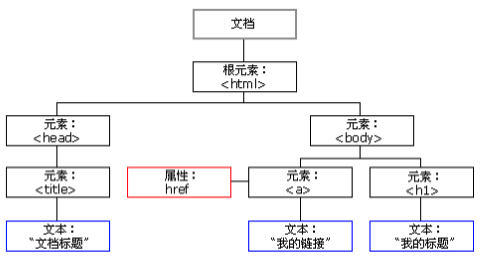

# 初始JavaScript

## JavaScript的组成


### ECMAScript

ECMAScript是由ECMA国际（原欧洲计算机制造商协会）进行标准化的一门编程语言，这种语言在万维网上应用广泛，它往往被称为JavaScript或JScript，但实际上后两者是ECMAScript语言的实现和扩展。

ECMAScript规定了JS的编程语法和基础核心知识，是所有浏览器厂商共同遵守的一套JS语法工业标准。

### DOM--文档对象模型

文档对象模型是W3C组织推荐的处理可扩展标记语言的标准编程接口，通过DOM提供的接口可以对页面上的各种元素进行操作。

### BOM -- 浏览器对象模型

BOM是指浏览器对象模型，它提供了独立于内容的、可以与浏览器窗口进行互动的对象结构。通过BOM可以操作浏览器窗口，比如弹出框、控制浏览器跳转、获取分辨率等。

## JavaScript 的引入方式

### 方式1：行内式
代码举例：
```html
<input type="button" value="点我点我" onclick="alert('千古壹号')" />
```
完整的可执行代码如下：
```html
<!DOCTYPE html>
<html lang="en">
    <head>
        <meta charset="UTF-8" />
        <meta name="viewport" content="width=device-width, initial-scale=1.0" />
        <title>Document</title>
    </head>
    <body>
        <input type="button" value="点我点我" onclick="alert('千古壹号的方式1')" />
    </body>
</html>
```

分析：

* 可以将单行或少量 JS 代码写在HTML标签的事件属性中（以 on 开头的属性），比如放在上面的 onclick点击事件中。

* 这种书写方式，不推荐使用，原因是：可读性差，尤其是需要编写大量 JS代码时，容易出错；引号多层嵌套时，也容易出错。

* 关于代码中的「引号」，在HTML标签中，我们推荐使用双引号, JS 中我们推荐使用单引号。

### 方式2、内嵌式
我们可以在html 页面的 `<body>` 标签里放入`<script type=”text/javascript”></script>`标签对儿，并在`<script>里书写JavaScript 代码`：
```html
<!DOCTYPE html>
<html lang="en">
<head>
	<meta charset="UTF-8">
	<title>Document</title>
</head>
<body>
	<script type="text/javascript">
		// 在这里写 js 代码
		alert('千古壹号的方式2');
		console.log('qianguyihao 方式2');
	</script>
</body>
</html>
```
分析：

* text表示纯文本，因为JavaScript也是一个纯文本的语言。

* 可以将多行JS代码写到 <script> 标签中。

* 内嵌式 JS 是学习时常用的方式。

### 方式3：引入外部的 JS 文件
```html
<!DOCTYPE html>
<html lang="en">
<head>
	<meta charset="UTF-8">
	<title>Document</title>
</head>
<body>
	<!-- 引入外部的 js 文件 -->
	<script src="tool.js"></script>
</body>
</html>
```
上面这段代码，依然是放到body标签里，可以和内嵌的js代码并列。

另外，引用外部 JS文件的 script 标签中间不可以再写代码。

总结：

我们在实战开发中，基本都是采用方式3，因为这种方式，可以确保 html 文件和 js 文件是分开的，有利于代码的结构化和复用。很少会有人把一大堆 js 代码塞到 html 文件里。

## JavaScript 的注释

单行注释：

```javascript
// 我是注释
```

多行注释：

```javascript
/*
	多行注释1
	多行注释2
*/
```

## Javascript 输入输出语句

### 弹出警告框：alert语句

alert（英文翻译为“警报”）的用途：弹出“警告框”。

代码举例如下：

```html
<!DOCTYPE html>
<html lang="en">
    <head>
        <meta charset="UTF-8" />
        <meta name="viewport" content="width=device-width, initial-scale=1.0" />
        <title>Document</title>
    </head>
    <body>
        <script>
            alert('千古壹号');
        </script>
    </body>
</html>
```

上面的代码中，如果写了两个alert()语句的话，网页的效果是：弹出第一个警告框，点击确定后，继续弹出第二个警告框。

### 控制台输出：console.log("")

console.log("")表示在控制台中输出。console表示“控制台”，log表示“输出”。

在Chrome浏览器中，按F12即可打开控制台，选择「console」栏，即可看到打印的内容。

控制台是工程师、程序员调试程序的地方。程序员经常使用这条语句输出一些东西，来测试程序是否正确。

### 弹出输入框：prompt()语句

prompt()就是专门用来弹出能够让用户输入的对话框。用得少，测试的时候偶尔会用。

```js
var a = prompt("请随便输入点什么东西吧");
console.log(a);
```

prompt()语句中，用户不管输入什么内容，都是`字符串`。

alert()和prompt()的区别：

* alert() 可以直接使用。

* prompt() 会返回用户输入的内容。我们可以用一个变量，来接收用户输入的内容。

## JavaScript 变量

### 变量的概念

**变量**：是用于存放数据的容器。我们通过「变量名」获取数据，甚至可以修改数据。

变量还可以用来保存字面量。

**本质**：变量是程序在内存中申请的一块用来存放数据的空间。

### 变量的声明和赋值

#### 变量的声明/变量的定义

在`ES6`语法之前，统一使用`var`关键字来声明一个变量。比如：

```js
var name; // 声明一个名为 name 的变量
```

PS：在JavaScript中，永远都是用var来定义变量（在ES6 之前），这和C、Java等语言不同。

在`ES6`语法及之后，可以使用`const`、`let`关键字来声明一个变量

```js
const name; // 定义一个常量

let age;
```

如果你想定义一个`常量`，就用`const`；如果你想定义一个`变量`，就用`let`。

#### 变量的赋值

```js
name = "coder"
```

变量的声明和赋值，写在一起，举例如下：

```js
var a = 100; // ES5语法

const b = hello; // ES6 语法
let b = world; // ES6 语法
```

#### 变量的初始化

声明一个变量并赋值， 我们称之为变量的初始化。

### 变量声明和赋值的补充

#### 更新变量

一个变量被重新复赋值后，它原有的值就会被覆盖，变量值将以最后一次赋的值为准。

```js
var a = 100;
a = 110;

console.log(a); // 打印结果：110。因为 110 覆盖了 100
```

#### 同时声明多个变量

同时声明多个变量时，只需要写一个 var， 多个变量名之间用英文逗号隔开。

```js
var name = '千古壹号', age = 27, number = 100;
```

#### 变量声明的几种特殊情况
变量建议先声明，再使用。否则可能会报错。具体如下。

写法1、先声明，再赋值：（正常）

```js
var a;
a = 100;
console.log(a); // 打印结果：100
```

写法2、不声明，只赋值：（正常）

```js
a = 100;
console.log(a); // 打印结果：100
```

写法3、只声明，不赋值：（注意，打印 undefined）

```js
var a;
console.log(a); // 打印结果：undefined
```

写法4、不声明，不赋值，直接使用：（会报错）

```js
console.log(a); // 会报错
```

### 变量的命名规范

* 只能由字母(A-Z、a-z)、数字(0-9)、下划线(_)、美元符( $ )组成

* 不能以数字开头。也就是说，必须以字母(A-Z、a-z)、下划线(_)或者美元符( $ )开头。变量名中不允许出现空格。

* 不用使用 JS 语言中保留的「关键字」和「保留字」作为变量名。

* 建议用驼峰命名规则。比如getElementById、matherAndFather、aaaOrBbbAndCcc

* 变量名会区分大小写(javascript 是区分大小写的语言)。

* 变量名长度不能超过255个字符。

* 汉语可以作为变量名。但是不建议使用，因为 low。

## 数据类型

JS 的变量数据类型，是在程序运行的过程中，根据等号右边的值来确定的。而且，变量的数据类型是可以变化的。比如说：

```js
var name = 'qianguyihao';

name = 123; // 强制将变量 name 修改为 数字类型
```

**JS中一共有六种数据类型**

* **基本数据类型（值类型）**：String 字符串、Number 数值、Boolean 布尔值、Null 空值、Undefined 未定义。

* **引用数据类型（引用类型）**：Object 对象。

注意：内置对象 Function、Array、Date、RegExp、Error等都是属于 Object 类型。也就是说，除了那五种基本数据类型之外，其他的，都称之为 Object类型。


**数据类型之间最大的区别：**

* 基本数据类型：参数赋值的时候，传数值。

* 引用数据类型：参数赋值的时候，传地址（修改的同一片内存空间）。

### 基本数据类型

#### 数字型 Number

JavaScript数字类型既可以用来保存整数值，也可以保存小数（浮点数）。

```js
var age = 22;
var PI = 3.14;
```

`isNaN()`这个方法用来判断变量是否是非数字类型，如果是数字类型则返回的是`false`,如果不是数字类型则返回的是`true`。

```js
console.log(isNaN(12)); // false
console.log(isNaN('12')); // false
console.log(isNaN('12a')); // true
```

#### 字符串型 String

字符串型可以是引号中的任意文本，其语法为：双引号`""`或者单引号 `''`。

**注意事项**：

1. 单引号和双引号不能混用。比如下面这样写是不可以的：

2. 同类引号不能嵌套：双引号里不能再放双引号，单引号里不能再放单引号。

3. 单引号里可以嵌套双引号；双引号里可以嵌套单引号。


**转义字符**：

在字符串中我们可以使用`\`作为转义字符，当表示一些特殊符号时可以使用`\`进行转义。

* \" 表示 " 双引号

* \' 表示 ' 单引号

* \\ 表示\

* \r 表示回车

* \n 表示换行。n 的意思是 newline。

* \t 表示缩进。t 的意思是 tab。

* \b 表示空格。b 的意思是 blank。

##### 获取字符串长度

字符串是由若干个字符组成的，这些字符的数量就是字符串的长度。我们可以通过字符串的`length`属性可以获取整个字符串的长度。

```js
var str1 = '千古壹号';
var str2 = '千古壹号，永不止步！';

var str3 = 'qianguyihao';
var str4 = 'qianguyihao, keep moving!';

console.log(str1.length); // 4
console.log(str2.length); // 10
console.log(str3.length); // 11
console.log(str4.length); // 25
```

由此可见，字符串的 length 属性，在判断字符串的长度时，会认为：

* 一个中文算一个字符，一个英文算一个字符

* 一个标点符号（包括中文标点、英文标点）算一个字符

* 一个空格算一个字符

##### 字符串拼接

多个字符串之间可以使用加号 `+` 进行拼接。

**拼接语法**：

```
字符串 + 任意数据类型 = 拼接之后的新字符串;
```

**拼接规则**：拼接前，会把与字符串相加的这个数据类型转成字符串，然后再拼接成一个新的字符串。

```js
var str1 = '千古壹号' + '永不止步';
var str2 = '千古壹号' + 666;
var str3 = '千古壹号' + true;
var str4 = '千古壹号' + null;
var str5 = '千古壹号' + undefined;

var obj = { name: '千古壹号', age: 28 };
var str6 = '千古壹号' + obj;

console.log(str1);
console.log(str2);
console.log(str3);
console.log(str4);
console.log(str5);
console.log(str6);
```

##### 字符串的不可变性

字符串里面的值不可被改变。虽然看上去可以改变内容，但其实是地址变了，内存中新开辟了一个内存空间。

##### 模板字符串（模板字面量）

ES6中引入了模板字符串，让我们省去了字符串拼接的烦恼。下面一起来看看它的特性。

###### 在模板字符串中插入变量

```js
var name = 'qianguyihao';
var age = '26';

console.log('我是' + name + ',age:' + age); //传统写法

console.log(`我是${name},age:${age}`); //ES6 写法。注意语法格式
```

**注意**，上方代码中，倒数第二行用的符号是单引号，最后一行用的符号是反引号（在 tab 键的上方）。

###### 在模板字符串中插入表达式

以前，在字符串中插入表达式的写法必须是这样的：

```js
const a = 5;
const b = 10;
console.log('this is ' + (a + b) + ' and\nnot ' + (2 * a + b) + '.');
```

现在，通过模板字符串，我们可以使用一种更优雅的方式来表示：

```js
const a = 5;
const b = 10;

// 下面这行代码，故意做了换行。
console.log(`this is ${a + b} and
not ${2 * a + b}.`);
```

###### 模板字符串中可以换行

因为模板字符串支持换行，所以可以让代码写得非常美观。

```js
const result = {
	name: 'qianguyihao',
	age: 28,
	sex: '男',
};

// 模板字符串支持换行
const html = `<div>
	<span>${result.name}</span>
	<span>${result.age}</span>
	<span>${result.sex}</span>
</div>`;

console.log(html); // 打印结果也会换行
```

###### 模板字符串中可以调用函数

模板字符串中可以调用函数。字符串中调用函数的位置，将会显示函数执行后的返回值。

```js
function getName() {
	return 'qianguyihao';
}

console.log(`www.${getName()}.com`); // 打印结果：www.qianguyihao.com
```

###### 模板字符串支持嵌套使用

```js
const nameList = ['千古壹号', '许嵩', '解忧少帅'];

function myTemplate() {
	// join('') 的意思是，把数组里的内容合并成一个字符串
	return `<ul>
	${nameList
		.map((item) => `<li>${item}</li>`)
		.join('')}
	</ul>`;
}
document.body.innerHTML = myTemplate();
```

#### 布尔值：Boolean

布尔型有两个值：true 和 false。主要用来做逻辑判断： true 表示真，false 表示假。

布尔值直接使用就可以了，千万不要加上引号。

```js
var a = true;
console.log(typeof a);
```

布尔型和数字型相加时， true 按 1 来算 ，false 按 0 来算。

#### Null：空对象

null 专门用来定义一个空对象（例如：let a = null）。

如果你想定义一个变量用来保存引用类型，但是还没想好放什么内容，这个时候，可以在初始化时将其设置为 null。

```js
let myObj = null;
cosole.log(typeof myObj); // 打印结果：object
```

总结：

* Null 类型的值只有一个，就是 null。比如 let a = null。

* 使用 typeof 检查一个 null 值时，会返回 object。

#### Undefined

##### case1：变量已声明，未赋值时

声明了一个变量，但没有赋值，此时它的值就是 undefined。举例：

```js
let name;
console.log(name); // 打印结果：undefined
console.log(typeof name); // 打印结果：undefined
```

##### case2：变量未声明（未定义）时

如果你从未声明一个变量，就去使用它，则会报错（这个大家都知道）；此时，如果用 typeof 检查这个变量时，会返回 undefined。举例：

```js
console.log(typeof a); // undefined
console.log(a); // 打印结果：Uncaught ReferenceError: a is not defined
```

##### case3：函数无返回值时

如果一个函数没有返回值，那么，这个函数的返回值就是 undefined。

或者，也可以这样理解：在定义一个函数时，如果末尾没有 return 语句，那么，其实就是 return undefined。

##### case4：调用函数时，未传参

调用函数时，如果没有传参，那么，这个参数的值就是 undefined。

举例：

```js
function foo(name) {
    console.log(name);
}

foo(); // 调用函数时，未传参。执行函数后的打印结果：undefined
```

实际开发中，如果调用函数时没有传参，我们可以给形参设置一个默认值：

```js
function foo(name) {
    name = name || 'qianguyihao';
}

foo();
```

#### Null 与 Undefined的区别

null 和 undefined 有很大的相似性。看看 null == undefined 的结果为 true 也更加能说明这点。

但是 null === undefined 的结果是 false。它们虽然相似，但还是有区别的，其中一个区别是，和数字运算时：

* 10 + null 结果为 10。

* 10 + undefined 结果为 NaN。

规律总结：

* 任何数据类型和 undefined 运算都是 NaN;

* 任何值和 null 运算，null 可看做 0 运算。

#### typeof 运算符

typeof()表示“获取变量的数据类型”，返回的是小写，语法为：（两种写法都可以）

```
// 写法1
typeof 变量;

// 写法2
typeof(变量);
```

typeof 这个运算符的返回结果就是变量的类型。那返回结果的类型是什么呢？是`字符串`。

```js
typeof typeof 1; // string
```

返回结果：

| typeof 的代码写法 | 返回结果 |
| --- | --- |
|typeof 数字|	number|
|typeof 字符串|	string|
|typeof 布尔型|	boolean|
|typeof 对象|	object|
|typeof 方法|	function|
|typeof null|	object|
|typeof undefined |	undefined|

注意：

为啥 typeof null的返回值也是 object 呢？因为 null 代表的是空对象。

typeof NaN的返回值是 number，NaN 是一个特殊的数字。

空数组[]、空对象{} ，为啥他们在使用 typeof 时，返回值也是 object呢？因为这里的 返回结果object指的是引用数据类型。空数组、空对象都是引用数据类型 Object。


#### 其他基本数据类型转String

##### 调用 toString()方法(显示转换)

语法：

```js
变量.toString()
```

【重要】该方法不会影响到原变量，它会将转换的结果返回。当然我们还可以直接写成a = a.toString()，这样的话，就是直接修改原变量。

注意：null 和 undefined 这两个值没有 toString()方法，所以它们不能用方法二。如果调用，会报错。

另外，Number 类型的变量，在调用 toString()时，可以在方法中传递一个整数作为参数。此时它将会把数字转换为指定的进制，如果不指定则默认转换为 10 进制。例如：

```js
var a = 255;

//对于Number调用toString()时可以在方法中传递一个整数作为参数
//此时它将会把数字转换为指定的进制,如果不指定则默认转换为10进制
a = a.toString(2); // 转换为二进制

console.log(a); // 11111111
console.log(typeof a); // string
```

##### 字符串拼接（隐式转换）

格式：

```
变量 + 字符串
```

举例：

```js
var a = 123; // Number 类型
console.log(a + ''); // 转换成 String 类型
console.log(a + 'haha'); // 转换成 String 类型
```

上面的例子中，打印的结果，都是字符串类型的数据。实际上内部是调用的 String() 函数。也就是说，c = c + "" 等价于 c = String(c)。

##### 使用 String()函数（强制转换）

语法：

```js
String(变量)
```

使用 String()函数做强制类型转换时：

* 对于 Number 和 Boolean 而言，本质上就是调用 toString()方法。

* 但是对于 null 和 undefined，则不会调用 toString()方法。它会将 null 直接转换为 "null"。将 undefined 直接转换为 "undefined"。


#### 其他的数据类型转Number


##### 使用 parseInt()函数：字符串 -> 整数（显示转换）

**parseInt()的作用是将字符串中的有效的整数内容转为数字**。parse 表示“转换”，Int 表示“整数”（注意`Int`的拼写）。例如：

```js
parseInt("5");

```


parseInt()的转换情况如下。

**情况一：字符串 --> 数字**

- 1.**只保留字符串最开头的数字**，后面的中文自动消失。
- 2.如果字符串不是以数字开头，则转换为 NaN。
- 3.如果字符串是一个空串或者是一个全是空格的字符串，转换时会报错。

**情况二：Boolean --> 数字**

- 结果为：NaN

**情况三：Null --> 数字**

- 结果为：NaN

**情况四：Undefined --> 数字**

- 结果为：NaN

Number() 函数和 parseInt() 函数的区别：

就拿`Number(true)` 和 `parseInt(true)/parseFloat(true)`来举例，二者在使用时，是有区别的：

- Number(true) ：千方百计地想转换为数字。
- parseInt(true)/parseFloat(true) ：先转为字符串，再提取出最前面的数字部分；没提取出来，那就返回 NaN。

**parseInt()具有以下特性**：

（1）**只保留字符串最开头的数字**，后面的中文自动消失。例如：

```
console.log(parseInt("2017在公众号上写了6篇文章")); //打印结果：2017

console.log(parseInt("2017.01在公众号上写了6篇文章")); //打印结果仍是：2017   （说明只会取整数）

console.log(parseInt("aaa2017.01在公众号上写了6篇文章")); //打印结果：NaN （因为不是以数字开头）
```

（2）如果对**非 String**使用 parseInt()或 parseFloat()，它会**先将其转换为 String** 然后再操作。【重要】

比如：

```
var a = 168.23;
console.log(parseInt(a)); //打印结果：168  （因为是先将 a 转为字符串"168.23"，然后然后再操作）

var b = true;
console.log(parseInt(b)); //打印结果：NaN （因为是先将 b 转为字符串"true"，然后然后再操作）

var c = null;
console.log(parseInt(c)); //打印结果：NaN  （因为是先将 c 转为字符串"null"，然后然后再操作）

var d = undefined;
console.log(parseInt(d)); //打印结果：NaN  （因为是先将 d 转为字符串"undefined"，然后然后再操作）
```

（3）自动带有截断小数的功能：**取整，不四舍五入**。

例 1：

```
var a = parseInt(5.8) + parseInt(4.7);
console.log(a);
```

打印结果：

```
9
```

例 2：

```
var a = parseInt(5.8 + 4.7);
console.log(a);
```

打印结果：

```
10;
```

（4）带两个参数时，表示在转换时，包含了进制转换。

代码举例：

```
var a = '110';

var num = parseInt(a, 16); // 【重要】将 a 当成 十六进制 来看待，转换成 十进制 的 num

console.log(num);
```

打印结果：

```
272
```

如果你对打印结果感到震惊，请仔细看上面的代码注释。就是说，无论 parseInt() 里面的进制参数是多少，最终的转换结果是十进制。

我们继续来看下面的代码，打印结果是多少。

```
var a = '5';

var num = parseInt(a, 2); // 将 a 当成 二进制 来看待，转换成 十进制 的 num

console.log(num); // 打印结果：NaN。因为 二进制中没有 5 这个数，转换失败。
```


##### parseFloat()函数：字符串 --> 浮点数（小数）

parseFloat()的作用是：将字符串转换为**浮点数**。

parseFloat()和 parseInt()的作用类似，不同的是，parseFloat()可以获得有效的小数部分。

代码举例：

```
var a = '123.456.789px';
console.log(parseFloat(a)); // 打印结果：123.456
```

parseFloat() 的几个特性，可以参照 parseInt()。


##### 使用 Number() 函数（强制转换）

**情况一：字符串 --> 数字**

- 1.如果字符串中是纯数字，则直接将其转换为数字。
- 2.如果字符串是一个空串或者是一个全是空格的字符串，则转换为 0。
- 3.只要字符串中包含了其他非数字的内容（`小数点`按数字来算），则转换为NaN。


**情况二：布尔 --> 数字**

- true 转成 1
- false 转成 0


**情况三：null --> 数字**

* 结果为：0


**情况四：undefined --> 数字**

* 结果为：NaN


补充：怎么理解这里的 **NaN** 呢？可以这样理解，使用 Number() 函数之后，**如果无法转换为数字，就会转换为 NaN**。


#### 转换为 Boolean

其他的数据类型都可以转换为 Boolean类型。情况如下：

- 情况一：数字 --> 布尔。除了 0 和 NaN，其余的都是 true。也就是说，`Boolean(NaN)`的结果是 false。
- 情况二：字符串 ---> 布尔。除了空串，其余的都是 true。全是空格的字符串，转换结果也是 true。字符串`'0'`的转换结果也是 true。
- 情况三：null 和 undefined 都会转换为 false。
- 情况四：引用数据类型会转换为 true。注意，空数组`[]`和空对象`{}`，**转换结果也是 true**，这一点，很多人都不知道。

**1、隐式转换为 Boolean 类型**：

当非 Boolean 类型的数值和 Boolean类型的数值做比较时，会先把前者进行隐式转换为 Boolean类型，然后再做比较；且不会改变前者的数据类型。举例如下：

```
const a = 1;

console.log(a == true); // 打印结果：true
console.log(typeof a); // 打印结果：number。可见，上面一行代码里，a 做了隐式类型转换，但是 a 的数据类型并没有发生变化，仍然是 Number 类型

console.log(0 == true); // 打印结果：false
```

**2、显式转换为 Boolean 类型**：

方法1：使用 `!!`可以显式转换为 Boolean 类型。比如 `!!3`的结果是true。

方法2：使用 Boolean()函数可以显式转换为 Boolean 类型。


**总结**：

转换为 Boolean 的这几种情况，**很重要**，开发中会经常用到。比如说，我们在项目开发中，经常需要对一些**非布尔值**做逻辑判断，符合条件后，才做进一步的事情。下面来看个例子。	

```js
const result1 = '';
const result2 = {a:'data1', b: 'data2'};

if (result1) {
    console.log('因为 result1的内容为空，所以代码进不了这里');
}

if (result2 && result2.a) {
    // 接口返回了 result2，且 result2.a 里面有值，前端才做进一步的事情
    console.log('代码能进来，前端继续在这里干活儿');
}
```

这里再次强调一下，空数组`[]`和空对象`{}`转换为 Boolean 值时，转换结果为 true。


#### 变量的类型转换的分类

类型转换分为两种：显示类型转换、隐式类型转换。

##### 显示类型转换

* toString()

* String()

* Number()

* parseInt(string)

* parseFloat(string)

* Boolean()

##### 隐式类型转换

* isNaN ()

* 自增/自减运算符：++、—-

* 正号/负号：+a、-a

* 加号：+

* 运算符：-、*、/

##### 隐式类型转换（特殊）

逻辑运算符：&&、||、！ 。非布尔值进行与或运算时，会先将其转换为布尔值，然后再运算，但运算结果是原值。具体可以看下一篇文章《运算符》。

关系运算符：<、> <= >=等。关系运算符，得到的运算结果都是布尔值：要么是true，要么是false。具体可以看下一篇文章《运算符》。


## 运算符和表达式

### 运算符的定义 

**运算符**：也叫操作符，是一种符号。通过运算符可以对一个或多个值进行运算，并获取运算结果。

**表达式**：由数字、运算符、变量的组合（组成的式子）。

表达式最终都会有一个运算结果，我们将这个结果称为表达式的**返回值**。

比如：`+`、`*`、`/`、`(` 都是**运算符**，而`（3+5）/2`则是**表达式**。


### 运算符的分类

JS 中的运算符，分类如下：

- 算数运算符
- 自增/自减运算符
- 一元运算符
- 逻辑运算符
- 赋值运算符
- 比较运算符
- 三元运算符（条件运算符）


#### 算术运算符

**算术运算符**：用于执行两个变量或值的算术运算。

常见的算数运算符有以下几种：

| 运算符 | 描述                   |
| ------ | ---------------------- |
| +      | 加、字符串连接         |
| -      | 减                     |
| *      | 乘                     |
| /      | 除                     |
| %      | 获取余数（取余、取模） |


**算数运算符的运算规则**

（1）先算乘除、后算加减。

（2）小括号`( )`：能够影响计算顺序，且可以嵌套。没有中括号、没有大括号，只有小括号。

（3）百分号：取余。只关心余数。


**浮点数运算的精度问题**

浮点数值的最高精度是 17 位小数，但在进行算术计算时，会丢失精度，导致计算不够准确。比如：

```
console.log(0.1 + 0.2); // 运算结果不是 0.3，而是 0.30000000000000004

console.log(0.07 * 100); // 运算结果不是 7，而是 7.000000000000001
```

因此，**不要直接判断两个浮点数是否相等**。


### 自增和自减

#### 自增 `++`

自增分成两种：`a++`和`++a`。

（1）一个变量自增以后，原变量的值会**立即**自增1。也就是说，无论是 `a++` 还是`++a`，都会立即使原变量的值自增1。

（2）**我们要注意的是**：`a`是变量，而`a++`和`++a`是**表达式**。

那这两种自增，有啥区别呢？区别是：`a++` 和 `++a`的值不同：（也就是说，表达式的值不同）

- `a++`这个表达式的值等于原变量的值（a自增前的值）。你可以这样理解：先把 a 的值赋值给表达式，然后 a 再自增。
- `++a`这个表达式的值等于新值 （a自增后的值）。 你可以这样理解：a 先自增，然后再把自增后的值赋值给表达式。


简单理解：a++(先用后加)，++a(先加后用)

#### 自减 `--`

原理同上。

开发时，大多使用后置的自增/自减，并且代码独占一行，例如：`num++`，或者 `num--`。


### 一元运算符

一元运算符，只需要一个操作数。

常见的一元运算符如下。

#### typeof

typeof就是典型的一元运算符，因为后面只跟一个操作数。

举例如下：

```
var a = '123';
console.log(typeof a); // 打印结果：string
```

#### 正号 `+`

（1）正号不会对数字产生任何影响。比如说，`2`和`+2`是一样的。

（2）我们可以对一个其他的数据类型使用`+`，来将其转换为number【重要的小技巧】。比如：

```js
var a = true;
a = +a;   // 注意这行代码的一元运算符操作
console.log('a：' + a);
console.log(typeof a);

console.log('-----------------');

var b = '18';
b = +b;   // 注意这行代码的一元运算符操作
console.log('b：' + b);
console.log(typeof b);
```

#### 负号 `-`

负号可以对数字进行取反。


### 逻辑运算符

逻辑运算符有三个：

- `&&` 与（且）：两个都为真，结果才为真。
- `||` 或：只要有一个是真，结果就是真。
- `!` 非：对一个布尔值进行取反。

注意：能参与逻辑运算的，都是布尔值。


#### 非布尔值的与或运算【重要】

> 之所以重要，是因为在实际开发中，我们经常用这种代码做容错处理或者兜底处理。


非布尔值进行**与或运算**时，会先将其转换为布尔值，然后再运算，但返回结果是**原值**。比如说：

```js
var result = 5 && 6; // 运算过程：true && true;
console.log('result：' + result); // 打印结果：6（也就是说最后面的那个值。）
```


**与运算**的返回结果：（以多个非布尔值的运算为例）

- 如果第一个值为false，则执行第一条语句，并直接返回第一个值；不会再往后执行。
- 如果第一个值为true，则继续执行第二条语句，并返回第二个值（如果所有的值都为true，则返回的是最后一个值）。

**或运算**的返回结果：（以多个非布尔值的运算为例）

- 如果第一个值为true，则执行第一条语句，并直接返回第一个值；不会再往后执行。
- 如果第一个值为false，则继续执行第二条语句，并返回第二个值（（如果所有的值都为false，则返回的是最后一个值）。

实际开发中，我们经常是这样来做「容错处理」的：

当前端成功调用一个接口后，返回的数据为 result 对象。这个时候，我们用变量 a 来接收 result 里的图片资源。通常的写法是这样的：

```js
if (result.resultCode == 0) {
    // 相当于给a设置了一个默认值。
	var a = result && result.data && result.data.imgUrl || 'http://img.smyhvae.com/20160401_01.jpg';
}
```


#### 非布尔值的 `!` 运算

非布尔值进行**非运算**时，会先将其转换为布尔值，然后再运算，但返回结果是**布尔值**。


举例：

```js
let a = 10;
a = !a

console.log(a);  // false
console.log(typeof a); // boolean
```


#### 短路运算的妙用【重要】

> 下方举例中的写法技巧，在实际开发中，经常用到。这种写法，是一种很好的「容错、容灾、降级」方案，需要多看几遍。

1、JS中的`&&`属于**短路**的与：

- 如果第一个值为false，则不会执行后面的内容。
- 如果第一个值为 true，则继续执行第二条语句，并返回第二个值。

举例：

```js
const a1 = 'qianguyihao';
//第一个值为true，会继续执行后面的内容
a1 && alert('看 a1 出不出来'); // 可以弹出 alert 框

const a2 = undefined;
//第一个值为false，不会继续执行后面的内容
a2 && alert('看 a2 出不出来'); // 不会弹出 alert 框
```

2、JS中的`||`属于**短路**的或：

- 如果第一个值为true，则不会执行后面的内容。
- 如果第一个值为 false，则继续执行第二条语句，并返回第二个值。

举例：

```js
const result; // 请求接口时，后台返回的内容
let errorMsg = ''; // 前端的文案提示

if (result && result.retCode != 0) {
	// 接口返回异常码时
	errorMsg = result.msg || '活动太火爆，请稍后再试'; // 文案提示信息，优先用 接口返回的msg字段，其次用 '活动太火爆，请稍后再试' 这个文案兜底。
}

if (!result) {
	// 接口挂掉时
	errorMsg = '网络异常，请稍后再试';
}
```


### 赋值运算符

可以将符号右侧的值赋值给符号左侧的变量。

举例：

- `=` 直接赋值。比如 `var a = 5`
- `+=`。a += 5 等价于 a = a + 5
- `-=`。a -= 5 等价于 a = a - 5
- `*=`。a *= 5 等价于 a = a * 5
- `/=`。a /= 5 等价于 a = a / 5
- `%=`。a %= 5 等价于 a = a % 5


### 比较运算符

比较运算符可以比较两个值之间的大小关系，如果关系成立它会返回true，如果关系不成立则返回false。

比较运算符有很多种，比如：

```
>	大于号
<	小于号
>= 	大于或等于
<=  小于或等于
== 	等于
=== 全等于
!=	不等于
!== 不全等于
```


**比较运算符，得到的结果都是布尔值：要么是true，要么是false**。


#### 非数值的比较

（1）对于非数值进行比较时，会将其转换为数字然后再比较。

举例如下：

```js
console.log(1 > true); //false
console.log(1 >= true); //true
console.log(1 > "0"); //true

//console.log(10 > null); //true

//任何值和NaN做任何比较都是false

console.log(10 <= "hello"); //false
console.log(true > false); //true
```

（2）特殊情况：如果符号两侧的值都是字符串时，**不会**将其转换为数字进行比较。比较两个字符串时，比较的是字符串的**Unicode编码**。【非常重要，这里是个大坑，很容易踩到】

比较字符编码时，是一位一位进行比较。如果两位一样，则比较下一位。

比如说，当你尝试去比较`"123"`和`"56"`这两个字符串时，你会发现，字符串"56"竟然比字符串"123"要大（因为 5 比 1 大）。也就是说，下面这样代码的打印结果，其实是true:（这个我们一定要注意，在日常开发中，很容易忽视）

```
// 比较两个字符串时，比较的是字符串的字符编码，所以可能会得到不可预期的结果
console.log("56" > "123");  // true
```

**因此**：当我们在比较两个字符串型的数字时，**一定一定要先转型**再比较大小，比如 `parseInt()`。

（3）任何值和NaN做任何比较都是false。


#### `==`符号的强调

注意`==`这个符号，它是**判断是否等于**，而不是赋值。

（1）`== `这个符号，还可以验证字符串是否相同。例如：

```
console.log("我爱你中国" == "我爱你中国");		// 输出结果为true
```

（2）`== `这个符号并不严谨，会做隐式转换，将不同的数据类型，**转为相同类型**进行比较（大部分情况下，都是转换为数字）。例如：

```
console.log("6" == 6);		// 打印结果：true。这里的字符串"6"会先转换为数字6，然后再进行比较
console.log(true == "1");   // 打印结果：true
console.log(0 == -0);       // 打印结果：true

console.log(null == 0);   // 打印结果：false
```

（3）undefined 衍生自 null，所以这两个值做相等判断时，会返回true。

```
console.log(undefined == null);  //打印结果：true。
```

（4）NaN不和任何值相等，包括他本身。

```
console.log(NaN == NaN); //false
console.log(NaN === NaN); //false
```

问题：那如果我想判断 b的值是否为NaN，该怎么办呢？

答案：可以通过isNaN()函数来判断一个值是否是NaN。举例：

```
console.log(isNaN(b));
```

如上方代码所示，如果 b 为 NaN，则返回true；否则返回false。


#### `===`全等符号的强调

**全等在比较时，不会做类型转换**。如果要保证**绝对等于（完全等于）**，我们就要用三个等号`===`。例如：

```
	console.log("6" === 6);		//false
	console.log(6 === 6);		//true
```

上述内容分析出：

- `==`两个等号，不严谨，"6"和6是true。
- `===`三个等号，严谨，"6"和6是false。

另外还有：**`==`的反面是`!=`，`===`的反面是`!==`**。例如：

```
	console.log(3 != 8);	//true
	console.log(3 != "3");	//false，因为3=="3"是true，所以反过来就是false。
	console.log(3 !== "3");	//true，应为3==="3"是false，所以反过来是true。
```


### 三元运算符

三元运算符也叫条件运算符。

语法：

```
条件表达式 ? 语句1 : 语句2;
```

**执行的流程**：

条件运算符在执行时，首先对条件表达式进行求值：

- 如果该值为true，则执行语句1，并返回执行结果
- 如果该值为false，则执行语句2，并返回执行结果

如果条件的表达式的求值结果是一个非布尔值，会将其转换为布尔值然后再运算。

## 流程控制语句

### 流程控制语句分类

- 顺序结构
- 选择结构：if 语句、switch 语句
- 循环结构：while 语句、for 语句

### 顺序结构

按照代码的先后顺序，依次执行。结构图如下：


### 选择结构


#### if语句

if 语句有以下三种。

1、条件判断语句

> 条件成立才执行。如果条件不成立，那就什么都不做。

格式：

```
if (条件表达式) {
    // 条件为真时，做的事情
}
```

2、条件分支语句

格式 1：

```
if (条件表达式) {
    // 条件为真时，做的事情

} else {
    // 条件为假时，做的事情

}
```

格式 2：（多分支的 if 语句）

```
if (条件表达式1) {
    // 条件1为真时，做的事情

} else if (条件表达式2) {
    // 条件1不满足，条件2满足时，做的事情

} else if (条件表达式3) {
    // 条件1、2不满足，条件3满足时，做的事情

} else {
    // 条件1、2、3都不满足时，做的事情
}
```

以上所有的语句体中，只执行其中一个。


#### switch语句

switch 语句也叫条件分支语句。

语法格式

```
switch(表达式) {
	case 值1：
		语句体1;
		break;

	case 值2：
		语句体2;
		break;

	...
	...

	default：
		语句体 n+1;
		break;
}
```


执行流程如下：

（1）首先，计算出表达式的值，和 case 依次比较，一旦有对应的值，就会执行相应的语句，在执行的过程中，遇到 break 就会结束。

（2）然后，如果所有的 case 都和表达式的值不匹配，就会执行 default 语句体部分。

##### switch 和 case 后面的值

switch 后面的**括号里**可以是**表达式**或者**值**， 通常是一个**变量**（通常做法是：先把表达式或者值存放到变量中）。

JS 是属于弱类型语言，case 后面的`值1`、`值2`可以是 `'a'`、`6`、`true` 等任意数据类型的值，也可以是**表达式**。注意，在这里，**字符串`'6'`和 数字 `6` 是不一样的**。


##### switch 语句的结束条件【非常重要】

- 情况 a：遇到 break 就结束，而不是遇到 default 就结束。（因为 break 在此处的作用就是退出 switch 语句）
- 情况 b：执行到程序的末尾就结束。


##### case 穿透

switch 语句中的`break`可以省略，但一般不建议（对于新手而言）。否则结果可能不是你想要的，会出现一个现象：**case 穿透**。


### 循环结构

#### for循环

语法：

```
for(①初始化表达式; ②条件表达式; ④更新表达式) {
	③语句...
}
```


执行流程：

```
①执行初始化表达式，初始化变量（初始化表达式只会执行一次）

②执行条件表达式，判断是否执行循环：
	如果为true，则执行循环③
	如果为false，终止循环

④执行更新表达式，更新表达式执行完毕继续重复②
```

例：
```js
for (var i=1; i < 100; i++) {
	console.log(i);
}
```


#### while循环


语法：

```
while(条件表达式){
	语句...
}
```


执行流程：

```
while语句在执行时，先对条件表达式进行求值判断：

	如果值为true，则执行循环体：
		循环体执行完毕以后，继续对表达式进行判断
		如果为true，则继续执行循环体，以此类推

	如果值为false，则终止循环
```


可以使用`break`关键字来终止循环。


#### do...while循环


语法：

```
do {
	语句...
}while(条件表达式)
```


执行流程：

```
do...while语句在执行时，会先执行循环体：

	循环体执行完毕以后，在对while后的条件表达式进行判断：
		如果结果为true，则继续执行循环体，执行完毕继续判断以此类推
		如果结果为false，则终止循环
```


**while循环和do...while循环的区别**


while是先判断后执行，而do...while是先执行后判断。也就是说do...while可以保证循环体至少执行一次。


#### break和continue

##### break

- break 可以用来退出 switch 语句或退出**整个**循环语句（循环语句包括 for 循环、while 循环。不包括 if。单独的if 语句里不能用 break 和 continue，否则会报错）。
- break 会立即终止离它**最近**的那个循环语句。
- 可以为循环语句创建一个 label，来标识当前的循环（格式：label:循环语句）。使用 break 语句时，可以在 break 后跟着一个 label，这样 break 将会结束指定的循环，而不是最近的。

例：

```js
outer: for (var i = 0; i < 5; i++) {
    console.log('外层循环 i 的值：' + i);
    for (var j = 0; j < 5; j++) {
        break outer; // 直接跳出outer所在的外层循环（这个outer是我自定义的label）
        console.log('内层循环 j 的值:' + j);
    }
}
```


##### continue

- continue 可以用来跳过**当次**循环，继续下一次循环。
- 同样，continue 默认只会离他**最近**的循环起作用。
- 同样，如果需要跳过指定的当次循环，可以使用 label 标签。


## 数组

数组（Array）是属于`内置对象`，我们可以在MDN网站上查询它的各种方法。

数组和普通对象的功能类似，也是用来存储一些值的。不同的是：

* 普通对象是使用字符串作为属性名的，而数组是使用数字作为`索引`来操作元素。索引：从 0 开始的整数就是索引。

数组的存储性能比普通对象要好。在实际开发中我们经常使用数组来存储一些数据（尤其是**列表数据**），使用频率非常高。

数组中的元素可以是任意的数据类型，也可以是对象，也可以是函数，也可以是数组。数组的元素中，如果存放的是数组，我们就称这种数组为二维数组。


### 创建数组对象


#### 方式一：使用字面量创建数组

举例：

```
var arr1 = []; // 创建一个空的数组

var arr2 = [1, 2, 3]; // 创建带初始值的数组
```

方式一最简单，也用得最多。


#### 方式二：使用构造函数创建数组

语法：

```
let arr = new Array(参数);

let arr = Array(参数);
```

如果**参数为空**，则表示创建一个空数组；如果参数是**一个数值**时，表示数组的长度；如果有多个参数时，表示数组中的元素。


### 数组的基本操作

#### 数组的索引

**索引** (下标) ：用来访问数组元素的序号，代表的是数组中的元素在数组中的位置（下标从 0 开始算起）。

数组可以通过索引来访问、设置、修改对应的数组元素。


#### 向数组中添加元素

语法：

```
数组[索引] = 值;
```


#### 获取数组中的元素

语法：

```
数组[索引];
```

如果读取不存在的索引（比如元素没那么多），系统不会报错，而是返回 undefined。


#### 获取数组的长度

可以使用`length`属性来获取数组的长度(即“元素的个数”)。

数组的长度是元素个数，不要跟索引号混淆。

语法：

```
数组的长度 = 数组名.length；
```


#### 修改数组的长度

- 如果修改的 length 大于原长度，则多出部分会空出来，置为 null。
- 如果修改的 length 小于原长度，则多出的元素会被删除，数组将从后面删除元素。
- （特例：伪数组 arguments 的长度可以修改，但是不能修改里面的元素）


#### 遍历数组

**遍历**: 就是把数组中的每个元素从头到尾都访问一次。

最简单的做法是通过 for 循环，遍历数组中的每一项。举例：

```js
var arr = [10, 20, 30, 40, 50];

for (var i=0; i<arr.length; i++) {
    console.log(arr[i]);
}
```


## 函数

函数：就是将一些功能或语句进行**封装**，在需要的时候，通过**调用**的形式，执行这些语句。

-   **函数也是一个对象**
-   使用`typeof`检查一个函数对象时，会返回function

**函数的作用**：

-   将大量重复的语句抽取出来，写在函数里，以后需要这些语句的时候，可以直接调用函数，避免重复劳动。
-   简化编程，让编程模块化。高内聚、低耦合。


### 函数的定义/声明

#### 方式一：利用函数关键字自定义函数（命名函数）

使用`函数声明`来创建一个函数（也就是 function 关键字）。语法：

```
function 函数名([形参1,形参2...形参N]){  // 备注：语法中的中括号，表示“可选”
	语句...
}
```


#### 方式二：函数表达式（匿名函数）

使用`函数表达式`来创建一个函数。语法：

```
var 变量名  = function([形参1,形参2...形参N]){
	语句....
}
```


#### 方式三：使用构造函数 new Function()

使用构造函数`new Function()`来创建一个对象。这种方式，用的少。

语法：

```
var 变量名/函数名  = new Function('形参1', '形参2', '函数体');
```

注意，Function 里面的参数都必须是**字符串**格式。也就是说，形参也必须放在**字符串**里；函数体也是放在**字符串**里包裹起来，放在 Function 的最后一个参数的位置。


### 函数的调用

#### 方式1：普通函数的调用

函数调用的语法：

```
函数名();
```

或者：

```
函数名.call();
```


### 函数的参数

**形参：**

-   概念：形式上的参数。定义函数时传递的参数，当时并不知道是什么值。
-   定义函数时，可以在函数的`()`中来指定一个或多个形参。
-   多个形参之间使用`,`隔开，声明形参就相当于在函数内部声明了对应的变量，但是并不赋值。

**实参**：

-   概念：实际上的参数。调用函数时传递的参数，实参将会传递给函数中对应的形参。
-   在调用函数时，可以在函数的 `()`中指定实参。


注意：实际参数和形式参数的个数，一般要相同。但JS中不强制实参和形参一致。

调用函数时，解析器不会检查实参的数量。

-   如果实参的数量多余形参的数量，多余实参不会被赋值。
-   如果实参的数量少于形参的数量，多余的形参会被定义为 undefined。表达式的运行结果为 NaN。

在 JS 中，形参的默认值是 undefined。


### 函数的返回值

-   return 的值将会作为函数的执行结果返回，可以定义一个变量，来接收该结果。
-   在函数中，return后的语句都不会执行（函数在执行完 return 语句之后停止并立即退出函数）
-   如果return语句后不跟任何值，就相当于返回一个undefined
-   如果函数中不写return，则也会返回undefined
-   返回值可以是任意的数据类型，可以是对象，也可以是函数。
-   return 只能返回一个值。如果用逗号隔开多个值，则以最后一个为准。


### 函数名、函数体和函数加载问题（重要，请记住）

我们要记住：**函数名 == 整个函数**。举例：

```
console.log(fn) == console.log(function fn(){alert(1)});

//定义fn方法
function fn(){
	alert(1)
};
```

我们知道，当我们在调用一个函数时，通常使用`函数()`这种格式；可如果，我们是直接使用`函数`这种格式，它的作用相当于整个函数。

**函数的加载问题**：JS加载的时候，只加载函数名，不加载函数体。所以如果想使用内部的成员变量，需要调用函数。


#### fn() 和 fn 的区别【重要】

-   `fn()`：调用函数。调用之后，还获取了函数的返回值。
-   `fn`：函数对象。相当于直接获取了整个函数对象。


### 立即执行函数

现有匿名函数如下：

```
	function(a, b) {
		console.log("a = " + a);
		console.log("b = " + b);
	};
```

立即执行函数如下：

```
	(function(a, b) {
		console.log("a = " + a);
		console.log("b = " + b);
	})(123, 456);
```

立即执行函数：函数定义完，立即被调用，这种函数叫做立即执行函数。

立即执行函数往往只会执行一次。为什么呢？因为没有变量保存它，执行完了之后，就找不到它了。


### arguments

当我们不确定有多少个参数传递的时候，可以用`arguments`来获取。在JavaScript中，arguments实际上是当前函数的一个`内置对象`。所有函数都内置了一个arguments对象，arguments对象中`存储了传递的所有实参`。


arguments的展示形式是一个**伪数组**。伪数组具有以下特点：

-   可以进行遍历；具有数组的 length 属性。
-   按索引方式存储数据。
-   不具有数组的 push()、pop() 等方法。


```javascript
function getMaxValue() {
  var max = arguments[0];
  // 通过 arguments 遍历实参
  for (var i = 0; i < arguments.length; i++) {
    if (max < arguments[i]) {
      max = arguments[i];
    }
  }
  return max;
}

console.log(getMaxValue(1, 3, 7, 5));
```


#### 类数组arguments

在调用函数时，浏览器每次都会传递进两个隐含的参数：

-   1.函数的上下文对象 this
-   2.**封装实参的对象** arguments


arguments 是一个类数组对象，它可以通过索引来操作数据，也可以获取长度。

**arguments 代表的是实参**。在调用函数时，我们所传递的实参都会在 arguments 中保存。有个讲究的地方是：arguments**只在函数中使用**。


##### 1、返回函数**实参**的个数：arguments.length

arguments.length 可以用来获取**实参的长度**。

举例：

```js
fn(2, 4);
fn(2, 4, 6);
fn(2, 4, 6, 8);

function fn(a, b) {
    console.log(arguments);
    console.log(fn.length); //获取形参的个数
    console.log(arguments.length); //获取实参的个数

    console.log('----------------');
}
```


##### 2、返回正在执行的函数：arguments.callee

arguments 里边有一个属性叫做 callee，这个属性对应一个函数对象，就是当前正在指向的函数对象。

```js
function fun() {
    console.log(arguments.callee == fun); //打印结果为true
}

fun('hello');
```

在使用函数**递归**调用时，推荐使用 arguments.callee 代替函数名本身。


##### 3、arguments 可以修改元素

之所以说 arguments 是伪数组，是因为：**arguments 可以修改元素，但不能改变数组的长短**。举例：

```js
fn(2, 4);
fn(2, 4, 6);
fn(2, 4, 6, 8);

function fn(a, b) {
    arguments[0] = 99; //将实参的第一个数改为99
    arguments.push(8); //此方法不通过，因为无法增加元素
}
```


## 作用域

- **概念**：通俗来讲，作用域是一个变量或函数的作用范围。作用域在**函数定义**时，就已经确定了。
- **目的**：为了提高程序的可靠性，同时减少命名冲突。


### 作用域的分类

在 JS 中，一共有两种作用域：（ES6 之前）

- 全局作用域：作用于整个 script 标签内部，或者作用域一个独立的 JS 文件。
- 函数作用域（局部作用域）：作用于函数内的代码环境。


### 全局作用域

直接编写在script标签中的JS代码，都在全局作用域。

- 全局作用域在页面打开时创建，在页面关闭时销毁。
- 在全局作用域中有一个全局对象window，它代表的是一个浏览器的窗口，由浏览器创建，我们可以直接使用。

在全局作用域中：

- 创建的**变量**都会作为window对象的属性保存。比如在全局作用域内写 `var a = 100`，这里的 `a` 等价于 `window.a`。
- 创建的**函数**都会作为window对象的方法保存。


### 作用域的访问关系

在内部作用域中可以访问到外部作用域的变量，在外部作用域中无法访问到内部作用域的变量。


### 变量的作用域

根据作用域的不同，变量可以分为两类：全局变量、布局变量。

**全局变量**：

- 在全局作用域下声明的变量，叫「全局变量」。在全局作用域的任何一地方，都可以访问这个变量。
- 在全局作用域下，使用 var 声明的变量是全局变量。
- 特殊情况：在函数内不使用 var 声明的变量也是全局变量（不建议这么用）。

**局部变量**：

- 定义在函数作用域的变量，叫「局部变量」。
- 在函数内部，使用 var 声明的变量是局部变量。
- 函数的**形参**也是属于局部变量。


从执行效率来看全局变量和局部变量：

- 全局变量：只有浏览器关闭时才会被销毁，比较占内存。
- 局部变量：当其所在的代码块运行结束后，就会被销毁，比较节约内存空间。

### 作用域的上下级关系

当在函数作用域操作一个变量时，它会先在自身作用域中寻找，如果有就直接使用（**就近原则**）。如果没有则向上一级作用域中寻找，直到找到全局作用域；如果全局作用域中依然没有找到，则会报错 ReferenceError。

在函数中要访问全局变量可以使用window对象。（比如说，全局作用域和函数作用域都定义了变量a，如果想访问全局变量，可以使用`window.a`）

### 作用域链

- 只要是代码，就至少有一个作用域
- 写在函数内部的局部作用域
- 如果函数中还有函数，那么在这个作用域中就又可以诞生一个作用域


**作用域链**：内部函数访问外部函数的变量，采用的是链式查找的方式来决定取哪个值，这种结构称之为作用域链。查找时，采用的是**就近原则**。

例：

```js
function f1() {
    var num = 123;
    
    function f2() {
        console.log(num);
    }
    f2();
}
var num = 456;
f1()
```


### JavaScript 没有块级作用域（ES6之前）

在其他编程语言中（如 Java、C#等），存在块级作用域，由`{}`包括起来。比如在 Java 语言中，if 语句里创建的变量，只能在if语句内部使用.但是，在 JS 中没有块级作用域（ES6之前）。举例如下：

```js
if(true){
var num = 123;
    console.log(123); //123
}

console.log(123); //123（可以正常打印）
```


## 预解析

JavaScript代码是由浏览器中的JavaScript解析器来执行的JavaScript解析器在运行JavaScript代码的时候分为两步：预解析和代码执行。

1. 预解析：js引擎会把js代码里所有的var还有function提升到当前作用域的最前面。
2. 代码执行：按照代码书写的顺序从上往下执行。


### 变量预解析(变量的声明提前)

使用var关键字声明的变量（ 比如 `var a = 1`），**会在所有的代码执行之前被声明**（但是不会赋值）。

但是如果声明变量时不是用var关键字（比如直接写`a = 1`），则变量不会被声明提前。

例1：

```js
console.log(a); // 此时输出为 undefined
var a = 123; 

/* js引擎执行上述两行代码其实是按照下边的代码运行的
1. 变量提升
var a; 
2. 代码执行
console.log(a); 
a = 123;
*/
```


例2：

```js
console.log(a); // 此时程序将报错：Uncaught ReferenceError: a is not defined
a = 123; // 此时a相当于window.a

/* js引擎执行上述两行代码其实是按照下边的代码运行的
1. 变量提升

2. 代码执行
console.log(a); 
a = 123;
*/
```


例3：

```js
foo();
function foo() {
    if (false) { // 永远也不会进入这个if语句
        var i = 123; // 在预编译时 var i; 已被声明
    }
    console.log(i); // 所以输出的结果为undefined
}
/* js引擎执行上述两行代码其实是按照下边的代码运行的
1. 变量提升
function foo(){...};
var i;
2. 代码执行
foo();
if判断;
console.log(i)
*/
```

**注意：**

既然JS中存在变量提升的现象，那么，在实战开发中，为了避免出错，建议先声明一个变量，然后再使用这个变量。


### 函数预解析(函数的声明提前)

**函数声明：**

使用`函数声明`的形式创建的函数`function foo(){}`，**会被声明提前**。

也就是说，整个函数会在所有的代码执行之前就被**创建完成**。所以，在代码顺序里，我们可以先调用函数，再定义函数。

代码举例：

```js
fn1();  // 虽然 函数 fn1 的定义是在后面，但是因为被提前声明了， 所以此处可以调用函数

function fn1() {
    console.log('我是函数 fn1');
}
```

**函数表达式：**

使用`函数表达式`创建的函数`var foo = function(){}`，**不会被声明提前**，所以不能在声明前调用。

很好理解，因为此时foo被声明了（这里只是变量声明），且为undefined，并没有把 `function(){}` 赋值给 foo。

所以说，下面的例子，会报错：

```js
foo();

var foo = function() {
    console.log("something.")
}
/* js引擎执行上述代码其实是按照下边的代码运行的
1. 变量提升
var foo;
2. 代码执行
foo();
foo = function(){...};
*/
```


### 两个规律

1. 任何变量，如果未经过声明就赋值，此变量是属于window的属性，而且不会做变量提升。
2. 一切声明的全局变量，全是window的属性。


`var a = b = 100` 这行**连续赋值**的代码等价于 `var a = (b = 100)`，其执行顺序是：

（1）先把 100 赋值给 b；

（2）再声明变量 a；

（3）再把 b 的值赋值给 a。


### 预解析面试题

**面试题1：**

```js
var num = 10;
fun();

function fun() {
    console.log(num);
    var num = 20;
}
```

结果：

```
undefined
```


解析：

```js
/* js引擎执行上述代码其实是按照下边的代码运行的
    1. 变量提升
    var num;
    function fun() {...};
    在function内部有变量提升 var num;
    2. 代码执行
    num = 10;
	fun();
	进入函数内部执行 console.log(num); 因为函数内部有变量提升 根据就近原则 取函数内部的num
	num = 20;
*/
```


**面试题2：**

```js
var num = 10;

function fn() {
    console.log(num);
    var num = 20;
    console.log(num);
}

fn();
```

结果：

```
undefined
20
```


解析:

```js
/* js引擎执行上述代码其实是按照下边的代码运行的
    1. 变量提升
    var num;
    function fn() {...};
    在function内部有变量提升 var num;
    2. 代码执行
    num = 10;
	fn();
	进入函数内部执行 console.log(num); 因为函数内部有变量提升 根据就近原则 取函数内部的num
				   num = 20;
				   console.log(num);
*/
```


**面试题3：**

```js
var a = 10;
fn();

function fn() {
    var b = 9;
    console.log(a);
    console.log(b);
    var a = '123';
}
```

结果：

```
undefined
9
```


解析：

```js
/* js引擎执行上述代码其实是按照下边的代码运行的 */
var a;
function fn() {
    var b;
    var a;
    b = 9;
    console.log(a);
    console.log(b);
    a = '123';
}
a = 10;
fn();
```


**面试题4：**

```js
fn();
console.log(c);
console.log(b);
console.log(a);
function fn() {
    var a = b = c = 9;
    console.log(a);
    console.log(b);
    console.log(c);
}
```

结果

```
9
9
9
9
9
Uncaught ReferenceError: a is not defined
```


解析

```js
/* js引擎执行上述代码其实是按照下边的代码运行的 */
function fn() {
    var a;
    c = 9;
    b = c;
	a = b;
    console.log(a);
    console.log(b);
    console.log(c);
}
fn();
console.log(c);
console.log(b);
console.log(a);
```

## 对象

### 对象的概念

在 JavaScript 中，对象是一组**无序**的相关属性和方法的集合。

**对象的作用是：封装信息**。比如Student类里可以封装学生的姓名、年龄、成绩等。

对象具有**特征**（属性）和**行为**（方法）。


### 为什么需要对象

保存一个值时，可以使用**变量**，保存多个值（一组值）时，可以使用**数组**。

比如，如果要保存一个人的信息，通过数组的方式可以这样保存：

```js
var arr = ['王二', 35, '男', '180'];
```

上面这种表达方式比较乱。而如果用JS中的**对象**来表达，**结构会更清晰**。如下：

```js
var person = {};

person.name = '王二';
person.age = 35;
person.sex = '男';
person.height = '180';
```

由此可见，对象里面的属性均是**键值对**：

- 键：相当于属性名。
- 值：相当于属性值，可以是任意类型的值（数字类型、字符串类型、布尔类型，函数类型等）。


对象的属性值可以是任何的数据类型，也可以是个**函数**：（也称之为方法）

```js
var obj = new Object();
obj.sayName = function () {
    console.log('smyhvae');
};

console.log(obj.sayName);  //没加括号，就是获取方法
console.log('-----------');
console.log(obj.sayName());  //加了括号，就是调用方法。即：执行函数内容，并执行函数体的内容
```


对象中的属性值，也可以是一个**对象**。

举例：

```js
//创建对象 obj1
var obj1 = new Object();
obj1.test = undefined;

//创建对象 obj2
var obj2 = new Object();
obj2.name = "smyhvae";

//将整个 obj2 对象，设置为 obj1 的属性
obj1.test = obj2;

console.log(obj1.test.name);
```

### 创建自定义对象的几种方法

#### 方式一：对象字面量

**对象的字面量**就是一个{}。里面的属性和方法均是**键值对**：

- 键：相当于属性名。
- 值：相当于属性值，可以是任意类型的值（数字类型、字符串类型、布尔类型，函数类型等）。

使用对象字面量来创建一个对象，非常简洁，举例如下：：

```js
var obj = {};
```

使用对象字面量，可以在创建对象时，直接指定对象中的属性。语法：{属性名:属性值,属性名:属性值....}

例 1：（一个简单的对象）

```js
const obj1 = {
    name: '千古壹号',
    age: 28,
};
```

例 2：（一个较复杂的对象）

```js
const obj2 = {
            name: "千古壹号",
            age: 26,
            isBoy: true,
            // 还可以存放一个嵌套的对象
            test: {
                id: 123,
                tel: 180
            }
		    //我们还可以在对象中增加一个方法。以后可以通过obj.sayName()的方式调用这个方法
            sayName: function() {
                console.log(this.name);
            }
        };

console.log(JSON.stringify(obj));
```

对象字面量的属性名可以加引号也可以不加，建议不加。如果要使用一些特殊的名字，则必须加引号。

属性名和属性值是一组一组的键值对结构，键和值之间使用`:`连接，多个值对之间使用`,`隔开。

#### 方式二：工厂模式 new Object()

通过该方法可以大批量的创建对象。

```js
/*
 * 使用工厂方法创建对象
 *  通过该方法可以大批量的创建对象
 */
function createPerson(name, age, gender) {
    //创建一个新的对象
    var obj = new Object();
    //向对象中添加属性
    obj.name = name;
    obj.age = age;
    obj.gender = gender;
    obj.sayName = function () {
        alert(this.name);
    };
    //将新的对象返回
    return obj;
}

var obj2 = createPerson('猪八戒', 28, '男');
var obj3 = createPerson('白骨精', 16, '女');
var obj4 = createPerson('蜘蛛精', 18, '女');
```

第一次看到这种工厂模式时，你可能会觉得陌生。如果简化一下，可以写成下面这种形式，更容易理解：（也就是，利用 new Object 创建对象）

```js
var obj = new Obect();
obj.name = '猪八戒';
obj.age = 28;
obj.gender = '男';
obj.sayHi = function () {
    alert('hello world');
};
```

**弊端：**

使用工厂方法创建的对象，使用的构造函数都是 Object。**所以创建的对象都是 Object 这个类型，就导致我们无法区分出多种不同类型的对象**。

#### 方式三：利用构造函数

```js
//利用构造函数自定义对象
var stu1 = new Student('smyh');
console.log(stu1);
stu1.sayHi();

var stu2 = new Student('vae');
console.log(stu2);
stu2.sayHi();

// 创建一个构造函数
function Student(name) {
    this.name = name; //this指的是当前对象实例【重要】
    this.sayHi = function () {
        console.log(this.name + '厉害了');
    };
}
```

**构造函数**是一种特殊的函数，主要用来创建和初始化对象，也就是为对象的成员变量赋初始值。它与 `new` 一起使用才有意义。

我们可以把对象中一些公共的属性和方法抽取出来，然后封装到这个构造函数里面。


构造函数的创建方式和普通函数没有区别，不同的是构造函数习惯上首字母大写。

构造函数和普通函数的区别就是**调用方式**的不同：普通函数是直接调用，而构造函数需要使用 new 关键字来调用。


### 对象的基本操作


#### 创建对象

使用 new 关键字调用的函数，是构造函数 constructor。**构造函数是专门用来创建对象的函数**。

例如：

```js
var obj = new Object();
```


#### 向对象中添加属性

在对象中保存的值称为属性。

向对象添加属性的语法：

```
对象.属性名 = 属性值;
```

举例：

```js
var obj = new Object();

//向obj中添加一个name属性
obj.name = '孙悟空';

//向obj中添加一个gender属性
obj.gender = '男';

//向obj中添加一个age属性
obj.age = 18;

console.log(JSON.stringify(obj)); // 将 obj 以字符串的形式打印出来
```

打印结果：

```
	{
		"name":"孙悟空",
		"gender":"男",
		"age":18
	}
```


#### 获取对象中的属性

**方式 1**：

语法：

```
对象.属性名;
```

如果获取对象中没有的属性，不会报错而是返回`undefined`。

举例：

```js
var obj = new Object();

//向obj中添加一个name属性
obj.name = '孙悟空';

//向obj中添加一个gender属性
obj.gender = '男';

//向obj中添加一个age属性
obj.age = 18;

// 获取对象中的属性，并打印出来
console.log(obj.gender); // 打印结果：男
console.log(obj.color); // 打印结果：undefined
```

**方式 2**：可以使用`[]`这种形式去操作属性

对象的属性名不强制要求遵守标识符的规范，不过我们尽量要按照标识符的规范去做。

但如果确实要使用特殊的属性名，就不能采用`.`的方式来操作对象的属性。比如说，`123`这种属性名，如果我们直接写成`obj.123 = 789`来操作属性，是会报错的。那怎么办呢？办法如下：

语法格式如下：（读取时，也是采用这种方式）

```
// 注意，括号里的属性名，必须要加引号
对象['属性名'] = 属性值;
```

上面这种语法格式，举例如下：

```js
obj['123'] = 789;
```

**重要**：使用`[]`这种形式去操作属性，更加的灵活，因为，我们可以在`[]`中直接传递一个**变量**。


#### 修改对象的属性值

语法：

```
对象.属性名 = 新值;
```

```js
obj.name = 'tom';
```


#### 删除对象的属性

语法：

```js
delete obj.name;
```


#### in 运算符

通过该运算符可以检查一个对象中是否含有指定的属性。如果有则返回 true，没有则返回 false。

语法：

```
'属性名' in 对象;
```

举例：

```js
//检查对象 obj 中是否含有name属性
console.log('name' in obj);
```


#### for in：遍历对象的属性

> `for ... in`主要用于遍历对象，不建议用来遍历数组。

语法：

```
for (const 变量 in 对象) {

}
```

解释：对象中有几个属性，循环体就会执行几次。每次执行时，会将对象中的**每个属性的 属性名 赋值给变量**。

语法举例：

```js
for (var key in obj) {
    console.log(key); // 这里的 key 是：对象属性的键（也就是属性名）
    console.log(obj[key]); // 这里的 obj[key] 是：对象属性的值（也就是属性值）
}
```


## 内置对象

> JavaScript 中的对象分为3种：自定义对象 、内置对象、 浏览器对象。
>
> 前面两种对象：是JS的基础内容，属于 ECMAScript； 第三个浏览器对象：属于JS独有，即 JS 内置的API。


**内置对象**：就是指这个语言自带的一些对象，供开发者使用，这些对象提供了一些常用或者最基本而必要的功能（属性和方法）。

内置对象最大的优点就是帮助我们快速开发。


**JavaScript的内置对象**：

| 内置对象  | 对象说明       |
| --------- | -------------- |
| Arguments | 函数参数集合   |
| Array     | 数组           |
| Boolean   | 布尔对象       |
| Math      | 数学对象       |
| Date      | 日期时间       |
| Error     | 异常对象       |
| Function  | 函数构造器     |
| Number    | 数值对象       |
| Object    | 基础对象       |
| RegExp    | 正则表达式对象 |
| String    | 字符串对象     |


### 内置对象 Math 的常见方法

Math 和其他的对象不同，它不是一个构造函数，不需要创建对象。所以我们不需要 通过 new 来调用，而是直接使用里面的属性和方法即可。

Math属于一个工具类，里面封装了数学运算相关的属性和方法。如下：


| 方法              | 描述                                       | 备注              |
| ----------------- | ------------------------------------------ | ----------------- |
| Math.PI           | 圆周率                                     | Math对象的属性    |
| Math.abs()        | **返回绝对值**                             |                   |
| Math.random()     | 生成0-1之间的**随机浮点数**                | 取值范围是 [0，1) |
| Math.floor()      | **向下取整**（往小取值）                   |                   |
| Math.ceil()       | **向上取整**（往大取值）                   |                   |
| Math.round()      | 四舍五入取整（正数四舍五入，负数五舍六入） |                   |
| Math.max(x, y, z) | 返回多个数中的最大值                       |                   |
| Math.min(x, y, z) | 返回多个数中的最小值                       |                   |
| Math.pow(x,y)     | 乘方：返回 x 的 y 次幂                     |                   |
| Math.sqrt()       | 开方：对一个数进行开方运算                 |                   |


#### Math.abs()：获绝对值

方法定义：返回绝对值。

注意：

- 参数中可以接收字符串类型的数字，此时会将字符串做隐式类型转换，然后再调用 Math.abs() 方法。

代码举例：

```js
console.log(Math.abs(2)); // 2
console.log(Math.abs(-2)); // 2

// 先做隐式类型转换，将 '-2'转换为数字类型 -2，然后再调用 Math.abs()
console.log(Math.abs('-2'));

console.log(Math.abs('hello')); // NaN
```


#### Math.floor()、Math.ceil()、Math.round()：四舍五入


方法定义：四舍五入


代码举例：

```js
var num = -0.6;

console.log(Math.floor(num));      //向下取整，向小取

console.log(Math.ceil(num));       //向上取整，向大取

console.log(Math.round(num));      //四舍五入取整（正数四舍五入，负数五舍六入）
```


#### Math.random() 方法：生成随机数

方法定义：生成 [0, 1) 之间的**随机浮点数**。

我们来看几个例子。

##### 生成 [0, x) 之间的随机数

```js
Math.round(Math.random()*x)
```

```js
function getRandom(x) {
    return Math.round(Math.random() * x);
}
```


##### 生成 [x, y) 之间的随机数

```js
Math.round(Math.random()*(y-x)+x)
```

```js
function getRandom(min, max) {
    return Math.round(Math.random() * (max-min) + min);
}
```


##### 生成 [x, y]之间的随机整数

也就是说：生成两个整数之间的随机整数，**并且要包含这两个整数**。

这个功能很常用，我们可以将其封装成一个方法，代码实现如下：

```js
/*
    * 生成两个整数之间的随机整数，并且要包含这两个整数
    */
function getRandom(min, max) {
    return Math.floor(Math.random() * (max - min + 1)) + min;
}

console.log(getRandom(1, 10));
```


### 内置对象：Date

> Date 对象在实际开发中，使用得很频繁，且容易在细节地方出错，需要引起重视。


内置对象 Date 用来处理日期和时间。

**需要注意的是**：与 Math 对象不同，Date 对象是一个**构造函数** ，需要**先实例化**后才能使用。


#### 创建Date对象

创建Date对象有两种写法：

- 写法一：如果Date()不写参数，就返回当前时间对象
- 写法二：如果Date()里面写参数，就返回括号里输入的时间对象


**写法一：如果Date()不写参数，就返回当前时间对象**

代码举例：

```js
var date1 = new Date();
console.log(date1);
console.log(typeof date1);
```

代码解释：不传递参数时，表示的是获取系统的当前时间对象。也可以理解成是：获取当前代码执行的时间。

打印结果：

```js
Mon Feb 17 2020 21:57:22 GMT+0800 (中国标准时间)
object
```


**写法二：如果Date()里面写参数，就返回括号里输入的时间对象**

传递参数时，表示获取指定时间的时间对象。参数中既可以传递字符串，也可以传递数字，也可以传递时间戳。

通过传参的这种写法，我们可以把时间字符串/时间数字/时间戳，按照指定的格式，转换为时间对象。

举例1：（参数是字符串）

```js
const date11 = new Date('2020/02/17 21:00:00');
console.log(date11); // Mon Feb 17 2020 21:00:00 GMT+0800 (中国标准时间)

const date12 = new Date('2020/04/19'); // 返回的就是四月
console.log(date12); // Sun Apr 19 2020 00:00:00 GMT+0800 (中国标准时间)

const date13 = new Date('2020-05-20');
console.log(date13); // Wed May 20 2020 08:00:00 GMT+0800 (中国标准时间)

const date14 = new Date('Wed Jan 27 2017 12:00:00 GMT+0800 (中国标准时间)');
console.log(date14); // Fri Jan 27 2017 12:00:00 GMT+0800 (中国标准时间)
```

举例2：（参数是多个数字）

```js
const date21 = new Date(2020, 2, 18); // 注意，第二个参数返回的是三月，不是二月
console.log(date21); // Wed Mar 18 2020 00:00:00 GMT+0800 (中国标准时间)

const date22 = new Date(2020, 3, 18, 22, 59, 58);
console.log(date22); // Sat Apr 18 2020 22:59:58 GMT+0800 (中国标准时间)

const params = [2020, 06, 12, 16, 20, 59];
const date23 = new Date(...params);
console.log(date23); // Sun Jul 12 2020 16:20:59 GMT+0800 (中国标准时间)
```

举例3：（参数是时间戳）

```js
const date31 = new Date(1591950413388);
console.log(date31); // Fri Jun 12 2020 16:26:53 GMT+0800 (中国标准时间)

// 先把时间对象转换成时间戳，然后把时间戳转换成时间对象
const timestamp = new Date().getTime();
const date32 = new Date(timestamp);
console.log(date32); // Fri Jun 12 2020 16:28:21 GMT+0800 (中国标准时间)
```


#### 日期格式化

如果我们需要获取日期的**指定部分**，就需要用到 Date对象自带的方法。

获取了日期指定的部分之后，我们就可以让日期按照指定的格式，进行展示（即日期的格式化）。比如说，我期望能以 `2020-02-02 19:30:59` 这种格式进行展示。


##### Date对象的方法

Date对象 有如下方法，可以获取日期和时间的**指定部分**：

| 方法名            | 含义              | 备注                 |
| ----------------- | ----------------- | -------------------- |
| getFullYear()     | 获取年份          |                      |
| getMonth()        | **获取月： 0-11** | 0代表一月            |
| getDate()         | **获取日：1-31**  | 获取的是几号         |
| getDay()          | **获取星期：0-6** | 0代表周日，1代表周一 |
| getHours()        | 获取小时：0-23    |                      |
| getMinutes()      | 获取分钟：0-59    |                      |
| getSeconds()      | 获取秒：0-59      |                      |
| getMilliseconds() | 获取毫秒          | 1s = 1000ms          |


**代码举例**：

```js
// 我在执行这行代码时，当前时间为 2019年2月4日，周一，13:23:52
var myDate = new Date();

console.log(myDate); // 打印结果：Mon Feb 04 2019 13:23:52 GMT+0800 (中国标准时间)

console.log(myDate.getFullYear()); // 打印结果：2019
console.log(myDate.getMonth() + 1); // 打印结果：2
console.log(myDate.getDate()); // 打印结果：4

var dayArr  = ['星期日', '星期一', '星期二', '星期三', '星期四','星期五', '星期六'];
console.log(myDate.getDay()); // 打印结果：1
console.log(dayArr[myDate.getDay()]); // 打印结果：星期一

console.log(myDate.getHours()); // 打印结果：13
console.log(myDate.getMinutes()); // 打印结果：23
console.log(myDate.getSeconds()); // 打印结果：52
console.log(myDate.getMilliseconds()); // 打印结果：393

console.log(myDate.getTime()); // 获取时间戳。打印结果：1549257832393
```


获取了日期和时间的指定部分之后，我们把它们用字符串拼接起来，就可以按照自己想要的格式，来展示日期。


**年月日的格式化**

代码举例：

```js
/*
    方法：日期格式化。
    格式要求：今年是：2020年02月02日 08:57:09 星期日
*/
function formatDate() {
    var date = new Date();

    var year = date.getFullYear(); // 年
    var month = date.getMonth() + 1; // 月
    var day = date.getDate(); // 日

    var week = date.getDay(); // 星期几
    var weekArr = ['星期日', '星期一', '星期二', '星期三', '星期四', '星期五', '星期六'];

    var hour = date.getHours(); // 时
    hour = hour < 10 ? '0' + hour : hour; // 如果只有一位，则前面补零

    var minute = date.getMinutes(); // 分
    minute = minute < 10 ? '0' + minute : minute; // 如果只有一位，则前面补零
    
    var second = date.getSeconds(); // 秒
    second = second < 10 ? '0' + second : second; // 如果只有一位，则前面补零

    var result = '今天是：' + year + '年' + month + '月' + day + '日 ' + hour + ':' + minute + ':' + second + ' ' + weekArr[week];

    return result;
}


console.log(formatDate());
```

##### 获取时间戳

```js
// 方式一：获取 Date 对象的时间戳（最常用的写法）
const timestamp1 = +new Date();
console.log(timestamp1); // 打印结果举例：1589448165370

// 方式二：获取 Date 对象的时间戳（较常用的写法）
const timestamp2 = new Date().getTime();
console.log(timestamp2); // 打印结果举例：1589448165370

// 方式三：获取 Date 对象的时间戳
const timestamp3 = new Date().valueOf();
console.log(timestamp3); // 打印结果举例：1589448165370

// 方式4：获取 Date 对象的时间戳
const timestamp4 = new Date() * 1;
console.log(timestamp4); // 打印结果举例：1589448165370

// 方式5：获取 Date 对象的时间戳
const timestamp5 = Number(new Date());
console.log(timestamp5); // 打印结果举例：1589448165370

// 方式六：获取当前时间的时间戳（很常用的写法）
console.log(Date.now()); // 打印结果举例：1589448165370
// Date.now()是H5标准中新增的特性，如果你的项目需要兼容低版本的IE浏览器，就不要用了。
```


### 内置对象：String

> 在日常开发中，String 对象（字符串对象）的使用频率是非常高的。所以有必要详细介绍。


需要注意的是：**字符串的所有方法，都不会改变原字符串**（字符串的不可变性），操作完成后会返回一个新的值。


#### 查找字符串

##### 1、indexOf()/lastIndexOf()：获取字符串中指定内容的索引

`indexOf()`可以检索一个字符串中是否含有指定内容。如果字符串中含有该内容，则会返回其**第一次出现**的索引；如果没有找到指定的内容，则返回 -1。

**语法 1**：

```
索引值 = str.indexOf(想要查询的字符串);
```


`indexOf()` 是从前向后查找字符串的位置。同理，`lastIndexOf()`是从后向前寻找。


因此可以得出一个重要技巧：

- **如果获取的索引值为 0，说明字符串是以查询的参数为开头的**。
- 如果获取的索引值为-1，说明这个字符串中没有指定的内容。


例：（判断单词开头是否为指定）

```js
function startwith(word, startchar) {
    if (word.indexOf(startchar===0)) {
        return true;
    }
    return false;
}
console.log(startwith('August Rush', 'A'));
```


**语法 2**：

这个方法还可以指定第二个参数，用来指定查找的**起始位置**。语法如下：

```
索引值 = str.indexOf(想要查询的字符串, [起始位置]);
```


##### 2.search()：获取字符串中指定内容的索引（参数里一般是正则）

`search()`可以检索一个字符串中是否含有指定内容。如果字符串中含有该内容，则会返回其**第一次出现**的索引；如果没有找到指定的内容，则返回 -1。

**语法**：

```
索引值 = str.search(想要查找的字符串);
索引值 = str.search(正则表达式);
```


##### 3、includes()：字符串中是否包含指定的内容

`includes()`判断一个字符串中是否含有指定内容。如果字符串中含有该内容，则会返回 true；否则返回 false。

参数中的 `position`：如果不指定，则默认为0；如果指定，则规定了检索的起始位置。


**语法**：

```
布尔值 = str.includes(想要查找的字符串, [position]);
```


##### 4、startsWith()：字符串是否以指定的内容开头

`startsWith()`判断一个字符串是否以指定的子字符串开头。如果是，则返回 true；否则返回 false。

**参数中的position**：

- 如果不指定，则默认为0。
- 如果指定，则规定了**检索的起始位置**。检索的范围包括：这个指定位置开始，直到字符串的末尾。即：[position, str.length)


**语法**：

```
布尔值 = str.startsWith(想要查找的内容, [position]);
```


##### 5、endsWith()：字符串是否以指定的内容结尾

`endsWith()`判断一个字符串是否以指定的子字符串结尾。如果是，则返回 true；否则返回 false。

**参数中的position**：

- 如果不指定，则默认为 str.length。
- 如果指定，则规定了**检索的结束位置**。检索的范围包括：从第一个字符串开始，直到这个指定的位置。即：[0, position)


#### 获取指定位置的字符

##### 1、charAt(index)

`charAt()`返回字符串指定位置的字符。这里的 `str.charAt(index)`和`str[index]`的效果是一样的。

注意：字符串中第一个字符的下标是 0。如果参数 index 不在 [0, string.length) 之间，该方法将返回一个空字符串。


##### 2、str[index]

`str.charAt(index)`和`str[index]`的效果是一样的，不再赘述。区别在于：`str[index]`是 H5 标准里新增的特性。


##### 3、charCodeAt(index)

返回字符串指定位置的字符的 Unicode 编码。不会修改原字符串。

在实际应用中，通过这个方法，我们可以判断用户按下了哪个按键。


语法：

```
字符 = str.charCodeAt(index);
```


**代码举例**：打印字符串的**占位长度**。


```js
<script>
    //    sort();   底层用到了charCodeAt();
    var str = 'I love my country!我你爱中国！';

    //需求：求一个字符串占有几个字符位。
    //思路；如果是英文，站一个字符位，如果不是英文占两个字符位。
    //技术点：判断该字符是否在0-127之间。（在的话是英文，不在是非英文）
    alert(getZFWlength(str));
    alert(str.length);

    //定义方法：字符位
    function getZFWlength(string) {
        //定义一个计数器
        var count = 0;
        for (var i = 0; i < string.length; i++) {
            //对每一位字符串进行判断，如果Unicode编码在0-127，计数器+1；否则+2
            if (string.charCodeAt(i) < 128 && string.charCodeAt(i) >= 0) {
                count++;
            } else {
                count += 2;
            }
        }
        return count;
    }
</script>
```
##### String.fromCharCode()

`String.fromCharCode()`：根据字符的 Unicode 编码获取字符。

代码举例：

```js
var result1 = String.fromCharCode(72);
var result2 = String.fromCharCode(20013);

console.log(result1); // 打印结果：H
console.log(result2); // 打印结果：中
```


#### 字符串截取

##### 1、slice()

解释：从字符串中截取指定的内容。不会修改原字符串，而是将截取到的内容返回。


语法：

```
新字符串 = str.slice(开始索引, 结束索引); //两个参数都是索引值。包左不包右。
```

注意：上面的参数，包左不包右。参数举例如下：

- `(2, 5)` 截取时，包左不包右。
- `(2)` 表示**从指定的索引位置开始，截取到最后**。
- `(-3)` 表示从倒数第三个开始，截取到最后。
- `(1, -1)` 表示从第一个截取到倒数第一个。
- `(5, 2)` 表示前面的大，后面的小，返回值为空。


##### 2、substring()

从字符串中截取指定的内容。和`slice()`类似。


语法：

```
新字符串 = str.substring(开始索引, 结束索引); //两个参数都是索引值。包左不包右。
```


`substring()`和`slice()`是类似的。但不同之处在于：

- `substring()`不能接受负值作为参数。如果传递了一个**负值**，则默认使用 0。
- `substring()`还会自动调整参数的位置，如果第二个参数小于第一个，则自动交换。比如说， `substring(1, 0)`相当于截取的是第一个字符。

##### 3、substr()

从字符串中截取指定的内容。不会修改原字符串，而是将截取到的内容返回。


语法：

```
字符串 = str.substr(开始索引, 截取的长度);
```


注意，这个方法的第二个参数**截取的长度**，不是结束索引。

参数举例：

- `(2,4)` 从索引值为 2 的字符开始，截取 4 个字符。
- `(1)` 从指定位置开始，截取到最后。
- `(-3)` 从倒数第几个开始，截取到最后。


#### concat()

语法：

```
新字符串 = str1.concat(str2)； //连接两个字符串
```

解释：字符串的连接。

这种方法基本不用，直接把两个字符串相加就好。

是的，你会发现，数组中也有`concat()`方法，用于数组的连接。这个方法在数组中用得挺多的。

代码举例：

```js
var str1 = 'qiangu';
var str2 = 'yihao';

var result = str1.concat(str2);
console.log(result); // 打印结果：qianguyihao
```


#### split()：字符串转换为数组 【重要】

通过指定的分隔符，将一个字符串拆分成一个**数组**。不会改变原字符串。


语法：

```
新的数组 = str.split(分隔符);
```


备注：`split()`这个方法在实际开发中用得非常多。一般来说，从接口拿到的 json 数据中，经常会收到类似于`"q, i, a, n"`这样的字符串，前端需要将这个字符串拆分成`['q', 'i', 'a', 'n']`数组，这个时候`split()`方法就派上用场了。


代码举例：

```js
//split()方法：字符串变数组
var str3 = '千古壹号|qianguyihao|许嵩';

console.log('结果1：' +str3.split()); // 无参数，表示：把整个字符串作为一个元素添加到数组中。

console.log(str3.split('')); // 参数为空字符串，则表示：分隔字符串中每一个字符，分别添加到数组中

console.log(str3.split('|')); // 参数为指定字符，表示：用 '|' 分隔字符串。此分隔符将不会出现在数组的任意一个元素中
```


#### replace()

将字符串中的指定内容，替换为新的内容并返回。不会修改原字符串。


语法：

```
新的字符串 = str.replace(被替换的字符，新的字符);
```


注意：这个方法，默认只会替换第一个被匹配到的字符。如果要全局替换，需要使用正则。


代码举例：

```js
//replace()方法：替换
var str2 = 'Today is fine day,today is fine day !';
console.log(str2);

console.log(str2.replace('today', 'tomorrow')); //只能替换第一个today
console.log(str2.replace(/today/gi, 'tomorrow')); //这里用到了正则，才能替换所有的today
```


#### repeat()：重复字符串

将字符串重复指定的次数。会返回新的值，不会修改原字符串。


语法：

```
newStr = str.repeat(重复的次数);
```


代码举例：（模糊字符串的后四位）

```js
const telephone = '13088889999';
const mix_telephone = telephone.slice(0, -4) + '*'.repeat(4); // 模糊电话号码的后四位

console.log(telephone); // 打印结果：13088889999
console.log(mix_telephone); // 打印结果：1308888****
```


#### trim()

`trim()`：去除字符串前后的空白。

代码举例：

```js
//去除字符串前后的空格，trim();
let str = '   a   b   c   ';
console.log(str);
console.log(str.length);

console.log(str.trim());
console.log(str.trim().length);
```


#### 大小写转换

代码举例：

```js
var str = 'abcdEFG';

//转换成小写
console.log(str.toLowerCase());

//转换成大写
console.log(str.toUpperCase());
```


### 内置对象：Array

**数组的方法清单：**


#### 数组的类型相关

| 方法                             | 描述                               | 备注 |
| -------------------------------- | ---------------------------------- | ---- |
| Array.isArray()                  | 判断是否为数组                     |      |
| toString()                       | 将数组转换为字符串                 |      |
| Array.from(arrayLike)            | 将**伪数组**转化为**真数组**       |      |
| Array.of(value1, value2, value3) | 创建数组：将**一系列值**转换成数组 |      |

注意，获取数组的长度是用`length`属性，不是方法。

##### isArray():判断是否为数组

语法：

```js
布尔值 = Array.isArray(被检测的数组);
```

以前，我们会通过 `A instanceof B`来判断 A 是否属于 B 类型。但是在数组里，这种 instanceof 方法已经用的不多了，因为有 isArray()方法。


##### toString():数组转换为字符串

语法：

```js
字符串 = 数组.toString();
```

把数组转换成字符串，每一项用`,`分割。


将数据转换为字符串有如下几种方法：

```
// 方式一：
字符串 = 数组.toString();

// 方式二：
字符串 = String(数组);

// 方式三：
字符串 = 数组.join(','); // 将数组转为字符串，每一项用 英文逗号 分隔
```

##### Array.from()：将伪数组转换为真数组

**语法**：

```
array = Array.from(arrayLike);
```


##### Array.of(): 创建数组

**语法：**

```
Array.of(value1, value2, value3);
```

根据参数里的内容，创建数组。


创建数组的几种方式：

```js
// 方式一
array1 = Array.of(1, 2, 3); // [1, 2, 3]

// 方式二
array2 = new Array(1, 2, 3); // [1, 2, 3]

// 方式三
array3 = new Array(2); //[空 x2]
array4 = new Array('string'); // ['string']
```


`new Array()`和 `Array.of()`的区别在于：当参数只有一个时，前者表示数组的长度，后者表示数组中的内容。


#### 数组元素的添加与删除

| 方法      | 描述                                                         | 备注           |
| --------- | ------------------------------------------------------------ | -------------- |
| push()    | 向数组的**最后面**插入一个或多个元素，返回结果为新数组的**长度** | 会改变原数组   |
| pop()     | 删除数组中的**最后一个**元素，返回结果为**被删除的元素**     | 会改变原数组   |
| unshift() | 在数组**最前面**插入一个或多个元素，返回结果为新数组的**长度** | 会改变原数组   |
| shift()   | 删除数组中的**第一个**元素，返回结果为**被删除的元素**       | 会改变原数组   |
|           |                                                              |                |
| slice()   | 从数组中**提取**指定的一个或多个元素，返回结果为**新的数组** | 不会改变原数组 |
| splice()  | 从数组中**删除**指定的一个或多个元素，返回结果为**被删除元素组成的新数组** | 会改变原数组   |
|           |                                                              |                |
| fill()    | 填充数组：用固定的值填充数组，返回结果为**新的数组**         | 不会改变原数组 |


##### push()

向数组的**最后面**插入一个或多个元素，返回结果为新数组的**长度**。会改变原数组，因为原数组变成了新数组。


语法：

```js
新数组的长度 = 数组.push(元素1,[元素2,元素3...]);
```


##### pop()

删除数组中的**最后一个**元素，返回结果为**被删除的元素**。

语法：

```js
被删除的元素 = 数组.pop();
```


##### unshift()

在数组**最前面**插入一个或多个元素，返回结果为新数组的**长度**。会改变原数组，因为原数组变成了新数组。插入元素后，其他元素的索引会依次调整。


语法：

```js
新数组的长度 = 数组.unshift(元素1,[元素2,元素3...]);
```


##### shift()

删除数组中的**第一个**元素，返回结果为**被删除的元素**。


语法：

```js
被删除的元素 = 数组.shift();
```


##### slice()

从数组中**提取**指定的一个或者多个元素，返回结果为**新的数组**（不会改变原来的数组）。


**语法**：

```
新数组 = 原数组.slice(开始位置的索引, 结束位置的索引); //注意：包含开始索引，不包含结束索引
```


举例：

```js
const arr = ['a', 'b', 'c', 'd', 'e', 'f'];

const result1 = arr.slice(); // 不加参数时，则获取所有的元素。相当于数组的整体赋值
const result2 = arr.slice(2); // 从第二个值开始提取，直到末尾
const result3 = arr.slice(-2); // 提取最后两个元素
const result4 = arr.slice(2, 4); // 提取从第二个到第四个之间的元素（不包括第四个元素）
const result5 = arr.slice(4, 2); // 空
```


##### splice()

从数组中**删除**指定的一个或多个元素，返回结果为**被删除元素组成的新数组**（会改变原来的数组）。


语法：

```js
新数组 = 原数组.splice(起始索引index, 需要删除的个数);

新数组 = 原数组.splice(起始索引index, 需要删除的个数, [新增的元素1, 新增的元素2...]);
```


举例：

```js
var arr1 = ['a', 'b', 'c', 'd', 'e', 'f'];
var result1 = arr1.splice(1); //从第index为1的位置开始，删除元素

var result2 = arr2.splice(-2); //删除最后两个元素
var result3 = arr3.splice(1, 3); //从第index为1的位置开始删除元素,一共删除三个元素
var result4 = arr4.splice(1, 3, 'string', 'abc'); //从第index为1的位置开始删除元素,一共删除三个元素。并且在 index=1 的前面追加两个元素
```


##### fill()

用一个固定值填充数组，返回结果为**新的数组**。不会改变原数组。


语法：

```js
// 用一个固定值填充数组。数组里的每个元素都会被这个固定值填充
新数组 = 数组.fill(固定值);

// 从 startIndex 开始的数组元素，用固定值填充
新数组 = 数组.fill(固定值, startIndex);

// 从 startIndex 到 endIndex 之间的元素（包左不包右），用固定值填充
新数组 = 数组.fill(固定值, startIndex, endIndex);
```


举例：

```js
// 创建一个长度为4的空数组，然后用 'f' 来填充这个空数组
console.log(Array(4).fill('f')); // ['f', 'f', 'f,' 'f']

// 将现有数组的每一个元素都进行填充
console.log(['a', 'b', 'c', 'd'].fill('f')); // ['f', 'f', 'f,' 'f']

// 指定位置进行填充
console.log(['a', 'b', 'c', 'd'].fill('f', 1, 3)); // ["a", "f", "f", "d"]
```


#### 数组的合并与拆分

| 方法     | 描述                                                 | 备注             |
| -------- | ---------------------------------------------------- | ---------------- |
| concat() | 合并数组：连接两个或多个数组，返回结果为**新的数组** | 不会改变原数组   |
| join()   | 将数组转换为字符串，返回结果为**转换后的字符串**     | 不会改变原数组   |
| split()  | 将字符串按照指定的分隔符，组装为数组                 | 不会改变原字符串 |


##### concat()

连接两个或多个数组，返回结果为**新的数组**。不会改变原数组。`concat()`方法的作用是**数组合并**。

语法：

```js
新数组 = 数组1.concat(数组2, [数组3 ...]);
```


**数组合并的另一种方式**：

我们可以使用`...`这种展开语法，将两个数组进行合并。举例如下：

```
const arr1 = [1, 2, 3];

const result = ['a', 'b', 'c', ...arr1];
console.log(JSON.stringify(result)); // 打印结果：["a","b","c",1,2,3]
console.log([...arr1, ...arr2]); // [1,2,3,1,2,3]
```


##### join()

将数组转换为字符串，返回结果为**转换后的字符串**（不会改变原来的数组）。


`join()`方法可以指定一个**字符串**作为参数，这个字符串将会成为数组中元素的**连接符**；如果不指定连接符，则默认使用 `,` 作为连接符，此时和 `toString()的效果是一致的`。

语法：

```js
新的字符串 = 原数组.join(参数); // 参数选填
```


##### str.split()

语法：

```
新的数组 = str.split(分隔符);
```

解释：通过指定的分隔符，将一个字符串拆分成一个**数组**。不会改变原字符串。

备注：`split()`这个方法在实际开发中用得非常多。一般来说，从接口拿到的 json 数据中，经常会收到类似于`"q, i, a, n"`这样的字符串，前端需要将这个字符串拆分成`['q', 'i', 'a', 'n']`数组，这个时候`split()`方法就派上用场了。


#### 数组排序

| 方法      | 描述                                                    | 备注         |
| --------- | ------------------------------------------------------- | ------------ |
| reverse() | 反转数组，返回结果为**反转后的数组**                    | 会改变原数组 |
| sort()    | 对数组的元素,默认按照**Unicode 编码**，从小到大进行排序 | 会改变原数组 |


##### reverse()

反转数组，返回结果为**反转后的数组**（会改变原来的数组）。

语法：

```js
反转后的数组 = 数组.reverse();
```


##### sort()

对数组的元素进行从小到大来排序（会改变原来的数组）。


* **sort()无参数时：**

如果在使用 sort() 方法时不带参，则默认按照**Unicode 编码**，从小到大进行排序。

**举例 1**：（当数组中的元素为字符串时）

```js
let arr1 = ['e', 'b', 'd', 'a', 'f', 'c'];

let result = arr1.sort(); // 将数组 arr1 进行排序

console.log('arr1 =' + JSON.stringify(arr1));
console.log('result =' + JSON.stringify(result));

// arr1 =["a","b","c","d","e","f"]
// result =["a","b","c","d","e","f"]
```


**举例 2**：（当数组中的元素为数字时）

```js
let arr2 = [5, 2, 11, 3, 4, 1];

let result = arr2.sort(); // 将数组 arr2 进行排序

console.log('arr2 =' + JSON.stringify(arr2));
console.log('result =' + JSON.stringify(result));

// arr2 =[1,11,2,3,4,5]
// result =[1,11,2,3,4,5]
```


因为`sort()`方法是按照**Unicode 编码**进行排序的。


* **sort()带参数时，自定义排序规则：**

如果在 sort()方法中带参，我们就可以**自定义**排序规则。具体做法如下：

我们可以在 sort()添加一个回调函数，来指定排序规则。回调函数中需要定义两个形参，浏览器将会分别使用数组中的元素作为实参去调用回调函数。

浏览器根据回调函数的返回值来决定元素的排序：（重要）

- 如果返回一个大于 0 的值，则元素会交换位置
- **如果返回一个小于 0 的值，则元素位置不变**
- 如果返回一个等于 0 的值，则认为两个元素相等，则不交换位置


举例：**将数组中的数字按照从小到大排序**

**写法 1**：

```js
var arr = [5, 2, 11, 3, 4, 1];

// 自定义排序规则
var result = arr.sort(function (a, b) {
    if (a > b) {
        // 如果 a 大于 b，则交换 a 和 b 的位置
        return 1;
    } else if (a < b) {
        // 如果 a 小于 b，则位置不变
        return -1;
    } else {
        // 如果 a 等于 b，则位置不变
        return 0;
    }
});
```

上方代码的写法太啰嗦了，其实也可以简化为如下写法：

**写法 2**：（冒泡排序）

```js
let arr = [5, 2, 11, 3, 4, 1];

// 自定义排序规则
let result = arr.sort(function (a, b) {
    return a - b; // 升序排列
    // return b - a; // 降序排列
});

console.log('arr =' + JSON.stringify(arr));
console.log('result =' + JSON.stringify(result));
```


#### 查找数组的元素

| 方法                  | 描述                                                         | 备注                                                     |
| --------------------- | ------------------------------------------------------------ | -------------------------------------------------------- |
| indexOf(value)        | 从前往后索引，检索一个数组中是否含有指定的元素               |                                                          |
| lastIndexOf(value)    | 从后往前索引，检索一个数组中是否含有指定的元素               |                                                          |
| includes(item)        | 数组中是否包含指定的内容                                     |                                                          |
| find(function())      | 找出**第一个**满足「指定条件返回 true」的元素                |                                                          |
| findIndex(function()) | 找出**第一个**满足「指定条件返回 true」的元素的 index        |                                                          |
| every()               | 确保数组中的每个元素都满足「指定条件返回 true」，则停止遍历，此方法才返回 true | 全真才为真。要求每一项都返回 true，最终的结果才返回 true |
| some()                | 数组中只要有一个元素满足「指定条件返回 true」，则停止遍历，此方法就返回 true | 一真即真。只要有一项返回 true，最终的结果就返回 true     |


##### indexOf() 和 lastIndexOf()：获取数据的索引

`indexOf()` 是从前向后查找元素的位置。同理，`lastIndexOf()`是从后向前寻找。

可以检索一个数组中是否含有指定的元素。如果数组中含有该元素，则会返回其**第一次出现**的索引；如果没有找到指定的内容，则返回 -1。

**语法 1**：

```js
索引值 = 数组.indexOf(想要查询的元素, [起始位置]);

索引值 = 数组.lastIndexOf(想要查询的元素, [起始位置]);
```


这个方法的作用：

- **如果获取的索引值为 0，说明数组是以查询的元素为开头的**。
- 如果获取的索引值为-1，说明这个数组中没有指定的元素。


`indexOf()`在检索时，是严格类型约束，类似于`===`。


##### includes()

判断一个数组中是否包含指定的元素。如果是，则会返回 true；否则返回 false。

参数中的 `position`：如果不指定，则默认为0；如果指定，则规定了检索的起始位置。


**语法**：

```js
布尔值 = arr.includes(想要查找的元素, [position]);
```


##### find()

找出**第一个**满足「指定条件返回 true」的元素；如果没找到，则返回 undefined。

一旦找到符合条件的第一个元素，将不再继续往下遍历。


**语法**：

```js
find((item, index, arr) => {
    return true;
});
```


举例：

```js
let arr = [2, 3, 2, 5, 7, 6];

let result = arr.find((item, index) => {
    return item > 4; //遍历数组arr，一旦发现有第一个元素大于4，就把这个元素返回
});

console.log(result); //打印结果：5
```


##### findIndex()

找出**第一个**满足「指定条件返回 true」的元素的 index。

**语法**：

```js
findIndex((item, index, arr) => {
    return true;
});
```


举例：

```js
let arr = [2, 3, 2, 5, 7, 6];

let result = arr.findIndex((item, index) => {
    return item > 4; //遍历数组arr，一旦发现有第一个元素大于4，就把这个元素的index返回
});

console.log(result); //打印结果：3
```


##### every()

对数组中每一项运行回调函数，如果都返回 true，every 就返回 true；如果有一项返回 false，则停止遍历，此方法返回 false。

注意：every()方法的返回值是 boolean 值，参数是回调函数。


举例：

```js
var arr1 = ['千古', '宿敌', '南山忆', '素颜'];
var bool1 = arr1.every(function (element, index, array) {
    if (element.length > 2) {
        return false;
    }
    return true;
});
console.log(bool1); //输出结果：false。只要有一个元素的长度是超过两个字符的，就返回false

var arr2 = ['千古', '宿敌', '南山', '素颜'];
var bool2 = arr2.every(function (element, index, array) {
    if (element.length > 2) {
        return false;
    }
    return true;
});
console.log(bool2); //输出结果：true。因为每个元素的长度都是两个字符。
```


##### some()

对数组中每一个元素运行回调函数，只要有一个元素返回 true，则停止遍历，此方法返回 true。

注意：some()方法的返回值是 boolean 值。


every() 和 some() 这两个方法，初学者很容易搞混。要怎么区分呢？你可以这样记：

- every()：全部真，才为真。当你需要让数组中的每一个元素都满足指定条件时，那就使用 every()。
- some()：一个真，则为真，点到为止。数组中只要有一个元素满足指定条件时，就停止遍历。那就使用 some()。


##### valueOf()：返回数组本身

```js
数组本身 = 数组.valueOf();
```


#### 遍历数组

| 方法      | 描述                                                         | 备注                                                   |      |      |      |
| --------- | ------------------------------------------------------------ | ------------------------------------------------------ | ---- | ---- | ---- |
| for 循环  | 这个大家都懂                                                 |                                                        |      |      |      |
| forEach() | 和 for 循环类似，但需要兼容 IE8 以上                         | forEach() 没有返回值。也就是说，它的返回值是 undefined |      |      |      |
| map()     | 对原数组中的每一项进行加工，将组成新的数组                   | 不会改变原数组                                         |      |      |      |
| filter()  | 过滤数组：返回结果是 true 的项，将组成新的数组，返回结果为**新的数组** | 不会改变原数组                                         |      |      |      |
| reduce    | 接收一个函数作为累加器，返回值是回调函数累计处理的结果       |                                                        |      |      |      |


##### for 循环遍历

举例：

```js
const arr = ['生命壹号', '许嵩', '永不止步'];
for (let i = 0; i < arr.length; i++) {
    console.log(arr[i]); // arr[i]代表的是数组中的每一个元素i
}

console.log(JSON.stringify(arr));
```


**for of 遍历数组**

ES6 中，如果我们要遍历一个数组，可以这样做：

```js
let arr1 = [2, 6, 8, 5];

for (let value of arr1) {
    console.log(value);
}
```


**for in 遍历数组（不建议）**

```js
const arr = ['hello1', 'hello2', 'hello3'];

for (const key in arr) {
    console.log('属性名：' + key);
    console.log('属性值：' + arr[key]);
}
```


##### forEach() 遍历

> `forEach()` 这种遍历方法只支持 IE8 以上的浏览器。IE8 及以下的浏览器均不支持该方法。所以如果需要兼容 IE8，则不要使用 forEach，改为使用 for 循环来遍历即可。

forEach()方法需要一个函数作为参数。这种函数，是由我们创建但是不由我们调用的，我们称为回调函数。

数组中有几个元素，该回调函数就会执行几次。

回调函数中传递三个参数：

- 第一个参数，就是当前正在遍历的元素
- 第二个参数，就是当前正在遍历的元素的索引
- 第三个参数，就是正在遍历的数组


举例：

```js
let myArr = ['王一', '王二', '王三'];

myArr.forEach((item, index, arr) => {
    console.log('item:' + item);
    console.log('index:' + index);
    console.log('arr:' + JSON.stringify(arr));
    console.log('----------');
});
```

打印结果：

```
item:王一
index:0
arr:["王一","王二","王三"]
----------
item:王二
index:1
arr:["王一","王二","王三"]
----------
item:王三
index:2
arr:["王一","王二","王三"]
----------
```


##### map()

对数组中每一项运行回调函数，返回该函数的结果，组成的新数组（返回的是**加工之后**的新数组）。不会改变原数组。

作用：对数组中的每一项进行加工。


语法：

```js
arr.map(function (item, index, arr) {
    return newItem;
});
```


**举例 1**：（拷贝的过程中改变数组元素的值）

有一个已知的数组 arr1，我要求让 arr1 中的每个元素的值都加 10，这里就可以用到 map 方法。代码举例：

```js
var arr1 = [1, 3, 6, 2, 5, 6];

var arr2 = arr1.map(function (item, index) {
    return item + 10; //让arr1中的每个元素加10
});
console.log(arr2);
```


**举例 2**：【重要案例，实际开发中经常用到】

将 A 数组中某个属性的值，存储到 B 数组中。代码举例：

```js
const arr1 = [
    { name: '千古壹号', age: '28' },
    { name: '许嵩', age: '32' },
];

// 将数组 arr1 中的 name 属性，存储到 数组 arr2 中
const arr2 = arr1.map((item) => item.name);

// 将数组 arr1 中的 name、age这两个属性，改一下“键”的名字，存储到 arr3中
const arr3 = arr1.map((item) => ({
    myName: item.name,
    myAge: item.age,
})); // 将数组 arr1 中的 name 属性，存储到 数组 arr2 中

console.log('arr1:' + JSON.stringify(arr1));
console.log('arr2:' + JSON.stringify(arr2));
console.log('arr3:' + JSON.stringify(arr3));
```


##### filter()

对数组中的**每一项**运行回调函数，该函数返回结果是 true 的项，将组成新的数组（返回值就是这个新的数组）。不会改变原数组。

作用：对数组进行过滤。


语法：

```js
arr.filter(function (item, index, arr) {
    return true;
});
```


**举例 1**：找出数组 arr1 中大于 4 的元素，返回一个新的数组。代码如下：

```js
let arr1 = [1, 3, 6, 2, 5, 6];

let arr2 = arr1.filter((item) => {
    if (item > 4) {
        return true; // 将arr1中大于4的元素返回，组成新的数组
    }
    return false;
});

console.log(JSON.stringify(arr1)); // 打印结果：[1,3,6,2,5,6]
console.log(JSON.stringify(arr2)); // 打印结果：[6,5,6]
```


**举例 2**：

获取数组 A 中指定类型的对象，放到数组 B 中。代码举例如下：

```js
const arr1 = [
    { name: '许嵩', type: '一线' },
    { name: '周杰伦', type: '过气' },
    { name: '邓紫棋', type: '一线' },
];

const arr2 = arr1.filter((item) => item.type == '一线'); // 筛选出一线歌手

console.log(JSON.stringify(arr2));
```

打印结果：

```js
[
    { name: '许嵩', type: '一线' },
    { name: '邓紫棋', type: '一线' },
];
```


##### reduce()


reduce() 方法接收一个函数作为累加器，数组中的每个值（从左到右）开始缩减，最终计算为一个值。返回值是回调函数累计处理的结果。


**语法**：

```js
arr.reduce(function (previousValue, currentValue, currentIndex, arr) {}, initialValue);
```


参数解释：

- previousValue：必填，上一次调用回调函数时的返回值
- currentValue：必填，当前正在处理的数组元素
- currentIndex：选填，当前正在处理的数组元素下标
- arr：选填，调用 reduce()方法的数组
- initialValue：选填，可选的初始值（作为第一次调用回调函数时传给 previousValue 的值）


为了方便理解 reduce()，我们先来看看下面的简单代码，过渡一下：

```js
let arr1 = [1, 2, 3, 4, 5, 6];

arr1.reduce((prev, item) => {
    console.log(prev);
    console.log(item);
    console.log('------');
    return 88;
}, 0);
```

打印结果：

```
0
1
------
88
2
------
88
3
------
88
4
------
88
5
------
88
6
------
```

上面的代码中，由于`return`的是固定值，所以 prev 打印的也是固定值（只有初始值是 0，剩下的遍历中，都是打印 88）。


**reduce() 的常见应用**

举例一  求和

计算数组中所有元素项的总和。代码实现：

```js
var arr = [1, 3, 5, 7, 9];

var total = arr.reduce(function(prev, current_value){
    return prev += current_value;
})
console.log(total)
```


举例二 统计某元素出现的次数

```js
function repeatCount(arr, value) {
    return arr.reduce((prev, curr_v) => {
        // if (curr_v === value) {
        //     prev++;
        // }
        prev += curr_v === value ? 1:0;
        return prev;
    }, 0)
}
```


举例三  求最大值

```js
function maxValue(arr) {
    return arr.reduce((prev, curr_v) => {
        return curr_v > prev ? curr_v : prev;
    }, 0)
}
```


## DOM


### DOM简介

**DOM**：Document Object Model，文档对象模型。DOM 为文档提供了结构化表示，并定义了如何通过脚本来访问文档结构。目的其实就是为了能让js操作html元素而制定的一个规范。


DOM就是由节点组成的。

**解析过程**： HTML加载完毕，渲染引擎会在内存中把HTML文档，生成一个DOM树，getElementById是获取内中DOM上的元素节点。然后操作的时候修改的是该元素的**属性**。




**在HTML当中，一切都是节点**（非常重要）。整个html文档就是一个文档节点。所有的节点都是Object。


**节点**（Node）：构成 HTML 网页的最基本单元。网页中的每一个部分都可以称为是一个节点，比如：html标签、属性、文本、注释、整个文档等都是一个节点。

虽然都是节点，但是实际上他们的具体类型是不同的。常见节点分为四类：

-   文档节点（文档）：整个 HTML 文档。整个 HTML 文档就是一个文档节点。
-   元素节点（标签）：HTML标签。
-   属性节点（属性）：元素的属性。
-   文本节点（文本）：HTML标签中的文本内容（包括标签之间的空格、换行）。

节点的类型不同，属性和方法也都不尽相同。所有的节点都是Object。


**DOM可以做什么**

-   找对象（元素节点）
-   设置元素的属性值
-   设置元素的样式
-   动态创建和删除元素
-   事件的触发响应：事件源、事件、事件的驱动程序


### 元素节点的获取

DOM节点的获取方式其实就是**获取事件源的方式**。


想要操作元素节点，必须首先要找到该节点。有三种方式可以获取DOM节点：

```js
var div1 = document.getElementById("box1"); //方式一：通过 id 获取 一个 元素节点（为什么是一个呢？因为 id 是唯一的）

var arr1 = document.getElementsByTagName("div"); //方式二：通过 标签名 获取 元素节点数组，所以有s

// H5新增属性，不兼容IE8以下浏览器
var arr2 = document.getElementsByClassName("hehe"); //方式三：通过 类名 获取 元素节点数组，所以有s

var element = document.querySelector("选择器"); // 根据指定选择器返回第一个元素对象

var arr3 = document.querySelectorAll('选择器'); // 故居指定选择器返回指定所有元素对象集合
```


既然方式二、方式三获取的是标签数组，那么习惯性是**先遍历之后再使用**。

特殊情况：数组中的值只有1个。即便如此，这一个值也是包在数组里的。这个值的获取方式如下：

```js
document.getElementsByTagName("div1")[0];    //取数组中的第一个元素

document.getElementsByClassName("hehe")[0];  //取数组中的第一个元素
```


**获取特殊元素（html，body）**

获取body元素：

```js
var bodyEle = document.body;
```


获取html元素：

```js
var htmlEle = document.documentElement;
```


### 事件

事件就是文档或浏览器窗口中发生的一些特定的交互瞬间。对于 Web 应用来说，有下面这些代表性的事件：点击某个元素、将鼠标移动至某个元素上方、关闭弹窗等等。

JavaScript 是以**事件驱动为核心**的一门语言。JavaScript 与 HTML 之间的交互是通过事件实现的。

#### 事件的三要素

**事件的三要素：事件源、事件、事件驱动程序**。

- 事件源：引发后续事件的html标签。
- 事件：js已经定义好了（见下图）。
- 事件驱动程序：对样式和html的操作。也就是DOM。

也就是说，我们可以在时间对应的属性中写一些js代码，当事件被触发时，这些代码将会执行。

**代码书写步骤如下：**（重要）

- （1）获取事件源：document.getElementById(“box”); 
- （2）绑定事件： 事件源box.事件onclick = function(){ 事件驱动程序 };
- （3）书写事件驱动程序：关于DOM的操作。

例：

```html
<body>
<div id="box1"></div>

<script type="text/javascript">
    // 1、获取事件源
    var div = document.getElementById("box1");
    // 2、绑定事件
    div.onclick = function () {
        // 3、书写事件驱动程序
        alert("我是弹出的内容");
    }
</script>

</body>
```

#### 常见事件

| 事件名      | 说明                               |
| ----------- | ---------------------------------- |
| onclick     | 鼠标点击                           |
| ondblclick  | 鼠标双击                           |
| onkeyup     | 按下并释放键盘上的一个键时触发     |
| onchange    | 文本内容或下拉菜单中的选项发生改变 |
| onfocus     | 获得焦点，表示文本框等获得鼠标光标 |
| onblur      | 失去焦点，即鼠标停留在图片等的上方 |
| onmouseover | 鼠标悬停，即鼠标停留在图片等的上方 |
| onmouseout  | 鼠标移出，即离开图片等所在的区域   |
| onload      | 网页文档加载事件                   |
| onunload    | 关闭网页时                         |
| onsubmit    | 表单提交事件                       |
| onreset     | 重置表单时                         |


### 操作元素

#### 改变元素内容

```js
element.innerText
```

从起始位置到终止位置的内容，但它取出html标签，同时空格和换行也会去掉。


```js
element.innerHTML
```

起始位置到终止位置的全部内容，包括html标签，同时保留空格和换行。


**innerText和innerHTML的区别**

* innerText不识别HTML标签，innerHTML识别HTML标签。
* innerText去除空格和换行


#### 操作元素属性

常见的元素属性有`src`、`href`、`title`、`alt`等


语法：

```
元素节点.元素属性 = 值;
```


例：

```js
var buttons = document.querySelectorAll('button');
var img = document.querySelector('img');
buttons[1].onclick = function () {
    img.src = 'https://c-ssl.duitang.com/uploads/blog/202106/06/20210606122325_68ec7.thumb.400_0.jpg';
    img.title = '老婆二';
}
buttons[0].onclick = function () {
    img.src = 'https://c-ssl.duitang.com/uploads/blog/202107/18/20210718184859_7a8a9.thumb.400_0.jpg';
    img.title = '老婆一';
}
```


#### 操作表单元素属性

常见的表单元素有`type`、`value`、`disabled`等


获取表单内的文字数据不是使用innerHTML而是使用`元素属性value`来获取的。


语法：

```
表单元素节点.表单元素属性 = 值;
```


例：

```js
var show = document.querySelector('#show');
var pwdInput = document.querySelector('#pwd');
show.onclick = function () {
    console.log(pwdInput.type);
    if (pwdInput.type == 'password') {
        pwdInput.type = 'text';
    } else {
        pwdInput.type = 'password';
    }
}
```

#### 操作元素样式属性

我们可以通过JS修改元素的大小、颜色、位置等样式。在DOM当中，如果想设置样式，有两种形式：

- element.className（针对内嵌样式）
- element.style（针对行内样式）


**element.style**

语法：

```
// 方式一
元素.style.样式名 = 样式值;

// 方式二
元素.style['属性'] = 样式值;
```


例：

```js
// 1、获取元素对象
var div = document.querySelector('div');

// 2、修改样式属性
div.onmouseover = function() {
    // div.style
    this.style.width = '300px';
    this.style.height = '300px';
    this.style.backgroundColor = 'deepskyblue';
}
div.onmouseout = function() {
    this.style['width'] = '200px';
    this.style['height'] = '200px'; 
    this.style['backgroundColor'] = 'deeppink';
}
```


注意：

1. JS里面的样式采取驼峰命名法
2. JS修改style样式操作，产生的是行内样式，css权重比较高
3. element.style只能获取行内样式，不能获取内嵌样式和外链样式
4. 样式少的时候推荐使用
5. style是对象。typeof的结果是Object
6. 值是字符串，没有设置值是""


**cssText**这个属性，其实就是把行内样式里面的值当做字符串来对待。

```js
var box1 = document.getElementsByTagName("div")[0];

//通过cssText一次性设置行内样式
box1.style.cssText = "width: 300px;height: 300px;background-color: green;";

console.log(box1.style.cssText);   //这一行更加可以理解,style是对象
```


**element.className**

可以通过修改元素的`className`更改元素的样式，适合于样式较多或者功能复杂的情况


语法：

```
元素.className = '类名'
```


className会直接更改元素的类名，会覆盖原先的类名。


#### 操作自定义元素

##### 获取自定义属性值

语法：

```js
element.getAttribute('属性', '值');
```


与`element.属性`的区别：

* `element.属性`获取内置属性（元素本身自带的属性）
* `element.getAttribute('属性')`主要获得自定义的属性


##### 设置自定义属性值

语法:

```js
element.setAttribute('属性');
```


与`element.属性=值`的区别：

* `element.属性=值`设置内置属性
* `element.setAttribute('属性', '值')` 主要设置自定义属性


##### 移出自定义属性值

语法：

```js
element.removeAttribute('属性');
```

