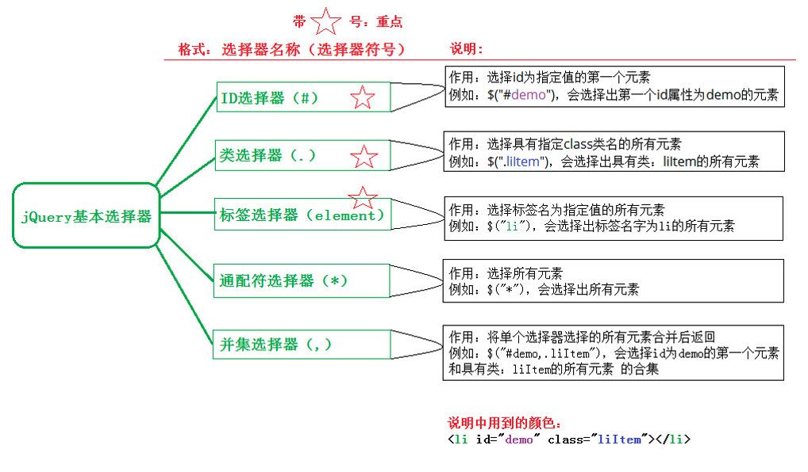
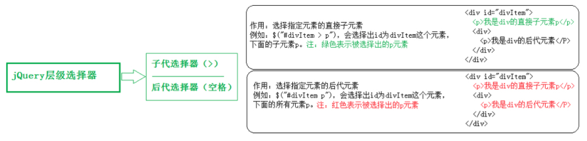
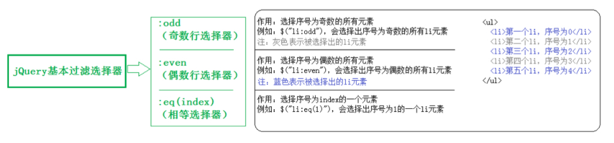

### jQuery

## jQuery的概念

jQuery是一个快速、简洁的JavaScript库，其设计的宗旨是`Write Less, Do More`。它封装了我们开发过程中常用的一些功能，方便我们调用，提高开发效率。


**jQuery的优点**

* 轻量级。核心文件才几十kb，不会影响页面加载速度

* 跨浏览器兼容。基本兼容了现在主流的浏览器

* **链式编程、隐式迭代**

* 对事件、样式、动画支持，大大简化了DOM操作

* 支持插件扩展开发。有着丰富的第三方的插件，例如：树形菜单、日期控件、轮播图等

* 免费、开源


## jQuery的基本使用

### 使用jQuery的基本步骤

1. 引包
2. 入口函数
3. 功能实现代码（事件处理）


### jQuery的版本

* 1.x版本：支持IE6、7、8；
* 2.x版本：不再支持IE6、7、8；
* 3.x版本：目前主要维护的版本；


### jQuery入口函数

`原生 js` 的入口函数指的是：`window.onload = function() {};` 如下：

```js
// 原生 js 的入口函数。页面上所有内容加载完毕，才执行。
// 不仅要等文本加载完毕，而且要等图片也要加载完毕，才执行函数。
window.onload = function () {
	alert(1);
}
// 仅当DOM加载完毕就执行，不需要等图片等外部资源加载完毕。
window.addEventListener('DOMContentLoaded', function() {
  alert(2);
})
```


`jQuery`的入口函数，有以下几种写法：

**写法一：**

```js
// 文档加载完毕，图片不加载的时候，就可以执行这个函数
$(document).ready(function() {
	alert(1);
})

// 简洁版
$(function() {
  alert(1);
})
```


**写法二：**

```js
// 文档加载完毕，图片也加载完毕的时候，在执行这个函数
$(window).ready(function() {
  alert(1);
})
```


### jQuery的顶级对象$

`$`是`jQuery`的别称，换句话说，`$ === jQuery`。在代码中可以使用jQuery代替$。

```js
<script src="jquery-1.11.1.js"></script>
<script>
    console.log($);
    console.log(jQuery);
    console.log($===jQuery);
</script>
```


`$`是jQuery的顶级对象，相当于原生JS中的window。把元素利用$包装成jQuery对象，就可以调用jQuery的方法。

```js
$(); // 调用上面我们自定义的函数$

$(document）.ready(function(){}); // 调用入口函数

$(function(){}); // 调用入口函数

$("#btnShow"); // 获取id属性为btnShow的元素

$("div"); // 获取所有的div标签元素
```


### jQuery对象和DOM对象

DOM对象：用原生js获取过来的对象就是DOM对象

```js
var div = document.querySelector('div');
console.dir(div);
```


jQuery对象：用jQuery方式获取过来的对象是jQuery对象。说白就是通过$把DOM元素进行了包装（伪数组形式存储）

```js
var div = $('div');
console.dir(div);
```


jQuery对象只能使用jQuery方法，DOM对象则只能使用原生js属性和方法。


**总结：**jQuery就是把DOM对象重新包装了一下，让其具有了jQuery方法。


#### 二者的相互转换

DOM对象与jQuery对象之间是可以相互转换的。


1.   **DOM对象-->jQuery对象**

```javascript
$(js对象);
```


```js
var div = document.querySelector('div');
var jQueryDiv = $(div);
console.log(jQueryDiv);
```

2.   **jQuery对象 --> DOM对象**

```js
jquery对象[index];      //方式1（推荐）

jquery对象.get(index);  //方式2
```


```js
var jQueryDiv = $("div");
var div = jQueryDiv[0];
console.dir(div);
```


## jQuery常用API

### 隐式迭代

遍历内部DOM元素（伪数组形式存储）的过程就叫做**隐式迭代**。


简单来说：

给匹配到的所有元素进行循环遍历，执行相应的方法，而不用我们再进行循环，简化操作，方便调用。


### jQuery选择器

原生JS获取元素方式很多，很杂，而且兼容性情况不一致，因此jQuery给我们做了封装，使获取元素统一标准。


语法：

```
$("选择器")
```


#### CSS选择器

| 名称         | 说明                                                       | 用法            |
| ------------ | ---------------------------------------------------------- | --------------- |
| ID选择器     | 获取指定ID的元素                                           | $("#id")        |
| 类选择器     | 获取同一类class的元素                                      | $(".class")     |
| 标签选择器   | 获取同一类标签的所有元素                                   | $("element")    |
| 通配符选择器 | 匹配所有元素                                               | $("*")          |
| 并集选择器   | 选取多个元素                                               | $("div,p,li")   |
| 交集选择器   | 交集元素                                                   | $("li.current") |
| 子代选择器   | 使用>号，获取亲儿子层级的元素                              | $("ul>li")      |
| 后代选择器   | 使用空格，代表后代选择器，获取ul下的所有li元素，包括孙子等 | $("ul li")      |






#### jQuery筛选选择器

| 语法       | 用法          | 描述                                                        |
| ---------- | ------------- | ----------------------------------------------------------- |
| :first     | $("li:first") | 获取第一个li元素                                            |
| :last      | $("li:last")  | 获取最后一个li元素                                          |
| :eq(index) | $("li:eq(2)") | 获取到的li元素中，选择索引号为2的元素，索引号index从0开始。 |
| :odd       | $("li:odd")   | 获取到的li元素中，选择索引号为奇数的元素                    |
| :even      | $("li:even")  | 获取到的li元素中，选择索引号为偶数的元素                    |




#### jQuery筛选方法

| 语法               | 用法                           | 说明                                                         |
| ------------------ | ------------------------------ | ------------------------------------------------------------ |
| parent()           | $("li").parent();              | 获取当前元素的父级元素（亲爸爸）                             |
| children(selector) | $("ul").children("li");        | 相当于`$("ul>li")`,最近一级（亲儿子）                        |
| find(selector)     | $("ul").find("li");            | 相当于`$("ul li")`,后代选择器                                |
| siblings(selector) | $(".first").siblings("li");    | 查找兄弟节点，不包括自己本身                                 |
| nextAll([expr])    | $(".first").nextAll();         | 查找当前元素之后所有的同辈元素                               |
| prevtAll([expr])   | $(".last").prevAll();          | 查找当前元素之前所有的同辈元素                               |
| hasClass(class)    | $("div").hasClass("protected") | 检查当前的元素是否含有某个特定的类，如果有返回true，没有返回false |
| eq(index)          | $("li").eq(2);                 | 相当于`$("li:eq(2)")`,index从0开始                           |


### jQuery样式操作

jQuery可以使用`css`方法来修改简单元素样式；也可以操作类，修改多个样式。


#### 操作css方法

1.   参数只写属性名，则是返回属性值

     ```js
     $(this).css('属性名')
     ```

2.   参数是属性名，属性值，逗号分隔，是设置一组样式，属性必须加引号，值如果是数字可以不用跟单位和引号

     ```js
     $(this).css('属性名', '属性值')
     ```

3.   参数可以是对象形式，方便设置多组样式。属性名和属性值用冒号隔开，属性可以不用加引号

     ```js
     $(this).css({'属性名': '属性值', '属性名': '属性值'})
     ```


#### 设置类样式方法

1.   添加类

     ```js
     $(this).addClass('类名');
     ```

2.   删除类

     ```js
     $(this).removeClass('类名');
     ```

3.   切换类（如果有则去除，如果没有则添加）

     ```js
     $(this).toggleClass('类名');
     ```


#### 类操作与className区别

原生JS中`className`会覆盖元素原先里面的类名。


jQuery里面类操作只是对指定类进行操作，不影响原先的类名。


### jQuery效果

jQuery封装了很多动画效果，最为常见的如下：

*   显示隐藏
    1.   show()
    2.   hide()
    3.   toggle()
*   滑动
    1.   slideDown()
    2.   slideUp()
    3.   slideToggle()
*   淡入淡出
    1.   fadeIn()
    2.   fadeOut()
    3.   fadeToggle()
    4.   fadeTo()
*   自定义动画
    animate()


#### 显示隐藏效果

**显示语法规范**

```js
show([speed], [easing], [fn])
```


**显示参数**

1.   参数都可以省略，无参数代表无动画直接显示。
2.   speed：三种预订速度之一的字符串('show', 'normal', 'fast')或表示动画时长的**毫秒数值**。
3.   easing： 用来指定切换效果，默认是"swing", 可用参数“linear”。
4.   fn：回调函数，在动画完成时执行的函数，每个元素执行一次。


**隐藏语法规范**

```js
hide([speed], [easing], [fn])
```


**隐藏参数**

1.   参数都可以省略，无参数代表无动画直接显示。
2.   speed：三种预订速度之一的字符串('show', 'normal', 'fast')或表示动画时长的**毫秒数值**。
3.   easing： 用来指定切换效果，默认是"swing", 可用参数“linear”。
4.   fn：回调函数，在动画完成时执行的函数，每个元素执行一次。


**切换语法规范**

```js
toggle([speed], [easing], [fn])
```


**切换参数**

1.   参数都可以省略，无参数代表无动画直接显示。
2.   speed：三种预订速度之一的字符串('show', 'normal', 'fast')或表示动画时长的**毫秒数值**。
3.   easing： 用来指定切换效果，默认是"swing", 可用参数“linear”。
4.   fn：回调函数，在动画完成时执行的函数，每个元素执行一次。


#### 滑动效果

**下滑语法规范**

```js
slideDown([speed], [easing], [fn])
```


**下滑参数**

1.   参数都可以省略，无参数代表无动画直接显示。
2.   speed：三种预订速度之一的字符串('show', 'normal', 'fast')或表示动画时长的**毫秒数值**。
3.   easing： 用来指定切换效果，默认是"swing", 可用参数“linear”。
4.   fn：回调函数，在动画完成时执行的函数，每个元素执行一次。


**上滑语法规范**

```js
slideUp([speed], [easing], [fn])
```


**上滑参数**

1.   参数都可以省略，无参数代表无动画直接显示。
2.   speed：三种预订速度之一的字符串('show', 'normal', 'fast')或表示动画时长的**毫秒数值**。
3.   easing： 用来指定切换效果，默认是"swing", 可用参数“linear”。
4.   fn：回调函数，在动画完成时执行的函数，每个元素执行一次。


**切换语法规范**

```js
slideToggle([speed], [easing], [fn])
```


**切换参数**

1.   参数都可以省略，无参数代表无动画直接显示。
2.   speed：三种预订速度之一的字符串('show', 'normal', 'fast')或表示动画时长的**毫秒数值**。
3.   easing： 用来指定切换效果，默认是"swing", 可用参数“linear”。
4.   fn：回调函数，在动画完成时执行的函数，每个元素执行一次。


#### 事件切换

```js
hover([over,] out)
```

over：鼠标移动元素上要触发的函数（相当于mouseenter）

out：鼠标移出元素要触发的函数（相当于mouseleave）


例子：

```js
$(".nav>li").hover(function() {
  $(this).children('ul').slideDown(200);
}, function() {
  $(this).children('ul').slideUp(200);
})

// 如果只写一个函数，那么鼠标经过和鼠标离开都会触发这个函数
$(".nav>li").hover(function() {
  $(this).children('ul').slideToggle(200);
})
```


#### 动画队列及其停止排队方法

**动画或效果队列**

动画或者效果一旦触发就会执行，如果多次触发就会造成多个动画或者效果排队执行。


**停止排队**

```js
stop()
```

1.   stop()方法用于停止动画或效果
2.   stop()写到动画或者效果的前面，相当于停止结束上一次的动画。


#### 淡入淡出效果

**淡入语法规范**

```js
fadeIn([speed], [easing], [fn])
```


**淡入参数**

1.   参数都可以省略，无参数代表无动画直接显示。
2.   speed：三种预订速度之一的字符串('show', 'normal', 'fast')或表示动画时长的**毫秒数值**。
3.   easing： 用来指定切换效果，默认是"swing", 可用参数“linear”。
4.   fn：回调函数，在动画完成时执行的函数，每个元素执行一次。


**淡出语法规范**

```js
fadeOut([speed], [easing], [fn])
```


**淡出参数**

1.   参数都可以省略，无参数代表无动画直接显示。
2.   speed：三种预订速度之一的字符串('show', 'normal', 'fast')或表示动画时长的**毫秒数值**。
3.   easing： 用来指定切换效果，默认是"swing", 可用参数“linear”。
4.   fn：回调函数，在动画完成时执行的函数，每个元素执行一次。


**切换语法规范**

```js
fadeToggle([speed], [easing], [fn])
```


**切换参数**

1.   参数都可以省略，无参数代表无动画直接显示。
2.   speed：三种预订速度之一的字符串('show', 'normal', 'fast')或表示动画时长的**毫秒数值**。
3.   easing： 用来指定切换效果，默认是"swing", 可用参数“linear”。
4.   fn：回调函数，在动画完成时执行的函数，每个元素执行一次。


**渐进方式调整到指定的不透明度**

```js
fadeTo(speed, opacity, [easing], [fn])
```

**效果参数**

1.   speed：三种预订速度之一的字符串('show', 'normal', 'fast')或表示动画时长的**毫秒数值**。必须值。
2.   opacity：透明度，取值0~1之间。必须值。
3.   easing： 用来指定切换效果，默认是"swing", 可用参数“linear”。
4.   fn：回调函数，在动画完成时执行的函数，每个元素执行一次。


#### 自定义动画animate

**语法：**

```js
animate(params, [speed], [easing], [fn])
```


**参数：**

1.   params：想要更改的样式属性，以对象形式传递，必须值。
2.   speed：三种预订速度之一的字符串('show', 'normal', 'fast')或表示动画时长的**毫秒数值**。
3.   easing： 用来指定切换效果，默认是"swing", 可用参数“linear”。
4.   fn：回调函数，在动画完成时执行的函数，每个元素执行一次。


### jQuery属性操作

#### 设置或获取元素固有属性值

所谓元素固有属性就是元素本身自带的属性，比如\<a\>标签元素里面的href,比如\<input\>标签元素里面的type等。


**获取属性值语法：**

```js
$(element).prop("属性名");
```


**设置属性值语法：**

```js
$(element).prop("属性名", "属性值");
```


#### 设置或获取元素自定义属性值

元素的自定义属性通过`attr()`来获取


**获取自定义属性值语法：**

```js
$(element).attr("属性名"); // 类似于原生getAttribute()
```


**设置自定义属性值语法：**

```js
$(element).attr("属性名", "属性值"); // 类似于原生setAttribute()
```


#### 数据缓存data()

data()方法可以在指定的元素上存取数据，并不会修改DOM元素结构。一旦页面刷新，之前存放的数据都将被移出。


**附加数据语法：**

```js
$(element).data("name", "value"); // 向被选中的元素附加数据 
```


**获取数据语法：**

```js
$(element).data("name"); // 向被选中元素获取数据 
```


如果要读取HTML5自定义属性，无需加data前缀。得到的是Number型。


### jQuery文本属性值

主要针对元素的内容还有表单的值的操作。


#### 普通元素内容

通过`html()` [相当于原生innerHTML]方法来获取标签元素内容

```js
$(element).html(); // 获取元素内容

$(element).html("content");  // 设置元素内容
```


#### 普通元素文本内容

通过`text()`[相当于原生innerText]方法来获取标签文本内容

```js
$(element).text(); // 获取文本内容

$(element).text("content"); // 设置文本内容
```


#### 表单的值

通过`val()`[相当于原生value]方法来获取表单中的值

```js
$(element).val(); // 获取表单的值
 
$(element).val("content"); // 设置表单的值
```


### jQuery元素操作

主要是遍历、创建、添加、删除元素操作。


#### 遍历元素

jQuery隐式迭代是对同一类元素做了同样的操作。如果想要给同一类元素做不同操作，就需要用到遍历。


**语法1：**

```js
$(element).each(function(index, DOMElement) {
    
})
```

1. each()方法遍历匹配的每一个元素。主要用DOM处理。
2. 参数：index是每个元素的索引号；DOMElement是每个**DOM元素对象**，不是jQuery对象


**语法2：**

```js
$.each(object, function(index, element) {
    
})
```

1. $.each()方法可用于遍历任何对象。主要用于数据处理，比如数组，对象
2. 参数：index是每个元素的索引号；element遍历内容


#### 创建元素

**语法：**

```js
$("<标签名></标签名>");
```


#### 添加元素

**内部添加**

```js
element.append("内容");
```

append()方法把内容放入匹配元素内部最后面，类似原生appendChild。


```js
element.prepend("内容");
```

prepend()方法把内容放入匹配元素内部最前面，类似原生insertBefore(0)


**外部添加**

```js
element.after("内容");
```

把内容放入目标元素后面


```js
element.before("内容");
```

把内容放入目标元素前面


**区别**

1. 内部添加元素，生成之后，它们是父子关系。
2. 外部添加元素，生成之后，它们是兄弟关系。


#### 删除元素

```js
element.remove() //删除匹配的元素（本身）

element.empty() // 删除匹配的元素集合中所有的子节点

element.html("") // 情况匹配的元素内容
```


### jQuery尺寸操作

| 语法                               | 用法                                                 |
| ---------------------------------- | ---------------------------------------------------- |
| width()/height()                   | 取得匹配元素宽度和高度值 只算width/height            |
| innerWidth()/innerHeight()         | 取得匹配元素宽度和高度值 包含padding                 |
| outerWidth()/outerHeight()         | 取得匹配元素宽度和高度值 包含padding、border         |
| outerWidth(true)/outerHeight(true) | 取得匹配元素宽度和高度值 包含padding、border、margin |

*   以上参数为空，则是获取相应值，返回的是数字型。
*   如果参数为数字，则是修改相应值。参数可以不必写单位。


### jQuery位置操作

位置主要有三个：offset()、position()、scrollTop()/scrollLeft()


#### offset()设置或获取元素偏移

offset()方法设置或返回被选元素相对于**文档**的偏移坐标，跟父级没有关系。


该方法有2个属性`left`、`top`。offset().top用于获取距离文档顶部的距离，offset().left用于获取距离文档左侧的距离。


可以设置元素的偏移：

```js
$(element).offset({
  top: 10,
  left: 30
});
```


#### position()获取元素偏移

`position()` 方法用于返回被选元素相对于**带有定位的父级**偏移坐标，如果父级都没有定位，则以文档为准。


position方法只能获取坐标不能设置坐标。


#### scrollTop()/scrollLeft()设置或获取元素被卷去的头部和左侧

scrollTop()方法设置或返回被选元素被卷去的头部。


## jQuery事件

### jQuery事件注册

**单个事件注册**

```js
$(element).event(function() {})
```


事件名称和原生基本一致。

比如mouseover、mouseout、blur、focus、change、keydown、keyup、resize、scroll等


#### jQuery事件处理

##### 事件处理on()绑定事件

on()方法在匹配元素上绑定一个或多个事件的时间处理函数


**语法**：

```js
$(element).on(events, [selector], fn)
```

**参数说明**：

1. events：一个或多个用**空格**分隔的事件类型。
2. selector：元素的子元素选择器。
3. fn：回调函数 即绑定在元素身上的侦听函数。


**on()方法优势：**

1. 可以绑定多个事件，多个处理事件处理程序

   ```js
   $("div").on({
       mouseover: function() {},
       mouseout: function() {},
       click: function() {}
   })
   ```

   如果事件处理程序相同

   ```js
   $("div").on("mouseover mouseout", function() {
       // 当前两个events共同执行同一个function
   })
   ```

2. 可以事件委派操作。事件委派的定义就是，把原来加给子元素身上的事件绑定在父元素身上，就是把事件委派给父元素。

   ```js
   $("ul").on("click", "li", function() {
       alert(1);
   }) // click是绑定在ul身上的，但是触发的对象是ul里面的小li
   ```

3. on()可以给未来动态创建的元素绑定事件


##### off()解绑事件

off()方法可以移出通过on()方法添加的事件处理程序。


**语法：**

```js
$(element).off([events], [selectors]);
```


例：

```js
$("div").off(); //解绑div元素所有事件处理程序

$("div").off("click"); //解绑div元素上面的点击事件 

$("ul").off("click", "li"); // 解绑事件委托
```


如果有的事件只想触发一次，可以使用`one()`来绑定事件。

```js
$(element).one("ev", function() {})
```

